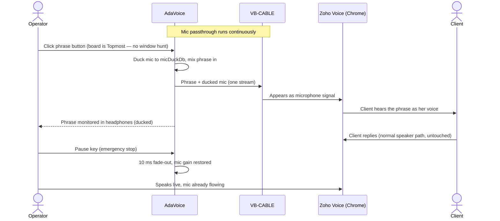

# 01 — Огляд, обсяг, вимоги

## 1. Короткий огляд

AdaVoice — це локальний десктопний застосунок для Windows для онлайн-операторки, яка багато разів на
день повторює одні й ті самі сказані фрази. Вона один раз записує фрази власним голосом, упорядковує
їх у категорії/скрипти і запускає під час живих дзвінків одним кліком. Аудіо маршрутизується так, щоб
клієнт чув його так, ніби воно сказане в її мікрофон, тоді як її справжній голос продовжує звично
звучати між фразами.

Головне технічне обмеження: **Windows не надає жодного user-mode API для запису аудіо в
мікрофон.** Потрібен драйвер віртуального аудіопристрою. AdaVoice залежить від безкоштовного
драйвера **VB-CABLE** і реалізує безперервний passthrough мікрофона + мікшування фраз у власному
аудіорушії (див. [02-audio-routing.md](02-audio-routing.md)).

**Стек:** .NET 10, WPF, C#, NAudio (WASAPI), CommunityToolkit.Mvvm, метадані у JSON + файли WAV.
Без хмари, без облікових записів, повністю офлайн.

## 2. Обсяг продукту

### У межах обсягу (v1)

- Запис фраз, перезапис, попереднє прослуховування, перейменування, видалення
- Категорії/скрипти, теги, пошук/фільтрація
- Миттєве відтворення у віртуальний мікрофон; миттєва зупинка; одна фраза за раз
- Безперервний passthrough апаратного мікрофона у віртуальний мікрофон з налаштовуваним притишенням (ducking)
- Одноразова калібрація рівня голосу, щоб фрази відповідали її живій гучності
- Глобальна гаряча клавіша аварійної зупинки (працює, коли Chrome у фокусі)
- Перемикач «завжди поверх інших вікон» для головної дошки (зручно поруч із повноекранним Chrome)
- Інтерфейс українською / польською / англійською (зміна мови застосовується після перезапуску)
- Налаштування: аудіопристрої, рівні притишення (duck levels), майстер тестування маршрутизації
- Локальне сховище, щоденне резервне копіювання (метадані **і** аудіо), експорт/імпорт (zip)

### Поза межами обсягу (v1)

- Синтез / клонування голосу
- Запис дзвінка (бік клієнта ніколи не захоплюється)
- Багатокористувацький режим / профілі
- Гарячі клавіші для окремих фраз (відкладено — див. roadmap)
- Перемикання мови під час роботи (без перезапуску), категоризація перетягуванням, підсистема
  кошика/автоочищення (усе прибрано в огляді 2026-06-10 — натомість постачаються простіші еквіваленти)
- Автовизначення контексту розмови, інтеграція з телефонією
- macOS / Linux

## 3. Припущення

> Усі припущення явно перелічені тут. Пункти, позначені ⚠, є неперевіреними до
> spike Фази 0.

| # | Припущення | Підстава |
|---|------------|----------|
| A1 | Windows 10 21H2+ або Windows 11 x64; права адміністратора доступні для одноразового встановлення драйвера | Підтверджено користувачем |
| A2 | Один ПК, одна операторка | Підтверджено користувачем |
| A3 | Дротова/USB гарнітура (не Bluetooth) | Підтверджено користувачем |
| A4 | Інструмент зв'язку: Zoho CRM Web у Google Chrome (софтфон Zoho Voice / PhoneBridge, WebRTC) | Підтверджено користувачем |
| A5 | ⚠ Софтфон Zoho поважає вибір мікрофона в Chrome, тож «CABLE Output» можна обрати як мікрофон | Стандартна поведінка WebRTC; перевіряється у Фазі 0 |
| A6 | ⚠ Заздалегідь записане мовлення проходить через обробку аудіо Chrome + Zoho розбірливо. Chrome обробляє вхід мікрофона на рівні getUserMedia: **придушення шуму, ехопридушення та автоматичне регулювання підсилення (AGC)**, з ресемплінгом до ~32 kHz моно на десктопі. AGC найбільш ворожий до цього дизайну — він може знову підсилити притишений мікрофон і вирівняти рівень фраз | Перевірено за документацією Chrome 2026-06-10; поведінку на її обліковому записі протестовано у Фазі 0 |
| A7 | Бібліотека: кілька десятків фраз, по 5–15 с кожна; загальний обсяг аудіо значно менше 1 GB | Підтверджено користувачем |
| A8 | Роботодавець/платформа дозволяють допоміжні аудіоінструменти | **Вирішено (2026-06-13):** угода з роботодавцем чи Zoho не потрібна (роботодавець лояльний). Більше не ворота; це **не** впливає на технічні невідомі A5/A6, які Фаза 0 все одно вимірює |
| A9 | VB-CABLE може бути встановлено на машині | Підтверджено користувачем |
| A10 | Уподобання щодо стилю гарячих клавіш відкладено; у MVP потрібна лише глобальна STOP | Підтверджено користувачем |
| A11 | ⚠ Бюджети затримки — це проєктні цілі, а не вимірювання, доки Фаза 0 не виміряє наскрізну затримку від рота до Chrome (включно з внутрішньою буферизацією VB-CABLE) | Огляд 2026-06-10 |

## 4. Confirmed Decisions (canonical)

> **Це єдине джерело правди щодо рішень проєкту.** Інші документи посилаються сюди.
> Останнє оновлення: 2026-06-10 (eng review).

| # | Питання | Рішення |
|---|---------|---------|
| 1 | Платформа зв'язку | Zoho CRM Web у Google Chrome |
| 2 | Гарнітура | Дротова |
| 3 | Поведінка мікрофона під час відтворення фрази | Притишений; рівень налаштовується наживо (`micDuckDb`, типово −12 dB) |
| 4 | Чи чути фразу в її навушниках | Так, притишено; рівень налаштовується наживо (`monitorPhraseDb`, типово −6 dB) |
| 5 | Розмір бібліотеки | Кілька десятків фраз, 5–15 с → усі заздалегідь декодуються в RAM (у фоновому потоці; кнопки активуються в міру готовності фраз) |
| 6 | Мова інтерфейсу | UA / PL / EN; вибір застосовується **після перезапуску** (статичні `.resx`, без витрат на динамічні прив'язки) |
| 7 | VB-CABLE + адмін | Схвалено |
| 8 | Гарячі клавіші для окремих фраз | Відкладено на post-MVP; глобальна STOP залишається |
| 9 | Новий тригер проти поточної фрази | Новий тригер зупиняє поточну фразу (типово; режим «ігнорувати» доступний як перемикач) |
| 10 | Гаряча клавіша аварійної зупинки | **`Pause`** (не Ctrl+Space — конфлікт IME/перемикання розкладки на багатомовних налаштуваннях); майстер перевіряє наявність клавіші й тестує її наживо; резервний `Ctrl+F12` |
| 11 | Запис проти живого дзвінка | **Запис під час дзвінків не дозволено.** Відкриття Recorder переводить застосунок OFF AIR (вивід кабелю призупинено, помітний банер); закриття відновлює живий стан. Гарантується дизайном, а не дисципліною |
| 12 | Притишення зв'язку Windows | Рушій програмно відмовляється (interop `SetDuckingPreference`) на своїх сесіях кабелю + монітора; майстер також встановлює Sound → Communications → «Do nothing» як резерв |
| 13 | Гучність фрази | RMS/гучність зіставлено з відкаліброваним майстром еталоном живого мікрофона (встановлює `gainDb` для кожної фрази); стеля піку −3 dBFS зберігається. Калібрацію можна перезапустити з Settings |
| 14 | Видалення | Без підсистеми кошика. Видалення = діалог підтвердження; запис метаданих прибрано, WAV зберігається на диску як «сирота» (перейменовано на `deleted-{id}.wav`) — голосові записи ніколи не є невідновними |
| 15 | Резервне копіювання | Щоденний zip включає `library.json`, `settings.json` **і `audio\`** (її голос — це незамінні дані); зберігати 7 |
| 16 | Вікно дошки | Перемикач «завжди поверх інших вікон» (`Topmost`) у MVP, типово УВІМК — без пошуку фокуса посеред дзвінка |
| 17 | Резервна архітектура | Voicemeeter (Варіант B) **відрепетировано у Фазі 0** (~пів дня), тож резерв є перевірено надійним, а не теоретичним. Архітектура A залишається основною |
| 18 | Стійкість до збоїв | `RegisterApplicationRestart`, щоб Windows перезапускав застосунок після збою; сигнал тривоги DEGRADED програється через **системний пристрій виводу за замовчуванням**, незалежно від налаштування монітора |
| 19 | Інсталятор | Inno Setup, **self-contained .NET 10** (без завантаження середовища виконання для нетехнічного користувача; ~80 MB більший прийнятно). Підписання коду явно відкладено — попередження SmartScreen прийнятне для родинного використання; переглянути, якщо колись поширюватиметься |
| 20 | Людські ворота | Ворота дозволу роботодавця **знято (2026-06-13):** угода з роботодавцем/Zoho не потрібна (роботодавець лояльний). Залишаються одні людські ворота — наглядовий піводенний пілот з операторкою після Фази 3 (не перший контакт на Фазі 5) |
| 21 | Візуальна система | Бібліотека WPF-UI (Fluent), **фіксована темна тема**, Segoe UI Variable, токенізовані кольори статусів, сітка 4 px — канонічна в [09-design-system.md](09-design-system.md) (design review 2026-06-10) |
| 22 | Компонування вікон | Два іменовані компонування: Full (≥720 px) та Docked (420–719 px, rail→dropdown, сітка 2 колонки); мін 420×560; Docked — основна реальна форма |
| 23 | Стани взаємодії | Кожна функція × стан (завантаження/порожньо/помилка/успіх/частково) визначено в [05 §2](05-ui-design.md); порожня дошка при першому запуску — це продуманий вітальний екран з основною дією |
| 24 | Впевненість у першому дзвінку | Майстер завершується чек-лістом тестового дзвінка (зателефонувати другу/на власний телефон, програти 2 фрази) перед першим дзвінком клієнту — продуманий міст через момент найбільшого страху |

## 5. Ключові користувацькі сценарії

### F1 — Перше налаштування (один раз)

1. Встановити AdaVoice → майстер керованого налаштування.
2. Майстер виявляє VB-CABLE; якщо відсутній, дає посилання на інсталятор і перевіряє після встановлення.
3. Перевірки середовища: приватність мікрофона Windows дозволяє десктопні застосунки; формат спільного
   режиму CABLE — 48 kHz (пропонує виправити); **пристрій виводу за замовчуванням НЕ є CABLE Input**
   (системні звуки не мають досягати клієнта); сесія AdaVoice не приглушена у Volume Mixer.
4. Обрати апаратний мікрофон + вивід моніторингу (навушники). Рушій запускає passthrough.
5. Калібрація голосу: «говоріть нормально 5 секунд» → зберігається еталон RMS живого мікрофона.
6. Перевірка гарячої клавіші зупинки: підтверджує наявність `Pause`, живе натискання для тесту; пропонує резервний `Ctrl+F12`.
7. Майстер інструктує: у Chrome / Zoho оберіть мікрофон **CABLE Output**.
8. Вбудований loopback-тест: говоріть → індикатор рівня показує сигнал на боці кабелю → підтвердити.
9. Картка впевненості в першому дзвінку: зробіть тестовий дзвінок (власний телефон / друг через Zoho), програйте дві
   фрази, підтвердьте, що вони звучать природно — перед першим дзвінком клієнту (рішення #24).

### F2 — Записати фразу

Панель запису (застосунок переходить **OFF AIR** — кабель призупинено, показано банер) → обрати категорію →
Record → говорити → Stop → автообрізання тиші + зіставлення гучності з відкаліброваним еталоном →
попереднє прослуховування (лише монітор) → Save (назва, теги) → закрити панель → знову ON AIR.

### F3 — Під час живого дзвінка (критичний сценарій)

### F4 — Реорганізувати бібліотеку

Діалог редагування для кожної фрази: змінити категорію, назву, теги. Видалення з підтвердженням (файл зберігається як «сирота»).

### F5 — Резервне копіювання

Автоматичний щоденний zip (метадані + аудіо). Вручну: Settings → Export → один `.zip`;
Import відновлює на новому ПК.

## 6. Функціональні вимоги

| ID | Вимога |
|----|--------|
| FR-1 | CRUD фрази: створити (записати), перейменувати, видалити (діалог підтвердження; WAV зберігається як «сирота»), перезаписати |
| FR-2 | Метадані фрази: назва, категорія, теги, тривалість, створено/оновлено, шлях до файлу, gain |
| FR-3 | Категорії: створити/перейменувати/видалити/переупорядкувати; фраза належить рівно одній категорії; фраза переміщується через діалог редагування |
| FR-4 | Локальне попереднє прослуховування (лише пристрій монітора, ніколи в дзвінок) |
| FR-5 | Жива гра у віртуальний мікрофон; затримка від тригера до кабелю < 100 ms (ціль ~40 ms на боці застосунку; наскрізне вимірювання у Фазі 0) |
| FR-6 | Рівно одна фраза за раз; новий тригер зупиняє поточну (типово) або ігнорується (перемикач) |
| FR-7 | Аварійна зупинка: глобальна гаряча клавіша `Pause` + завжди видима кнопка; діє в межах одного аудіобуфера (~20 ms) з 10 ms fade |
| FR-8 | Безперервний passthrough мікрофона з налаштовуваним наживо притишенням під час гри фрази |
| FR-9 | Відтворення фрази дублюється в навушники на налаштовуваному наживо рівні монітора |
| FR-10 | Пошук за назвою/тегом, клавіатура передусім (фільтрація під час набору) |
| FR-11 | Налаштування: пристрій захоплення, пристрій віртуального кабелю, пристрій монітора, рівні притишення, гаряча клавіша зупинки, мова інтерфейсу (перезапуск), перемикач Topmost, перезапуск калібрації |
| FR-12 | Майстер самотестування маршрутизації + живі індикатори статусу (рівень мікрофона, рівень кабелю, стан рушія) |
| FR-13 | Щоденне резервне копіювання метаданих + аудіо (зберігати 7); ручний експорт/імпорт у zip |
| FR-14 | Інтерфейс повністю локалізовано UA/PL/EN; вибір мови застосовується після перезапуску |
| FR-15 | Режим запису є взаємовиключним з ефіром: Recorder відкрито ⇒ вивід кабелю призупинено + банер OFF AIR |
| FR-16 | Калібрація рівня голосу: майстер вимірює RMS живого мікрофона; фраза зберігається із зіставленням гучності до нього через `gainDb` |
| FR-17 | Рушій відмовляється від притишення зв'язку Windows на своїх render-сесіях |
| FR-18 | Застосунок реєструється для перезапуску ОС після збою; сигнал тривоги DEGRADED програється на системному пристрої за замовчуванням незалежно від налаштування монітора |

## 7. Нефункціональні вимоги

- **Затримка:** тригер фрази → кабель < 100 ms на боці застосунку (ціль ~40 ms). Passthrough додає
  **≤ 60 ms ціль / 80 ms жорстка стеля** до шляху мікрофона, на боці застосунку. Внутрішня
  буферизація VB-CABLE та буферизація захоплення Chrome додають ще — **наскрізне число від рота до Chrome
  вимірюється у Фазі 0**, і розміри буферів тоді ж налаштовуються (A11).
- **Надійність:** витримує 8-годинні зміни; автовідновлюється після змін пристроїв; ніколи *тихо*
  не припиняє пересилати мікрофон — стан DEGRADED має бути гучно видимим/чутним (системний пристрій
  за замовчуванням, а не опційний монітор).
- **Слід (footprint):** < 150 MB RAM з повним кешем фраз (~100 MB у найгіршому випадку на масштабі A7).
- **Офлайн:** нуль мережевих викликів. **Приватність:** записи ніколи не залишають машину.
- **Встановлення:** один self-contained інсталятор + окреме встановлення VB-CABLE користувачем (ліцензування).
- **Підтримуваність:** MVVM, аудіорушій ізольовано за інтерфейсами (див.
  [08-testing.md](08-testing.md) щодо швів для пристроїв), без коду драйвера, зручно для solo-розробника.
