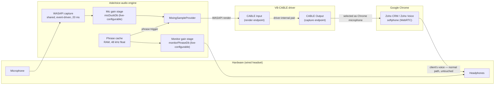

# 02 — Маршрутизація аудіо в мікрофон (головний технічний виклик)

## 1. Чому це складно

Аудіо Windows (WASAPI / MMDevice API) суворо розділяє кінцеві точки **render** (динаміки,
навушники) та кінцеві точки **capture** (мікрофони). Застосунки можуть грати в render-кінцеві
точки й читати з capture-кінцевих точок — **немає підтримуваного user-mode API для запису
семплів у capture-кінцеву точку.**

Наслідок, чесно кажучи: **чистий .NET / NAudio / WASAPI сам по собі не може змусити Chrome «чути»
наше аудіо як мікрофон.** Єдиний спосіб, яким інший застосунок може отримати наше аудіо як вхід
мікрофона, — це **драйвер**, який надає віртуальну capture-кінцеву точку, що дзеркалить
playback-кінцеву точку. Це жорстке обмеження платформи, а не прогалина бібліотеки.

Друга, тонша проблема — це **мікшування**: Chrome може обрати лише *один* мікрофон. Якщо мікрофон
Chrome — це віртуальний кабель, справжній голос операторки більше не досягає дзвінка, доки щось
безперервно не пересилає апаратний мікрофон у той самий кабель. Це пересилання й мікшування — серце
аудіорушія AdaVoice.

## 2. Аналіз варіантів

| # | Підхід | Як це працює | Вердикт |
|---|--------|--------------|---------|
| A | **Віртуальний кабель VB-CABLE** | Драйвер надає render-кінцеву точку («CABLE Input»), чиє аудіо з'являється на парній capture-кінцевій точці («CABLE Output»). Застосунок грає в render-бік; Chrome використовує capture-бік як свій мікрофон. | ✅ **Рекомендовано.** Безкоштовний (donationware), повсюдний, стабільний, створений саме для цього. |
| B | Voicemeeter (Banana) | Повноцінний віртуальний mixer: апаратний мікрофон + аудіо застосунку мікшуються всередині Voicemeeter; Chrome використовує «Voicemeeter Out» як мікрофон. AdaVoice лише грав би фрази на вхід Voicemeeter. | Надійний резерв — **відрепетировано у Фазі 0** (~пів дня), тож перемикання є перевірено надійним кроком, а не теорією. Мікшування відбувається поза нашим застосунком (надійно, прибирає єдину точку відмови з §5), але операторка мусить запускати й налаштовувати другий, складний застосунок. |
| C | Windows «Listen to this device» | Функція Control Panel маршрутизує апаратний мікрофон → CABLE Input без коду. | Безкодовий passthrough-резерв, але додає 50–150 ms затримки і живе в прихованому, крихкому UI ОС. Задокументовано лише як план B. |
| D | Написати власний драйвер віртуального аудіо | Kernel-драйвер AVStream/ACX або APO, підписаний WHQL. | ❌ Відхилено. Місяці роботи, вартість і процес підписання, kernel-ризик. Нереалістично для solo-розробника. |
| E | Перехоплювати потік мікрофона інших застосунків (у стилі Soundpad) | Інʼєкція коду в аудіосесії інших процесів. | ❌ Відхилено. Крихко, антивіруси позначають, ламається пісочницею браузера. |

## 3. Рекомендована архітектура (Варіант A + вбудований mixer)

Ключові властивості:

- Налаштування **динаміка** Chrome залишається на її навушниках — шлях голосу клієнта не зачеплено.
- Застосунок тримає **один постійний render-потік** до CABLE Input; фрази мікшуються всередину й назовні
  без повторного відкриття пристроїв → миттєвий старт/стоп, без затримки відкриття пристрою на гарячому шляху.
- Притишення мікрофона (`micDuckDb`, типово −12 dB, діапазон −60…0 dB з порогом mute, рамп 50 ms) і
  рівень монітора фрази (`monitorPhraseDb`, типово −6 dB) — це незалежні налаштовувані наживо
  каскади підсилення (gain stages).
- Рушій **відмовляється від притишення зв'язку Windows** на своїх сесіях кабелю й монітора
  (`IAudioSessionControl2::SetDuckingPreference`, невеликий COM-interop — NAudio його не обгортає). Без
  цього Windows послаблює вивід AdaVoice тієї миті, коли Chrome відкриває комунікаційний потік — тобто
  саме коли починається дзвінок. Майстер додатково встановлює
  Sound → Communications → «Do nothing» як подвійний запобіжник.

## 4. Застереження щодо браузера / Zoho

- Chrome обробляє вхід мікрофона на рівні getUserMedia: **ехопридушення, придушення
  шуму та автоматичне регулювання підсилення (AGC)**, з ресемплінгом приблизно до 32 kHz моно на
  десктопі. Zoho Voice може додавати власну обробку зверху.
- **AGC — найбільш ворожий компонент для цього дизайну**: він може знову підсилити притишений
  мікрофон (зводячи нанівець налаштований рівень притишення), «пампити» між фразою та живим голосом і
  заново вирівнювати гучність фрази. Значення притишення/підсилення, які налаштовує операторка, можуть не
  збігатися з тим, що чує клієнт. Фаза 0 тестує з AGC явно в матриці; якщо Zoho/Chrome надають
  перемикач `autoGainControl`, майстер це документує.
- Зіграні фрази — це звичайне людське мовлення, тож очікується, що вони пройдуть розбірливо, але
  подвійна обробка може забарвити аудіо. **Припущення A6 — неперевірене, доки spike Фази 0
  не зробить справжній дзвінок Zoho.**
- Пом'якшення: записувати чисті фрази, зіставлені за гучністю до рівня її живого мікрофона (див. калібрацію,
  рішення #13); вимкнути опційні перемикачі придушення шуму/AGC у Zoho/Chrome, якщо доступні.

## 5. Чесне обмеження: єдина точка відмови

З Архітектурою A **AdaVoice — це компонент, що пересилає її живий голос.** Якщо застосунок
падає або його render-потік помирає, її мікрофон замовкає в дзвінку.

Пом'якшення (деталі в [07-risks-security.md](07-risks-security.md)):

1. Watchdog рушія з автоматичною перебудовою потоку при помилках пристроїв.
2. Гучний стан DEGRADED: візуальний банер + тон тривоги, зіграний на **системному пристрої виводу
   за замовчуванням** (а не опційний потік монітора — тривога має пережити `monitorEnabled=false`).
3. Стійкість до загибелі процесу: застосунок викликає `RegisterApplicationRestart`, тож Windows перезапускає
   його після збою; при перезапуску після нечистого виходу рушій автовідновлюється й показує toast відновлення.
4. Задокументований 60-секундний ручний резерв: перемкнути мікрофон Chrome назад на апаратний пристрій.
   **Відрепетировано під час Фази 0 на живому тестовому дзвінку** — чи застосовує Zoho зміну мікрофона
   посеред дзвінка без перепідключення, потрібно перевірити, а не припускати.
5. Задокументований резерв на рівні ОС: Windows «Listen to this device» (Варіант C).
6. Voicemeeter (Варіант B) проспайкано у Фазі 0 поруч з Архітектурою A, тож якщо вбудований
   passthrough виявиться ненадійним, перемикання — це перехід до перевірено надійної конфігурації — AdaVoice тоді
   стає звичайним саундбордом, а мікшування переходить у рушій Voicemeeter.

## 6. Нотатка про ліцензування VB-CABLE

VB-CABLE — це donationware і **не може тихо постачатися в комплекті чи розповсюджуватися** з
інсталятором. Майстер налаштування дає посилання на офіційне завантаження, дозволяє користувачу запустити встановлення
і перевіряє пристрій після цього.
