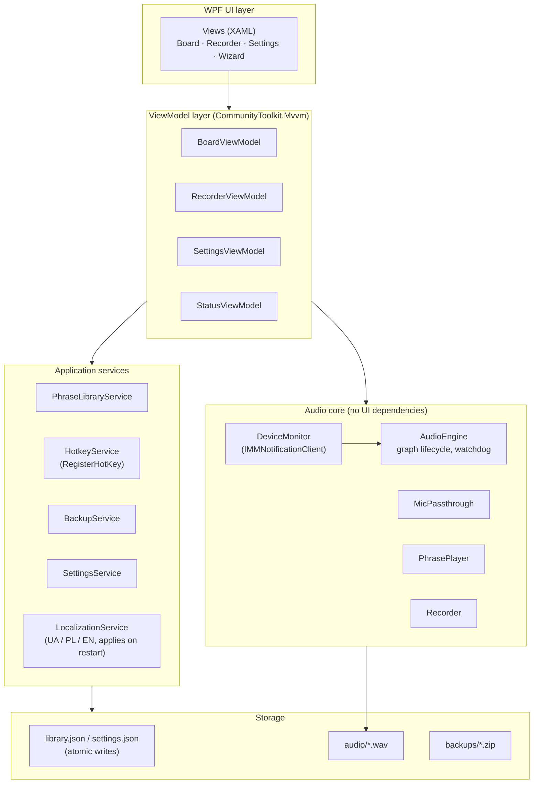

# 03 — Архітектура застосунку та вибір технологій

## 1. Огляд архітектури

Один процес, шарова, MVVM. Аудіоядро не залежить від UI й піддається тестуванню.

### Правила

- **Аудіоядро працює на виділених потоках.** UI спілкується з ним через потокобезпечний
  інтерфейс команд/подій; жодна аудіоробота ніколи не виконується на диспетчері WPF.
- `AudioEngine` володіє рівно трьома потоками, усі тримаються відкритими протягом життя застосунку:
  один capture (апаратний мікрофон), один render (CABLE Input), один опційний render (монітор у навушники).
- Глобальна гаряча клавіша зупинки зареєстрована загальносистемно, тож вона спрацьовує, коли Chrome у фокусі.
- Сховище за інтерфейсом репозиторію, тож JSON можна замінити на SQLite без зачіпання
  ViewModels (див. альтернативи нижче).

## 2. Вибір технологій

| Аспект | Вибір | Обґрунтування |
|---|---|---|
| Середовище виконання / UI | .NET 10, WPF, C# | Згідно з брифом проєкту; зрілий стек десктопу Windows |
| MVVM | CommunityToolkit.Mvvm | Згенеровані з джерела observables/commands, легковагі |
| Аудіо I/O | **NAudio 2.x** | WASAPI capture/render, `MixingSampleProvider`, `WaveFileWriter`; перевірений у боях, ліцензія MIT |
| Віртуальний пристрій | **VB-CABLE** | Де-факто стандарт; безкоштовний; не може постачатися в комплекті (встановлення користувачем через майстер) |
| Метадані | Файли JSON, атомарний запис (tmp + rename) | Просто для solo-розробника, відновлюване людиною, тривіально резервується |
| Формат аудіо | **WAV PCM 16-bit / 48 kHz / mono** | Нульова затримка декодування, без ліцензування, відповідає формату рушія. ~5.6 MB/хв — несуттєво при 5–15 с на фразу. MP3 лише як майбутній варіант *експорту* |
| Локалізація | Статичні `.resx` на мову (uk/pl/en) | Вибір мови застосовується після перезапуску — уникає витрат на прив'язки `DynamicResource` у кожному view, які наклало б перемикання під час роботи. Без жорстко закодованих рядків XAML (правило діє з першого дня) |
| Гарячі клавіші | Win32 `RegisterHotKey` через `HwndSource` | Загальносистемно, простіше й дружніше до AV, ніж низькорівневі клавіатурні hooks. Типова клавіша зупинки: `Pause` (див. рішення #10) |
| Відмова від притишення | COM-interop `IAudioSessionControl2::SetDuckingPreference` (~30 рядків) | NAudio його не обгортає; потрібно, щоб Windows не послаблював потік кабелю, коли починається дзвінок |
| Стійкість до збоїв | `RegisterApplicationRestart` | Windows перезапускає застосунок після збою — процес пересилання мікрофона не повинен лишатися мертвим |
| Логування | Serilog → rolling file | Постфактумна діагностика проблем з аудіо |
| Інсталятор | Inno Setup, **self-contained .NET 10 publish** | Без завантаження середовища виконання на чистій машині (нетехнічний користувач); ~80 MB більший прийнятно. Підписання коду відкладено (задокументоване рішення #19) |

### Компроміс WAV проти MP3 (явно)

- **WAV (обрано):** без кроку декодування на гарячому шляху, без патентних/ліцензійних проблем, без втрат при
  повторному редагуванні (перезапис/обрізання без втрати поколінь). Ціна: ~10× диска проти MP3 — несуттєво при
  цьому розмірі бібліотеки (найгірший випадок — десятки MB усього).
- **MP3:** економить диск, якого тут нікому не бракує, додає залежність від декодера й втрату якості при кожному
  повторному редагуванні. Відхилено для зберігання; прийнятно пізніше як формат експорту.

## 3. Розглянуті альтернативні архітектури

| Альтернатива | Коли вона виграла б | Чому не зараз |
|---|---|---|
| Мікшування робить Voicemeeter (маршрутизація Варіант B) | Якщо вбудований passthrough виявиться нестабільним у Фазі 0 чи реальному використанні — **проспайкано у Фазі 0, тож це перемикання відрепетировано** | Операторка мусить керувати другим складним застосунком; A лишається основною, поки B — перевірено надійний резерв |
| Без passthrough; Windows «Listen to this device» | Мінімальна складність застосунку | +50–150 ms затримки; приховані крихкі налаштування ОС |
| SQLite замість JSON | Бібліотека росте понад ~1–2k фраз або з'являються складні запити | Надмірно при масштабі в кілька десятків; інтерфейс репозиторію робить міграцію тривіальною |
| Розділення на два процеси (аудіосервіс + UI) | Загартовування: збій UI більше не вбивав би мікрофон | Надмірна інженерія для v1; перелічено як майбутнє покращення |

## 4. Модель потоків

| Потік | Робота |
|---|---|
| Диспетчер WPF | Лише UI |
| Callback захоплення WASAPI | Заповнення буфера мікрофона (керовано драйвером, event-driven) |
| Callback(и) рендерингу WASAPI | Витягування mixer → кабель / монітор (керовано драйвером) |
| Керувальний потік рушія | Команди старт/стоп/перебудова, обробка змін пристроїв, тики watchdog |
| Фоновий | Збереження бібліотеки, zip резервної копії, скидання логів |

Міжпотокова взаємодія: незмінні командні об'єкти в конкурентну чергу (UI → рушій);
зміни стану рушія виводяться як події, маршалені до диспетчера (рушій → UI).
