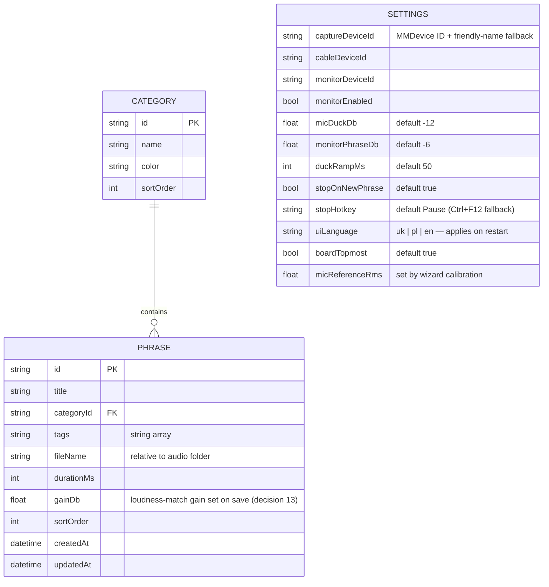

# 04 — Модель даних та локальне сховище

## 1. Модель даних



### Приклад `library.json`

```jsonc
{
  "version": 1,
  "categories": [
    { "id": "c1", "name": "Greeting", "color": "#4F8EF7", "sortOrder": 0 }
  ],
  "phrases": [
    {
      "id": "p-7f3a",
      "title": "Hello, how can I help?",
      "categoryId": "c1",
      "tags": ["opening"],
      "fileName": "p-7f3a.wav",
      "durationMs": 2350,
      "gainDb": -2.4,
      "sortOrder": 0,
      "createdAt": "2026-06-09T10:00:00Z",
      "updatedAt": "2026-06-09T10:00:00Z"
    }
  ]
}
```

Нотатки:

- Аудіопристрої зберігаються за **MMDevice ID з резервом за дружньою назвою (friendly-name)** — це
  переживає переенумерацію/перенумерацію пристроїв Windows після перезавантажень чи перепідключень USB (класичний
  режим відмови аудіозастосунків). Якщо не збігається жоден, застосунок запитує, а не вгадує.
- `gainDb` встановлюється автоматично при збереженні: recorder зіставляє гучність дубля з
  відкаліброваним майстром еталоном RMS живого мікрофона (`micReferenceRms`), тож фрази та її живий голос
  досягають клієнта на однаковому сприйнятому рівні (рішення #13).
- Поле гарячої клавіші для окремої фрази навмисно відсутнє у v1 (відкладене рішення); схема
  несе поле `version`, тож додавання його пізніше — це міграція без поломок.

## 2. Структура папок

```
%LOCALAPPDATA%\AdaVoice\          (root configurable in settings)
├── library.json                  metadata (atomic write: tmp + rename)
├── settings.json
├── audio\                        p-{id}.wav — 48 kHz / 16-bit / mono PCM
│                                 deleted-{id}.wav — orphaned recordings (kept, see §3)
├── backups\                      adavoice-backup-YYYY-MM-DD.zip (daily, keep 7)
└── logs\                         app-YYYYMMDD.log (Serilog rolling)
```

## 3. Правила збереження

- **Атомарні записи:** метадані записуються у тимчасовий файл і перейменовуються поверх оригіналу —
  збій посеред збереження ніколи не може пошкодити `library.json`.
- **Видалення = «сирота», ніколи не знищення:** видалення показує діалог підтвердження, прибирає запис
  метаданих і перейменовує WAV на `deleted-{id}.wav` на місці. Голосові записи
  незамінні; вартість диска на цьому масштабі — нуль. Без підсистеми кошика, без таймера очищення —
  «сироти» просто виключаються з бібліотеки та ручних експортів, але **включаються до
  щоденних резервних копій**. (Прибрано з первісного дизайну з кошиком + 30-денним очищенням в огляді
  2026-06-10.)
- **Перезапис:** новий дубль записується поруч; старий файл стає «сиротою» лише після
  успішного збереження нового (атомарна заміна).
- **Валідація при запуску:** кожен запис метаданих перевіряється проти файлової системи; відсутні чи
  пошкоджені файли позначають фразу як зламану в UI, а не падають.

## 4. Резервне копіювання / експорт / імпорт

| Операція | Поведінка |
|---|---|
| Автоматичне резервне копіювання | Щоденний zip із `library.json` + `settings.json` + **`audio\`** до `backups\`, зберігати останні 7. Аудіо — незамінні дані (її голос) — при десятках MB усього, виключення його нічого не економило б |
| Ручний експорт | Один `.zip` метаданих + активних фраз у `audio\` («сироти» виключені), призначення обирає користувач |
| Імпорт | Валідує версію схеми, потім користувач обирає **merge** (пропустити дублікати ID) або **replace** |
| Шифрування | Не у v1 — резервні копії є звичайними zip; задокументовано в [07-risks-security.md](07-risks-security.md). Зашифрований експорт — майбутнє покращення |

## 5. RAM-кеш фраз

Згідно з підтвердженим рішенням (кілька десятків фраз × 5–15 с): **усі фрази заздалегідь декодуються в
масиви float 48 kHz** (~3 MB на 15-секундну фразу, ≈ 100 MB у найгіршому випадку). Без потокового шляху,
без витіснення кешу у v1 — це гарантує нуль дискового I/O на гарячому шляху відтворення.

**Декодування виконується у фоновому потоці при запуску** (рішення з perf review): вікно та
аудіорушій з'являються негайно; кнопки фраз показують приглушений/завантажувальний стан і активуються
по черзі в міру завершення кожного декодування (зазвичай < 1 с на SSD, але запуск ніколи не блокується на
холодному чи зайнятому диску).
