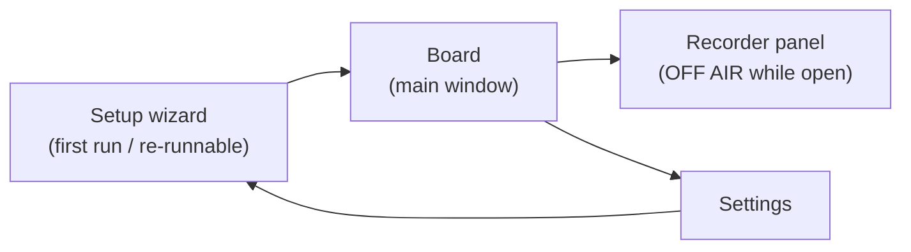

# 05 — Проєкт інтерфейсу WPF та локалізація

Мета дизайну: операторка під тиском часу, посеред дзвінка, з Chrome у фокусі більшу частину дня.
Великі цілі (targets), постійна видимість статусу, паніка-стоп в одне натискання, вікно завжди досяжне.
Найкращий результат — невидимість: вона перестає помічати, що застосунок існує.

Джерело правди дизайну: [`09-design-system.md`](09-design-system.md) (токени, шкала шрифтів,
тема). Цей документ описує екрани; система дизайну описує, з чого вони побудовані.

## 0. Візуальна система (короткий виклад — канонічна в 09-design-system.md)

- **Тема:** бібліотека WPF-UI (Fluent / стиль Windows 11, MIT), **фіксована темна тема**
  (рішення: уподобання операторки; одна палітра, перевірена один раз).
- **Типографіка:** Segoe UI Variable (платформна угода). Шкала (DIPs): заголовки вікон/секцій
  20/16 semibold, назва кнопки фрази 16 semibold, рядок статусу 14 ALL-CAPS,
  метадані/тривалість 12. Поріг: нічого нижче 12; елементи статусу ніколи нижче 14.
- **Токени статусу** (темні поверхні, контраст ≥ 4.5:1 проти `#1F1F1F`):
  `LIVE` зелений `#54D262`, `OFF AIR` бурштиновий `#F2A33C`, `DEGRADED` червоний `#FF6B6B`
  (також використовується для STOP), поверхні `#1F1F1F` вікно / `#2B2B2B` піднята, текст `#F0F0F0`
  основний / `#A0A0A0` другорядний, акцент `#4CC2FF` (лише інтерактивні підсвічування).
- **Відступи:** сітка 4 px (контроли з padding 8/12/16). **Радіус кутів:** 4 px усюди.
- **Кольори категорій:** показані як маленька крапка лише в rail категорій. Кнопки фраз лишаються
  нейтральними — без кольорових рамок (спокійна ієрархія поверхонь; картки з кольоровим краєм — це відомий
  генеричний AI-патерн).
- **Довгий текст:** назви фраз обрізаються до 2 рядків з трикрапкою, повна назва в підказці.
  Назви категорій обрізаються до 1 рядка. Усі підписи розраховані на найдовшу локаль (польську).

## 1. Головне вікно («Board»)

```
┌──────────────────────────────────────────────────────────┐
│ [🔍 Search…]              📌 Engine ● LIVE     Mic ▮▮▮   │
├───────────┬──────────────────────────────────────────────┤
│ ●Greeting │  ┌─────────────┐ ┌─────────────┐ ┌─────────┐ │
│ ●Payment  │  │ Hello, how…  │ │ One moment  │ │ Thank   │ │
│ ●Shipping │  │ 0:02         │ │ 0:03        │ │ you…    │ │
│ ●Closing  │  └─────────────┘ └─────────────┘ └─────────┘ │
│ + New     │   (large buttons, 3 per row in Full layout;   │
│           │    the playing one glows + progress ring)     │
├───────────┴──────────────────────────────────────────────┤
│ ▶ Playing: "One moment please"  ████░░ 0:02/0:03         │
│ [⏹ STOP (Pause)]      [🎙 Record]  [⚙ Settings]          │
└──────────────────────────────────────────────────────────┘
```

- **Завжди поверх інших вікон за замовчуванням** (`Topmost`, перемикач 📌, рішення #16): вона пристиковує AdaVoice
  поруч із повноекранним Chrome/Zoho і ніколи не шукає вікно посеред дзвінка.
- **Кнопки фраз ≥ 96 px заввишки**, назва (обрізання до 2 рядків) + тривалість; кнопка під час гри світиться
  (акцентне кільце + прогрес); кнопки в очікуванні декодування — за таблицею станів нижче.
- **Рядок статусу завжди видимий:** стан рушія (кольоровий токен LIVE / OFF AIR / DEGRADED /
  STOPPED, ≥14 DIP caps), живий індикатор мікрофона, поточна фраза + прогрес, велика STOP.
- Лівий rail: категорії з кольоровою крапкою + лічильником. Фрази переміщуються між категоріями через
  діалог редагування (перетягування прибрано в огляді 2026-06-10).
- Зверху: поле пошуку — фільтрація під час набору по назві й тегах.

### Розміри вікна — два іменовані компонування

| Компонування | Ширина | Поведінка |
|---|---|---|
| **Full** | ≥ 720 px | Rail категорій видимий, сітка фраз у 3 колонки |
| **Docked** | 420–719 px | Rail згортається у dropdown категорій над сіткою, сітка у 2 колонки, рядок статусу та STOP без змін (ніколи не згортаються) |

- **Мінімальний розмір вікна: 420 × 560.** Зміна розміру нижче мінімуму заблокована.
- Docked — це *основне* реальне компонування (смуга поруч із повноекранним Chrome на
  ноутбуці 1366×768); проєктуйте й тестуйте його першим, а не як запізнілу думку.
- Поважає масштабування дисплея ОС (per-monitor DPI aware); усі розміри в DIPs.

### Поріг доступності

- Контраст ≥ 4.5:1 для всього тексту; кольори статусу перевірені на темних поверхнях.
- Цілі кліку: кнопки фраз ≥ 96 px; кожен інший інтерактивний контрол ≥ 32 px.
- Досяжно з клавіатури: кожна дія доступна без миші (див. §3).
- `AutomationProperties.Name` на всіх контролах (дешево; вмикає інструментарій ОС).

## 2. Стани взаємодії (що вона БАЧИТЬ)

| Функція | LOADING | EMPTY | ERROR | SUCCESS | PARTIAL |
|---|---|---|---|---|---|
| Сітка дошки (перший запуск) | — | **Продуманий вітальний екран:** «Ваша дошка фраз порожня. Запишіть свою першу фразу — це займає 30 секунд.» + основна кнопка Record + підказка про тестовий дзвінок (§4 крок 9) | — | — | — |
| Сітка дошки (декодування при запуску) | Кнопки видимі з назвою, але приглушені (40% непрозорості) + малий спінер замість тривалості; активуються по черзі в міру завершення декодувань | — | Зламана фраза: кнопка показує ⚠ + підзаголовок «file missing», клік відкриває діалог ремонту (перезаписати / прибрати) | — | Деякі декодовані, деякі в очікуванні — придатні до гри повністю підсвічені |
| Пошук | — | «Жодна фраза не відповідає '{query}'» + у один клік **Clear search** | — | — | — |
| Категорія (порожня) | — | «У {category} ще немає фраз.» + кнопка запису в цю категорію | — | — | — |
| Recorder | Індикатор рівня наживо під час запису; «Processing…» ≤ 1 с після Stop (обрізання+гучність) | — | Мікрофон не дає сигналу 3 с → вбудоване «No signal from microphone — check connection»; диск повний → блокувальний діалог, дубль відкинуто | Toast «Saved ✓ — {title}» 2 с, поля панелі скидаються для наступного дубля | — |
| Перевірки майстра | Кожен рядок перевірки: спінер → ✓/✗ з підказкою-виправленням | — | Невдала перевірка: червоний рядок + посилання «Fix it» + кнопка Re-check; Next вимкнено до проходження чи явного «skip anyway» | Усе зелене → Next увімкнено | Деякі перевірки пройдено — невдалі перелічені першими |
| Калібрація | Кільце відліку 5 с, поки вона говорить | — | Надто тихо (< придатного RMS): «Ми ледь вас почули — підсуньтеся ближче й повторіть» | «Рівень голосу захоплено ✓» | — |
| Зміна пристрою в Settings | Коротке вбудоване «Switching device…» | — | Не вдалося відкрити пристрій → вбудована помилка + авто-повернення до попереднього пристрою | Індикатор показує живий сигнал на новому пристрої | — |
| Резервне копіювання/експорт | Смуга прогресу в рядку Settings | — | Toast «Backup failed: {reason}», посилання на лог | Toast «Backed up ✓ {date}» / експорт показує шлях до файлу | — |

Порожні стани — це функції: кожен із них вище називає, для чого простір, і пропонує
єдину очевидну наступну дію.

## 3. Клавіатура передусім (всередині застосунку)

| Клавіша | Дія |
|---|---|
| `/` | Фокус на пошук |
| Стрілки | Навігація по сітці фраз |
| `Enter` | Грати сфокусовану фразу |
| `Esc` | Зупинити відтворення |
| `Pause` | Глобальна зупинка (працює загальносистемно, зокрема коли Chrome у фокусі) |

Глобальні гарячі клавіші для окремих фраз **відкладено** (рішення #8); дошка Topmost + клавіші в застосунку
мають бути достатньо швидкими для v1. Підтверджується на пілоті з операторкою після Фази 3 (рішення #20).

## 4. Екрани



### Панель Recorder — правило OFF AIR (рішення #11)

**Запис під час дзвінків не дозволено, і застосунок це гарантує:** відкриття Recorder
призупиняє вивід кабелю (її мікрофон перестає досягати дзвінка) і показує на всю ширину
банер **OFF AIR** (бурштиновий токен); закриття панелі відновлює попередній живий стан.
Запис і перебування в ефірі взаємовиключні за дизайном.

- Індикатор рівня пристрою з попередженням про кліпінг, кнопки Record / Stop.
- Легкий попередній перегляд хвилі (waveform) дубля.
- Обробка при збереженні: обрізання тиші (увімк), **зіставлення гучності з відкаліброваним еталоном
  живого мікрофона** (встановлює `gainDb`; стеля піку −3 dBFS), згідно з рішенням #13.
- Поля: назва, категорія, теги. Save / discard. Перезапис тримає старий дубль до збереження.
- Попереднє прослуховування завжди грає на пристрій **монітора** — ніколи в кабель.
- Стани за таблицею §2 (no-signal, disk-full, saved-toast).

### Settings — згрупована IA (часте першим, небезпечне останнім)

| Група | Зміст | Нотатки |
|---|---|---|
| **1. Levels** | Слайдер притишення мікрофона, слайдер монітора фрази (обидва наживо), перезапуск калібрації голосу | Єдина група, якої вона торкається регулярно — вгорі сторінки |
| **2. Behavior** | Перемикач «новий тригер зупиняє поточну», перемикач «дошка завжди поверх», перепризначення гарячої клавіші зупинки (живе натискання для тесту, конфлікт показано вбудовано) | |
| **3. Language & Backup** | Мова інтерфейсу (Українська / Polski / English — застосовується після перезапуску, діалог пропонує «Restart now»), експорт, імпорт, відкрити папку резервних копій | |
| **4. Devices & Routing** | Селектори мікрофона / кабелю / монітора з живими індикаторами, «Run routing test» (повторно відкриває самотест майстра) | Візуально відокремлено + кожна зміна пристрою запитує одне підтвердження («Перемикання може перервати потік дзвінка — продовжити?»), бо ця група може вбити шлях дзвінка |

### Майстер налаштування

1. Виявлення VB-CABLE → посилання на офіційне завантаження, якщо відсутній → повторна перевірка.
2. **Перевірки середовища** (кожен рядок: спінер → ✓/✗ + підказка-виправлення, за §2):
   приватність мікрофона дозволяє десктопні застосунки; спільний формат CABLE = 48 kHz (пропонує виправлення);
   **вивід за замовчуванням ≠ CABLE Input** (і перевірка осудності комунікаційного пристрою); сесія AdaVoice
   не приглушена у Volume Mixer; Sound → Communications = «Do nothing» (резерв рішення #12).
3. Вибір пристрою (мікрофон / кабель / монітор) з індикаторами.
4. **Калібрація голосу:** «говоріть нормально 5 секунд» → зберігає `micReferenceRms`
   (рішення #13), зі станом повтору при надто тихому.
5. **Перевірка гарячої клавіші зупинки:** підтверджує наявність `Pause`, живе натискання для тесту; резервний `Ctrl+F12`
   (рішення #10).
6. Крок з інструкцією зі скриншотами: встановити мікрофон Chrome/Zoho на **CABLE Output**.
7. Loopback-самотест: говоріть → підтвердьте сигнал на кабелі; програйте тестовий тон → підтвердьте.
8. Згадує налаштування затримки в панелі керування VB-CABLE (тримається на типовому, якщо вимірювання Фази 0
   не вказали інакше).
9. **Картка впевненості в першому дзвінку (фінальний екран):** «Перед першим дзвінком клієнту зробіть
   тестовий дзвінок» — чек-лист з 3 пунктів: зателефонуйте на власний телефон чи другу через Zoho; програйте дві
   фрази; підтвердьте, що вони звучать природно й рівні відповідають вашому голосу. Вітальний екран порожньої дошки
   (§2) повторює цю підказку після того, як вона запише свої перші фрази. Це продуманий
   міст через найстрашніший момент у продукті: довіритися йому на справжньому клієнті.

## 5. Локалізація (UA / PL / EN)

- Усі рядки UI містяться у статичних файлах ресурсів `.resx` (`Strings.uk.resx`, `Strings.pl.resx`,
  `Strings.en.resx`); **без жорстко закодованих рядків у XAML** — діє з першого коміту.
- Мова обирається в Settings і **застосовується після перезапуску** (рішення #6).
- *Вміст* фраз (назви, аудіо) — власний операторки будь-якою мовою — локалізується лише
  обрамлення (chrome) застосунку. Тест повноти ресурсів стверджує, що кожен ключ існує в усіх трьох
  мовах (див. [08-testing.md](08-testing.md)).
- Компонування використовує динамічні розміри (без підписів фіксованої ширини); польські рядки задають розмір боксів.
- Голос копірайту: утилітарна мова — орієнтація, статус, дія. Без настроєвого копірайту, без маркетингу.

## 6. Поведінка статусу й тривоги

| Стан рушія | UI | Аудіо |
|---|---|---|
| LIVE | Зелена крапка-токен + «LIVE», індикатори активні | — |
| OFF AIR (Recorder відкрито) | Бурштиновий банер на всю ширину «OFF AIR — recording mode» | — |
| DEGRADED (пересилання мікрофона лежить, перебудова) | Червоний банер через усю дошку, спалах на панелі завдань | Тон тривоги на **системному пристрої виводу за замовчуванням** — незалежно від налаштування монітора; вона мусить знати, що клієнт її не чує |
| STOPPED | Приглушений UI, дошка вимкнена, підказка налаштування | — |
