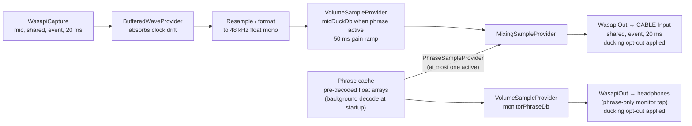
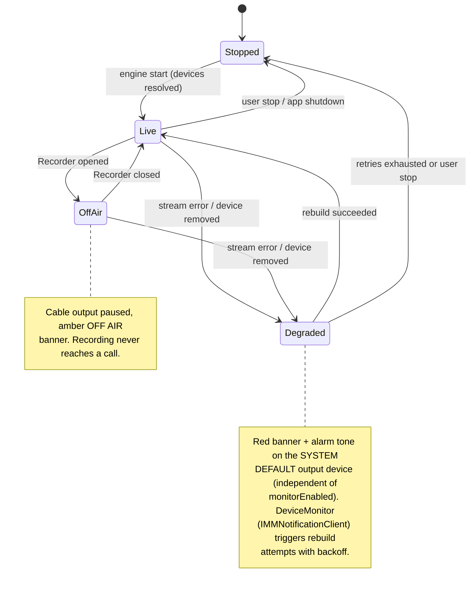
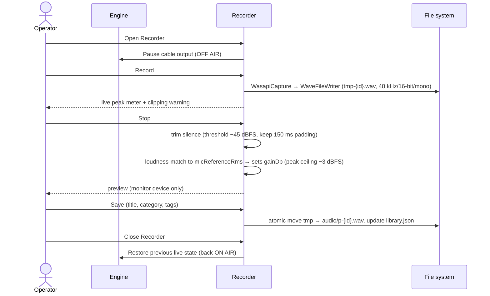

# 06 — Аудіорушій, рушій запису, гарячі клавіші

## 1. Граф рушія

Внутрішній формат: **48 kHz / 32-bit float / mono**, конвертується на краях (підмікшується до stereo
на виході в cable, якщо пристрій очікує stereo).

### Захист на рівні сесії

- Обидві render-сесії (cable + monitor) викликають
  `IAudioSessionControl2::SetDuckingPreference(optOut: true)` після старту потоку —
  інакше Windows приглушує їх у момент, коли Chrome відкриває комунікаційний потік, тобто
  саме тоді, коли починається дзвінок (рішення #12). NAudio це не обгортає; це COM
  interop shim приблизно на 30 рядків. Зверніть увагу на задокументоване обмеження: налаштування набуває чинності при
  (пере)старті потоку, тому воно застосовується як частина ініціалізації потоку.
- Застосунок викликає `RegisterApplicationRestart` під час старту, щоб Windows перезапускав його після
  збою (рішення #18) — цей процес є шляхом мікрофона оператора; він не повинен лишатися мертвим.

### Поведінка на гарячому шляху (hot-path)

- **Старт фрази:** усі фрази декодуються в RAM заздалегідь (фоновий потік під час старту;
  кнопки активуються в міру завершення декодування — див. 04 §5). Тригер = додати один `PhraseSampleProvider` до
  мікшера → чутно протягом одного-двох буферів по 20 ms. Без відкриття пристрою, без дискового I/O.
- **Стоп:** позначити provider як завершений із **лінійним fade-out на 10 ms** (уникає клацань),
  мікшер видаляє його. Потоки пристроїв ніколи не розбираються при тригері/стопі.
- **Правило одного відтворення:** рушій тримає щонайбільше один вхід фрази. Новий тригер
  **замінює** поточну фразу (підтверджено за замовчуванням) або ігнорується (перемикач у налаштуваннях).
- **Приглушення (ducking):** поки фраза активна, гілка мікрофона плавно опускається до `micDuckDb` за
  `duckRampMs` (50 ms за замовчуванням) і повертається назад після завершення/стопу. Обидва значення
  регулюються наживо з Settings. (Застереження: AGC у Chrome нижче за потоком може частково протидіяти
  сприйнятому приглушенню — див. 02 §4; значення за замовчуванням налаштовані проти вихідного сигналу після AGC у Phase 0.)
- **OFF AIR (рішення #11):** вхід у режим запису повністю призупиняє гілку виходу в cable;
  monitor лишається доступним для попереднього прослуховування. Відновлюється при закритті Recorder.

### Бюджет затримки — latency (цілі на боці застосунку — A11: не перевірено до Phase 0)

| Етап | Бюджет |
|---|---|
| Диспетчеризація тригера (UI/hotkey → черга рушія) | < 5 ms |
| Підхоплення мікшером (наступний render callback) | ≤ 20 ms |
| WASAPI render buffer | 20 ms |
| **Тригер на боці застосунку → cable** | **≈ 40–45 ms** (жорстка стеля 100 ms) |

Наскрізна передача (passthrough, голосовий шлях): capture buffer 20 ms + мікшер ≤ 20 ms + render buffer 20 ms ⇒
**ціль ≤ 60 ms доданих, жорстка стеля 80 ms, на боці застосунку**.

**Ці числа не включають власну внутрішню буферизацію VB-CABLE** (драйвер за замовчуванням "max latency"
— це тисячі семплів, десятки ms, регулюється лише в його панелі керування) **та буферизацію
захоплення WebRTC у Chrome.** Тому Phase 0 вимірює **mouth-to-Chrome end-to-end**
(говорити → loopback-запис того, що отримує Chrome), а не лише внутрішній час застосунку, і
розміри буферів плюс налаштування затримки VB-CABLE підбираються з цього вимірювання. Майстер
документує налаштування cable в його панелі керування (05 §2).

### Дрейф годинника (clock drift) і політика буфера

Захоплення (capture) і відтворення (render) працюють на різних годинниках пристроїв. Політика в обох напрямках:

- **Overrun** (захоплення швидше): якщо буфер перевищує ~100 ms, відкинути найстаріші семпли і
  залогувати. Чутно як невеликий пропуск у її живому голосі; повторення логуються, щоб Phase 0/1 могли
  виміряти частоту.
- **Underrun** (відтворення швидше): вставити тишу замість відсутніх семплів і залогувати. Чутно як
  коротка пауза; те саме логування.
- Якщо будь-яка з цих подій повторюється часто (> кількох разів на годину), це знахідка Phase 1 для виправлення
  (розмір буфера або повільно-адаптивний resampler, прив'язаний до заповнення буфера) — а не щось, навколо чого слід
  тихо обходити при випуску. Очікувана частота збоїв документується після вимірювання Phase 0.

## 2. Машина станів рушія

- `DeviceMonitor` реалізує `IMMNotificationClient` — події додавання/видалення/зміни пристрою за замовчуванням
  запускають цільові перебудови потоків (тільки відповідний потік, а не весь граф).
- Серцебиття сторожового таймера (watchdog) виявляє зависання render callback (немає запиту понад 500 ms) і примусово
  виконує перебудову.
- Головне правило: **рушій ніколи не повинен бути тихо мертвим.** Будь-який стан, у якому мікрофон
  не передається, гучно сигналізується — і шлях тривоги (системний пристрій за замовчуванням)
  не залежить від того, чи увімкнено та чи справний опціональний потік monitor.

## 3. Рушій запису

- **Узгодження гучності (рішення #13):** лише пікова нормалізація робить так, що фрази та живий
  голос відрізняються за сприйнятою гучністю (пік ≠ гучність), створюючи чутні стрибки рівня на
  кожній межі фрази. Натомість recorder обчислює RMS дубля і встановлює `gainDb` так,
  щоб він відповідав каліброваному майстром референсу живого мікрофона (`micReferenceRms`), з піковою стелею −3 dBFS.
  Калібрування можна перезапустити з Settings (наприклад, після зміни мікрофона).
- Свідомо **без DSP шумозниження у v1** (за брифом: не перевиконувати інженерію). Тиха
  кімната і пристойна дротова гарнітура кращі за програмне очищення. Лише простий trim + узгодження гучності.
- Перезапис зберігає старий файл, доки новий дубль не збережено; старий файл потім стає
  сиротою (orphan) (04 §3).
- Перевірка вільного місця на диску перед записом; збій writer чисто перериває дубль із повідомленням.

## 4. Система гарячих клавіш (обсяг MVP)

- Механізм: Win32 `RegisterHotKey` на прихованому `HwndSource`; `WM_HOTKEY` диспетчеризується до
  `HotkeyService`. Системного рівня — спрацьовує, поки Chrome у фокусі. Без low-level keyboard hook
  (менш нав'язливо, дружніше до антивірусів).
- **MVP реєструє рівно одну глобальну гарячу клавішу: аварійний стоп, за замовчуванням `Pause`** (рішення
  #10). `Ctrl+Space` було відхилено: на тримовній машині воно конфліктує з перемиканням IME/розкладки,
  а кнопка паніки не може жити на спірних клавішах. Майстер перевіряє, що клавіша
  `Pause` існує (відсутня на деяких компактних ноутбуках) живим натисканням для тесту і пропонує
  `Ctrl+F12` як запасний варіант. Можна перепризначити в Settings.
- Збій реєстрації (комбінацію зайняв інший застосунок) показується вбудовано в Settings,
  ніколи тихо.
- Майбутнє (після MVP): слоти гарячих клавіш на фразу, редактор конфліктів, опціональне уникнення
  push-to-talk клавіші платформи. Інтерфейс `HotkeyService` спроєктовано для N гарячих клавіш з
  першого дня, тому це адитивно.
