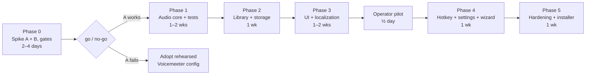

# AdaVoice — Дорожня карта реалізації MVP

Шар стратегії: **який порядок, як довго, які перешкоди go/no-go.** Повний дизайн:
[`../design/`](../design/README.md). Деталі виконання:
[план реалізації](../plans/implementation-plan.md). Перешкода релізу:
[план готовності до продакшну](../plans/production-readiness-plan.md). Живий статус:
[handoff.md](../../handoff.md).

**Статус (2026-06-13): дизайн завершено і пройдено eng-review; код spike Phase 0 написано, але ще не
запущено на обладнанні; виробничого коду застосунку чи scaffolding ще не існує.**

## Мета

WPF/.NET 10 застосунок: записувати фрази голосом оператора, організовувати їх і відтворювати у
віртуальний мікрофон (VB-CABLE) під час живих дзвінків Zoho CRM у Chrome, з безперервною наскрізною передачею (passthrough)
реального мікрофона і миттєвим стопом. Local-first, offline, у масштабі solo-dev.

## Зафіксовані рішення

**Канонічна таблиця рішень — це [design 01 §4](../design/01-overview.md#4-confirmed-decisions-canonical)** (20 записів).
Критична для реалізації суть: VB-CABLE + вбудований mixer NAudio (Voicemeeter відрепетировано у
Phase 0 як відомо-робочий план B); WAV 48 kHz mono з узгодженням гучності RMS до каліброваного
референсу мікрофона; гаряча клавіша стопу `Pause`; Recorder = OFF AIR (взаємно виключно з feed
дзвінка); відмова від ducking через `SetDuckingPreference`; мова застосовується при перезапуску; Topmost
борд; видалення = orphan (без підсистеми кошика); щоденна копія включає аудіо; self-contained
.NET 10 інсталятор, непідписаний у v1.

## Чек-лист обсягу MVP

- [ ] Setup wizard: detect/verify VB-CABLE; перевірки середовища (приватність мікрофона, cable = 48 kHz, вихід за замовчуванням ≠ CABLE Input, сесію не заглушено, Communications = "Do nothing"); вибір пристрою; калібрування голосу; натискання клавіші `Pause` для тесту; інструкція Chrome/Zoho; loopback-самотест
- [ ] Аудіорушій: постійний граф capture→mix→cable за seams `IAudioCaptureDevice`/`IAudioRenderDevice`; monitor tap; приглушення (ducking) + interop відмови від ducking; правило одного відтворення; стоп-fade 10 ms; стан OFF AIR; політика дрейфу (drop-oldest / insert-silence, залоговано); відновлення після втрати пристрою; тривога DEGRADED на системному пристрої за замовчуванням; `RegisterApplicationRestart`
- [ ] Recorder: запис/перезапис, trim тиші, узгодження гучності RMS до каліброваного референсу (пікова стеля −3 dBFS), попереднє прослуховування в monitor, забезпечення OFF AIR
- [ ] Бібліотека: категорії, теги, пошук, переміщення через діалог редагування, видалення-як-orphan, JSON-репозиторій (атомарні записи)
- [ ] UI Board: великі кнопки фраз (активуються в міру фонового декодування), перемикач Topmost (за замовчуванням увімкнено), рядок статусу (стан рушія включно з OFF AIR, метр мікрофона, прогрес), великий STOP; **фіксована темна тема WPF-UI + токени за [design 09](../design/09-design-system.md)**; **макети Full + Docked (мін 420×560)**
- [ ] Стани взаємодії за design 05 §2: борд привітання при першому запуску, decode-dimmed кнопки, ремонт зламаної фрази, порожні стани пошуку/категорії, toasts збереження/копії
- [ ] Глобальна гаряча клавіша стопу `Pause` через `RegisterHotKey`, перепризначувана, з показом конфлікту, запасний `Ctrl+F12`
- [ ] Settings: згрупований IA (Levels → Behavior → Language & Backup → Devices з підтвердженням при зміні), пристрої з метрами, живі повзунки приглушення (duck), перезапуск калібрування, вибір мови (застосовується при перезапуску)
- [ ] Локалізація UA/PL/EN (статичний .resx, тест повноти)
- [ ] Резервна копія: щоденний zip із `audio\` (тримати 7), ручний export/import
- [ ] Тести за [design 08](../design/08-testing.md): машина станів, golden-file DSP, storage, services; CI з Phase 1
- [ ] Логування (Serilog) + тривоги стану рушія
- [ ] Інсталятор (Inno Setup, self-contained .NET 10) + короткий посібник користувача зі скриншотами Zoho включно з нотою SmartScreen

**Не в MVP:** гарячі клавіші на фразу, компактна always-on-top смужка (Topmost борд покриває v1), перемикання мови під час виконання, drag-and-drop, підсистема кошика/purge, експорт MP3, зашифрована резервна копія, DSP шумозниження, ланцюжки фраз, поділ на два процеси.

## Фази

### Phase 0 — Spike + людські перешкоди (2–4 дні) · найвищий ризик першим

Викидний консольний прототип (не виробничий код): наскрізна передача (passthrough) мікрофона NAudio→CABLE + мікшування WAV.

- **Перешкода дозволу A8 — вирішено (2026-06-13):** не потрібна жодна угода з роботодавцем/Zoho
  (роботодавець лояльний). Phase 0 переходить напряму до технічної валідації. Це **не**
  вирішує технічні невідомі A5/A6 (чи проводить Zoho/Chrome попередньо записану мову через
  AGC розбірливо) — вони все ще вимірюються нижче.
- Тестувати end-to-end у Chrome проти **реального дзвінка Zoho Voice** на цільовій машині.
- Виміряти **затримку (latency) mouth-to-Chrome end-to-end** (включає внутрішню буферизацію VB-CABLE і
  буферизацію захоплення Chrome — не лише внутрішній час застосунку); налаштувати затримку VB-CABLE з панелі керування,
  якщо потрібно.
- Тестова матриця включає **AGC**: чи виживає приглушення (ducking)? Чи лишаються рівні фраз сталими
  після AGC? Перевірити перемикачі `autoGainControl`/NS у Zoho/Chrome.
- Перевірити, що відмова від комунікаційного приглушення (ducking) тримається через цикли старт/стоп дзвінка.
- **Відрепетирувати запасний варіант:** переключити мікрофон Chrome на апаратну гарнітуру під час дзвінка; підтвердити, що
  Zoho застосовує його без перепідключення.
- **Spike Architecture B (~пів дня):** те саме налаштування дзвінка через Voicemeeter Banana;
  задокументувати робочу конфігурацію як відомо-робочий план B.
- **Критерії виходу / go-no-go:** фрази чітко розбірливі для дальнього кінця після AGC;
  тригер→cable на боці застосунку < 100 ms і прийнятний загальний mouth-to-Chrome; passthrough стабільний
  протягом 1 год; відмову від ducking перевірено; запасний варіант відрепетировано; B задокументовано. Збій A →
  прийняти відрепетировану конфігурацію B і перевизначити обсяг Phase 1 (рушій стискається до саундборду).

### Phase 1 — Аудіоядро + тести (1–2 тиж)

`AudioEngine`, `MicPassthrough`, `PhrasePlayer`, `Recorder`, `DeviceMonitor` за
device seams з [design 08 §1](../design/08-testing.md); машина станів
(LIVE/OFF AIR/DEGRADED/STOPPED), watchdog, логіка перебудови, політика дрейфу, відмова від ducking,
`RegisterApplicationRestart`. Unit + golden-file набори в CI.
**Вихід:** усі тести рушія/mixer/recorder з 08 §3 зелені; 8-годинний soak проходить (події дрейфу
залоговано < кількох/годину); від'єднання/під'єднання пристрою відновлюється автоматично.

### Phase 2 — Бібліотека + storage (1 тиж)

JSON-репозиторій з атомарними записами, orphaning-видалення, перевірка під час старту, щоденна резервна копія
включно з аудіо, zip export/import.
**Вихід:** набір тестів storage зелений (включно з автоматизованою симуляцією kill -9 і відновленням після пошкодження
файлу); export→import робить round-trip без втрат.

### Phase 3 — UI Board + UI Recorder + локалізація (1–2 тиж)

MVVM-екрани на темній темі WPF-UI + токенах [design 09](../design/09-design-system.md); макети Full **і Docked**;
пошук, категоризація через діалог редагування, рядок статусу + STOP, перемикач Topmost, панель recorder з
банером OFF AIR; усі стани взаємодії §2 (привітання при першому запуску, decode-dimmed, зламана фраза,
порожній пошук/категорія, toasts); статичний `.resx` UA/PL/EN + тест повноти.
**Вихід:** повний потік запис→організація→відтворення→стоп придатний у обох макетах; тест локалізації
зелений; кожен стан у таблиці 05 §2 досяжний і стилізований.

### Пілот оператора (½ дня, після Phase 3)

Контрольована сесія з реальним оператором на реальній машині (тестові дзвінки, а не клієнтські
дзвінки): розміри кнопок, значення duck за замовчуванням, робочий процес категорій, ергономіка Topmost, ясність OFF AIR.
Знахідки живлять Phase 4. **Прийняття єдиного користувача валідується тут, а не в кінці.**

### Phase 4 — Гаряча клавіша стопу + Settings + майстер (1 тиж)

Стоп через `RegisterHotKey` (`Pause` + запасний), показ конфлікту; сторінка налаштувань із живими повзунками
duck, перезапуском калібрування, метрами пристроїв; setup wizard з усіма перевірками середовища,
loopback-самотестом і карткою впевненості першого дзвінка (рішення #24).
**Вихід:** стоп спрацьовує, поки Chrome у фокусі; майстер успішно проходить на чистій Windows VM
(self-contained install, без завантаження runtime).

### Phase 5 — Загартовування + інсталятор (1 тиж)

Граничні випадки з [design 07](../design/07-risks-security.md), Serilog, інсталятор Inno Setup
(self-contained), посібник користувача (збірник запасних дій, скриншоти мікрофона Zoho, нота SmartScreen),
фінальний чек-лист ручного тесту дзвінка ([design 08 §4](../design/08-testing.md)), фоллоу-ап пілоту.
**Вихід:** оператор завершує повний реальний робочий день на AdaVoice без допомоги розробника.

**Усього: ~5.5–7.5 календарних тижнів solo**, з домінуванням Phases 0–1.

## Припущення (перенесені в реалізацію)

1. ⚠ Zoho Voice поважає вибір мікрофона Chrome і проводить попередньо записану мову розбірливо
   через NS/EC/**AGC** — **перевірено лише Phase 0** (A5/A6).
2. Дротова гарнітура на Windows 10/11 x64; адмін доступний для встановлення VB-CABLE (підтверджено).
3. Бібліотека лишається в масштабі "кілька десятків" — повне попереднє декодування в RAM безпечне (стеля ~100 MB).
4. Роботодавець/платформа дозволяє допоміжні аудіо-інструменти — **вирішено 2026-06-13: не потрібна угода
   з роботодавцем/Zoho (роботодавець лояльний); більше не перешкода** (A8).
5. VB-CABLE не можна бандлити (ліцензія) — ручне встановлення під керівництвом майстра — прийнятний UX.
6. ⚠ Усі числа затримки (latency) — це проєктні цілі на боці застосунку, доки Phase 0 не виміряє mouth-to-Chrome
   end-to-end, включно з внутрішньою буферизацією VB-CABLE (A11).

## Відкладено (беклог після MVP)

Глобальні гарячі клавіші на фразу + редактор конфліктів · компактна always-on-top смужка · ланцюжки фраз
("script player") · перемикання мови під час виконання · drag-and-drop категоризація ·
інструмент purge orphan · експорт MP3 · зашифровані резервні копії · поділ на два процеси (аудіо-сервіс
переживає збій UI) · підписання коду (якщо колись розповсюджуватиметься) · тригери Stream Deck/MIDI ·
локальна статистика використання для макета борду.

## GSTACK REVIEW REPORT

| Review | Trigger | Why | Runs | Status | Findings |
|--------|---------|-----|------|--------|----------|
| CEO Review | `/plan-ceo-review` | Scope & strategy | 0 | — | — |
| Codex Review | `/codex review` | Independent 2nd opinion | 0 | — | — |
| Eng Review | `/plan-eng-review` | Architecture & tests (required) | 1 | CLEAR (PLAN) | 22 issues (8 inside + 14 outside-voice), all resolved; 0 critical gaps |
| Design Review | `/plan-design-review` | UI/UX gaps | 1 | CLEAR (FULL) | score: 4/10 → 9/10, 7 decisions (visual system, dark theme, Docked layout, state table, Settings IA, confidence step, design-system doc) |
| DX Review | `/plan-devex-review` | Developer experience gaps | 0 | — | — |

- **CROSS-MODEL:** Eng-review поза voice (Claude fresh-context subagent; Codex CLI
  недоступний) підняв 14 знахідок; усі 14 прийнято. Design review пройшов без зовнішніх
  голосів (вибір користувача) і без макетів (немає ключа OpenAI — відстежується в [handoff.md](../../handoff.md)).
- **VERDICT:** ENG + DESIGN CLEARED — дизайн-документи, [дизайн-система](../design/09-design-system.md),
  і ця дорожня карта оновлені на місці; готово до Phase 0.

NO UNRESOLVED DECISIONS
