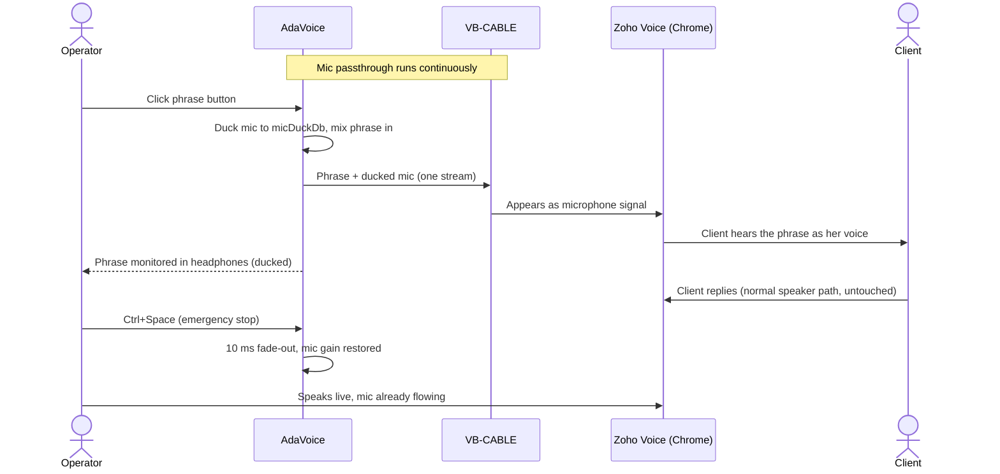

# 01 — Overview, Scope, Requirements

## 1. Executive Summary

AdaVoice is a local-first Windows desktop application for an online operator who repeats the
same spoken phrases many times per day. She records phrases once in her own voice, organizes
them into categories/scripts, and triggers them during live calls with one click. The audio is
routed so the client hears it as if spoken into her microphone, while her real voice continues
to flow normally between phrases.

The core technical constraint: **Windows provides no user-mode API to write audio into a
microphone.** A virtual audio device driver is required. AdaVoice depends on the free
**VB-CABLE** driver and implements continuous mic passthrough + phrase mixing in its own audio
engine (see [02-audio-routing.md](02-audio-routing.md)).

**Stack:** .NET 10, WPF, C#, NAudio (WASAPI), CommunityToolkit.Mvvm, JSON metadata + WAV files.
No cloud, no accounts, fully offline.

## 2. Product Scope

### In scope (v1)

- Phrase recording, re-recording, preview, rename, delete
- Categories/scripts, tags, search/filter
- Instant playback into the virtual mic; instant stop; one phrase at a time
- Continuous hardware-mic passthrough into the virtual mic with configurable ducking
- Global emergency-stop hotkey (works while Chrome has focus)
- Runtime-switchable UI language: Ukrainian / Polish / English
- Settings: audio devices, duck levels, routing test wizard
- Local storage, backup/export/import (zip)

### Out of scope (v1)

- Voice synthesis / cloning
- Call recording (the client's side is never captured)
- Multi-user / profiles
- Per-phrase hotkeys (deferred — see roadmap)
- Auto-detection of conversation context, telephony integration
- macOS / Linux

## 3. Assumptions

> All assumptions are listed here explicitly. Items marked ⚠ are unverified until the
> Phase 0 routing spike.

| # | Assumption | Basis |
|---|------------|-------|
| A1 | Windows 10 21H2+ or Windows 11 x64; admin rights available for one-time driver install | Confirmed by user |
| A2 | Single PC, single operator | Confirmed by user |
| A3 | Wired/USB headset (not Bluetooth) | Confirmed by user |
| A4 | Communication tool: Zoho CRM Web in Google Chrome (Zoho Voice / PhoneBridge softphone, WebRTC) | Confirmed by user |
| A5 | ⚠ Zoho's softphone respects Chrome's microphone device selection, so "CABLE Output" can be chosen as mic | Standard WebRTC behavior; must be verified on her account in Phase 0 |
| A6 | ⚠ Pre-recorded speech survives Chrome + Zoho echo-cancellation / noise-suppression intelligibly | Speech normally passes; double processing unverified until Phase 0 test call |
| A7 | Library: a few dozen phrases, 5–15 s each; total audio well under 1 GB | Confirmed by user |
| A8 | Employer/platform permits assistive audio tools | **Unverified** — user should confirm (see [07-risks-security.md](07-risks-security.md)) |
| A9 | VB-CABLE may be installed on the machine | Confirmed by user |
| A10 | Hotkey style preferences deferred; only global STOP needed in MVP | Confirmed by user |

## 4. Confirmed Decisions (2026-06-10)

| Question | Decision |
|----------|----------|
| Communication platform | Zoho CRM Web in Google Chrome |
| Headset | Wired |
| Mic behavior during phrase playback | Ducked; level configurable live (`micDuckDb`, default −12 dB) |
| Phrase audible in her headphones | Yes, ducked; level configurable live (`monitorPhraseDb`, default −6 dB) |
| Library size | Few dozen phrases, 5–15 s → all pre-decoded to RAM |
| UI language | Switchable UA / PL / EN at runtime, in MVP |
| VB-CABLE + admin | Approved |
| Per-phrase hotkeys | Deferred to post-MVP; global STOP stays |
| New trigger vs. current phrase | New trigger stops the current phrase (default; "ignore" mode available as toggle) |

## 5. Key User Flows

### F1 — First-time setup (once)

1. Install AdaVoice → guided setup wizard.
2. Wizard detects VB-CABLE; if missing, links to the installer and verifies after install.
3. Pick hardware mic + monitoring output (headphones). Engine starts passthrough.
4. Wizard instructs: in Chrome / Zoho, select microphone **CABLE Output**.
5. Built-in loopback test: speak → level meter shows signal on the cable side → confirm.

### F2 — Record a phrase

Recording panel → choose category → Record → speak → Stop → auto-trim silence + peak
normalization → preview → Save (title, tags).

### F3 — During a live call (critical flow)

### F4 — Reorganize library

Drag phrases between categories, edit titles/tags, delete to trash.

### F5 — Backup

Settings → Export → single `.zip` (metadata + audio). Import restores on a new PC.

## 6. Functional Requirements

| ID | Requirement |
|----|-------------|
| FR-1 | CRUD phrases: create (record), rename, delete (to trash folder), re-record |
| FR-2 | Phrase metadata: title, category, tags, duration, created/updated, file path, gain |
| FR-3 | Categories: create/rename/delete/reorder; a phrase belongs to exactly one category |
| FR-4 | Local preview playback (monitor device only, never into the call) |
| FR-5 | Live playback into virtual mic; trigger-to-audio latency < 100 ms (target ~40 ms) |
| FR-6 | Exactly one phrase at a time; new trigger stops current (default) or is ignored (toggle) |
| FR-7 | Emergency stop: global hotkey + always-visible button; effective within one audio buffer (~20 ms) with 10 ms fade |
| FR-8 | Continuous mic passthrough with live-configurable ducking while a phrase plays |
| FR-9 | Phrase playback mirrored to headphones at live-configurable monitor level |
| FR-10 | Search by title/tag, keyboard-first (type-to-filter) |
| FR-11 | Settings: capture device, virtual cable device, monitor device, duck levels, stop hotkey, UI language |
| FR-12 | Routing self-test wizard + live status indicators (mic level, cable level, engine state) |
| FR-13 | Export/import library as zip; automatic daily metadata backup |
| FR-14 | UI fully localized UA/PL/EN, switchable at runtime without restart |

## 7. Non-Functional Requirements

- **Latency:** phrase trigger → audible in cable < 100 ms; passthrough adds < 50 ms to mic path.
- **Reliability:** survives 8-hour shifts; auto-recovers from device changes; never *silently*
  stops forwarding the mic — DEGRADED state must be loudly visible/audible.
- **Footprint:** < 150 MB RAM with full phrase cache (~100 MB worst case at A7 scale).
- **Offline:** zero network calls. **Privacy:** recordings never leave the machine.
- **Install:** single installer + separate user-driven VB-CABLE install (licensing).
- **Maintainability:** MVVM, audio engine isolated behind interfaces, no driver code, solo-dev friendly.
