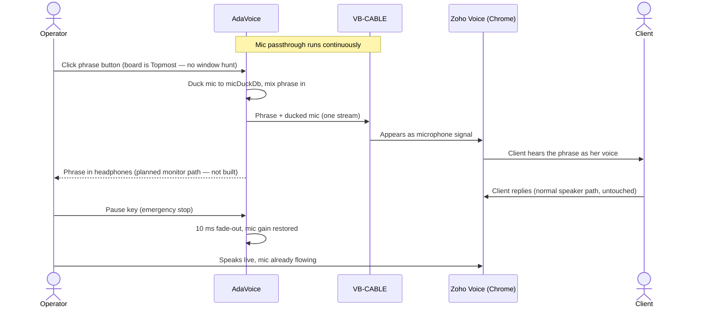

# 01 — Overview, Scope, Requirements

## 1. Executive Summary

AdaVoice is a local-first Windows desktop application for an online operator who repeats the
same spoken phrases many times per day. She records phrases once in her own voice, organizes
them into categories/scripts, and triggers them during live calls with one click. The audio is
routed so the client hears it as if spoken into her microphone, while her real voice continues
to flow normally between phrases.

The core technical constraint: **Windows provides no user-mode API to write audio into a
microphone.** A virtual audio device driver is required. AdaVoice depends on the free
**VB-CABLE** driver and implements continuous mic passthrough + phrase mixing in its own audio
engine (see [02-audio-routing.md](02-audio-routing.md)).

**Stack:** .NET 10, WPF, C#, NAudio (WASAPI), CommunityToolkit.Mvvm, JSON metadata + WAV files.
No cloud, no accounts, fully offline.

## 2. Product Scope

### In scope (v1)

- Phrase recording, re-recording, preview, rename, delete
- Categories/scripts, tags, search/filter
- Instant playback into the virtual mic; instant stop; one phrase at a time
- Continuous hardware-mic passthrough into the virtual mic with configurable ducking
- One-time voice-level calibration so phrases match her live loudness
- Global emergency-stop hotkey (works while Chrome has focus)
- Always-on-top toggle for the main board (usable beside a full-screen Chrome)
- UI in Ukrainian / Polish / English (planned — last UI slice; the app is English-only today)
- Settings: audio devices, duck levels, routing test wizard
- Local storage, daily backup (metadata **and** audio), export/import (zip)

### Out of scope (v1)

- Voice synthesis / cloning
- Call recording (the client's side is never captured)
- Multi-user / profiles
- Per-phrase hotkeys (deferred — see roadmap)
- Runtime (no-restart) language switching, drag-and-drop categorization, trash/auto-purge
  subsystem (all trimmed in review 2026-06-10 — simpler equivalents ship instead)
- Auto-detection of conversation context, telephony integration
- macOS / Linux

## 3. Assumptions

> All assumptions are listed here explicitly. Items marked ✅ were open questions that the
> Phase 0 gate verified (passed 2026-06-15).

| # | Assumption | Basis |
|---|------------|-------|
| A1 | Windows 10 21H2+ or Windows 11 x64; admin rights available for one-time driver install | Confirmed by user |
| A2 | Single PC, single operator | Confirmed by user |
| A3 | Wired/USB headset (not Bluetooth) | Confirmed by user |
| A4 | Communication tool: Zoho CRM Web in Google Chrome (Zoho Voice / PhoneBridge softphone, WebRTC) | Confirmed by user |
| A5 | ✅ Zoho's softphone respects Chrome's microphone device selection, so "CABLE Output" can be chosen as mic | Verified at the Phase 0 gate (2026-06-15) |
| A6 | ✅ Pre-recorded speech survives Chrome + Zoho audio processing intelligibly. Chrome processes mic input at the getUserMedia layer: **noise suppression, echo cancellation, and automatic gain control (AGC)**, with resampling to ~32 kHz mono on desktop. AGC is the most adversarial to this design — it can re-amplify the ducked mic and re-level phrases | Verified at the Phase 0 gate (2026-06-15) on a real Zoho call |
| A7 | Library: a few dozen phrases, 5–15 s each; total audio well under 1 GB | Confirmed by user |
| A8 | Employer/platform permits assistive audio tools | **Resolved (2026-06-13):** no agreement with the employer or Zoho is required (employer is loyal). No longer a gate; this did **not** affect the technical unknowns A5/A6, which Phase 0 measured |
| A9 | VB-CABLE may be installed on the machine | Confirmed by user |
| A10 | Hotkey style preferences deferred; only global STOP needed in MVP | Confirmed by user |
| A11 | ✅ Latency budgets were measured mouth-to-Chrome end to end (including VB-CABLE's internal buffering) | Verified at the Phase 0 gate (2026-06-15) |

## 4. Confirmed Decisions (canonical)

> **This is the single source of truth for project decisions.** Other documents link here.
> Last updated: 2026-06-10 (eng review).

| # | Question | Decision |
|---|----------|----------|
| 1 | Communication platform | Zoho CRM Web in Google Chrome |
| 2 | Headset | Wired |
| 3 | Mic behavior during phrase playback | Ducked; level configurable live (`micDuckDb`, default −12 dB) |
| 4 | Phrase audible in her headphones | **Deferred — the headphone monitor path is not built.** Planned: ducked mirror, level configurable live (`monitorPhraseDb`, default −6 dB). Today: previews play to the default output; no monitor-level setting exists |
| 5 | Library size | Few dozen phrases, 5–15 s. RAM pre-decode is a **planned optimization**; today each trigger loads the WAV from disk (fine at this library size) |
| 6 | UI language | UA / PL / EN via static `.resx`; choice applies **on restart**. Planned as the last UI slice — the app is English-only today |
| 7 | VB-CABLE + admin | Approved |
| 8 | Per-phrase hotkeys | Deferred to post-MVP; global STOP stays |
| 9 | New trigger vs. current phrase | New trigger stops the current phrase (default; "ignore" mode available as toggle) |
| 10 | Emergency-stop hotkey | **`Pause`** (not Ctrl+Space — IME/layout-switch conflict on multilingual setups); wizard verifies the key exists and tests it live; `Ctrl+F12` fallback |
| 11 | Recording vs. live call | **Recording during calls is not allowed.** Opening the Recorder takes the app OFF AIR (cable output paused, prominent banner); closing restores the live state. Enforced by design, not discipline |
| 12 | Windows communications ducking | Engine opts out programmatically (`SetDuckingPreference` interop) on its cable session (and the monitor session once that path is built); wizard also sets Sound → Communications → "Do nothing" as fallback |
| 13 | Phrase loudness | RMS/loudness-matched to a wizard-calibrated live-mic reference (sets per-phrase `gainDb`); peak ceiling −3 dBFS retained. Calibration re-runnable from Settings |
| 14 | Deletion | No trash subsystem. Delete = confirm dialog; metadata entry removed, WAV kept on disk as an orphan (renamed `deleted-{id}.wav`) — voice recordings can always be recovered |
| 15 | Backup | Daily zip includes `library.json`, `settings.json` **and `audio\`** (her voice is the irreplaceable data); keep 7 |
| 16 | Board window | Always-on-top (`Topmost`) toggle in MVP, default ON — no focus hunt mid-call |
| 17 | Architecture fallback | Voicemeeter (Option B) was **rehearsed in Phase 0**, so the fallback is known-good, not theoretical. Architecture A stays primary |
| 18 | Crash resilience | `RegisterApplicationRestart` so Windows relaunches after a crash; DEGRADED alarm plays via the **system default output device**, independent of the monitor setting |
| 19 | Installer | Inno Setup, **self-contained .NET 10** (no runtime download for a non-technical user; ~80 MB larger accepted). Code signing explicitly deferred — SmartScreen warning accepted for family use; revisit if ever distributed |
| 20 | Human gates | Employer-permission gate **removed (2026-06-13):** no employer/Zoho agreement needed (employer is loyal). The remaining gate — the supervised operator pilot after Phase 3 — **passed 2026-06-29** |
| 21 | Visual system | WPF-UI library (Fluent), **fixed dark theme**, Segoe UI Variable, tokenized status colors, 4 px grid — canonical in [09-design-system.md](09-design-system.md) (design review 2026-06-10) |
| 22 | Window layouts | One continuous layout at every width (Slice 3, resolved 2026-07-20: no category rail — a persistent rail would serve category-browsing, now the secondary workflow behind Conversations; category filter is a checkable menu button at all widths); "Full" (≥720 px) and "Docked" (420–719 px) are width labels, not separate layouts; min 420×560; Docked is the primary real-world shape |
| 23 | Interaction states | Every feature × state (loading/empty/error/success/partial) specified in [05 §2](05-ui-design.md); first-run empty board is a designed welcome with a primary action |
| 24 | First-call confidence | Wizard ends with a test-call checklist (call a friend/own phone, play 2 phrases) before the first client call — designed bridge over the peak-fear moment |

## 5. Key User Flows

### F1 — First-time setup (once)

The shipped wizard runs **four environment checks** (`EnvironmentChecks`): cable present,
cable at 48 kHz, default output is not the cable, and a mic is present. Steps marked
*(planned — v2)* are design intent, not built yet.

1. Install AdaVoice → guided setup wizard.
2. Wizard detects VB-CABLE (cable-present check); if missing, links to the installer and
   verifies after install.
3. Environment checks — shipped: CABLE format is 48 kHz; **default output device is NOT
   CABLE Input** (system sounds must not reach the client); a mic is present.
   *(Planned — v2: Windows mic-privacy check; AdaVoice-not-muted-in-Volume-Mixer check.)*
4. *(Planned — v2)* Pick hardware mic + monitoring output. Today the mic and cable are
   resolved by role at runtime; the engine starts passthrough on them.
5. Voice calibration: "speak normally for 5 seconds" → live-mic RMS reference stored.
6. Stop-hotkey check: verifies `Pause` exists, live press-to-test; offers `Ctrl+F12` fallback.
7. Wizard instructs: in Chrome / Zoho, select microphone **CABLE Output**.
8. *(Planned — v2)* Built-in loopback test: speak → level meter shows signal on the cable side.
9. First-call confidence card: make a test call (own phone / friend via Zoho), play two
   phrases, confirm they sound natural — before the first client call (decision #24).

### F2 — Record a phrase

Recording panel (app goes **OFF AIR** — cable paused, banner shown) → choose category →
Record → speak → Stop → auto-trim silence + loudness-match to calibrated reference →
preview (monitor only) → Save (title, tags) → close panel → back ON AIR.

### F3 — During a live call (critical flow)

### F4 — Reorganize library

Edit dialog per phrase: change category, title, tags. Delete with confirm (file kept as orphan).

### F5 — Backup

Automatic daily zip (metadata + audio). Manual: Settings → Export → single `.zip`;
Import restores on a new PC.

## 6. Functional Requirements

| ID | Requirement |
|----|-------------|
| FR-1 | CRUD phrases: create (record), rename, delete (confirm dialog; WAV kept as orphan), re-record |
| FR-2 | Phrase metadata: title, category, tags, duration, created/updated, file path, gain |
| FR-3 | Categories: create/rename/delete/reorder; a phrase belongs to exactly one category; phrase moved via edit dialog |
| FR-4 | Local preview playback (monitor device only, never into the call) |
| FR-5 | Live playback into virtual mic; trigger-to-cable latency < 100 ms (target ~40 ms app-side; end-to-end measured at the Phase 0 gate, 2026-06-15) |
| FR-6 | Exactly one phrase at a time; new trigger stops current (default) or is ignored (toggle) |
| FR-7 | Emergency stop: global `Pause` hotkey + always-visible button; effective within one audio buffer (~20 ms) with 10 ms fade |
| FR-8 | Continuous mic passthrough with live-configurable ducking while a phrase plays |
| FR-9 | Phrase playback mirrored to headphones at a configurable monitor level (planned — monitor path not built yet) |
| FR-10 | Search by title/tag, keyboard-first (type-to-filter) |
| FR-11 | Settings: monitor device, duck level, retrigger mode, Topmost toggle, UI language (restart; English-only today), re-run calibration. Mic and cable are resolved by role at runtime, not stored; a stop-hotkey setting is planned |
| FR-12 | Routing self-test wizard + live status indicators (mic level, cable level, engine state) |
| FR-13 | Daily backup of metadata + audio (keep 7); manual export/import as zip |
| FR-14 | UI localized UA/PL/EN; language choice applies on restart (planned — last UI slice; English-only today) |
| FR-15 | Recording mode is mutually exclusive with on-air: Recorder open ⇒ cable output paused + OFF AIR banner |
| FR-16 | Voice-level calibration: wizard measures live-mic RMS; phrase saves loudness-match to it via `gainDb` |
| FR-17 | Engine opts out of Windows communications ducking on its render sessions |
| FR-18 | App registers for OS restart after crash; DEGRADED alarm plays on the system default device regardless of monitor setting |

## 7. Non-Functional Requirements

- **Latency:** phrase trigger → cable < 100 ms app-side (target ~40 ms). Passthrough adds
  **≤ 60 ms target / 80 ms hard ceiling** to the mic path, app-side. VB-CABLE internal
  buffering and Chrome capture buffering add more — the mouth-to-Chrome end-to-end number
  **was measured at the Phase 0 gate (2026-06-15)** and buffer sizes tuned then (A11).
- **Reliability:** survives 8-hour shifts; auto-recovers from device changes; never *silently*
  stops forwarding the mic — DEGRADED state must be loudly visible/audible (system default
  device, not the planned monitor).
- **Footprint:** < 150 MB RAM with the planned phrase cache (~100 MB worst case at A7 scale);
  well under that today, since phrases load from disk per trigger.
- **Offline:** zero network calls. **Privacy:** recordings never leave the machine.
- **Install:** single self-contained installer + separate user-driven VB-CABLE install (licensing).
- **Maintainability:** MVVM, audio engine isolated behind interfaces (see
  [08-testing.md](08-testing.md) for the device seams), no driver code, solo-dev friendly.
