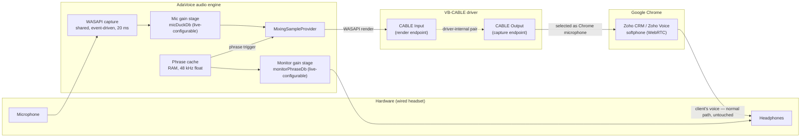

# 02 — Audio Routing to the Microphone (Core Technical Challenge)

## 1. Why this is hard

Windows audio (WASAPI / MMDevice API) strictly separates **render** endpoints (speakers,
headphones) from **capture** endpoints (microphones). Applications can play to render
endpoints and read from capture endpoints — **there is no supported user-mode API to write
samples into a capture endpoint.**

Consequence, stated honestly: **pure .NET / NAudio / WASAPI alone cannot make Chrome "hear"
our audio as a microphone.** The only way another application can receive our audio as mic
input is through a **driver** that exposes a virtual capture endpoint mirroring a playback
endpoint. This is a hard platform limitation, not a library gap.

A second, subtler problem is **mixing**: Chrome can select only *one* microphone. If Chrome's
mic is the virtual cable, the operator's real voice no longer reaches the call unless
something continuously forwards the hardware mic into that same cable. That forwarding and
mixing is the heart of AdaVoice's audio engine.

## 2. Options analysis

| # | Approach | How it works | Verdict |
|---|----------|--------------|---------|
| A | **VB-CABLE virtual cable** | Driver exposes a render endpoint ("CABLE Input") whose audio appears on a paired capture endpoint ("CABLE Output"). App plays into the render side; Chrome uses the capture side as its mic. | ✅ **Recommended.** Free (donationware), ubiquitous, stable, built exactly for this. |
| B | Voicemeeter (Banana) | Full virtual mixer: hardware mic + app audio mixed inside Voicemeeter; Chrome uses "Voicemeeter Out" as mic. AdaVoice would only play phrases to a Voicemeeter input. | Solid fallback. Mixing happens outside our app (robust), but the operator must run and configure a second, complex application. |
| C | Windows "Listen to this device" | Control Panel feature routes hardware mic → CABLE Input with no code. | Zero-code passthrough fallback, but adds 50–150 ms latency and lives in hidden, fragile OS UI. Documented as plan B only. |
| D | Write our own virtual audio driver | AVStream/ACX kernel driver or APO, WHQL-signed. | ❌ Rejected. Months of work, signing cost and process, kernel risk. Not realistic for a solo developer. |
| E | Hook the mic stream of other apps (Soundpad-style) | Code injection into other processes' audio sessions. | ❌ Rejected. Fragile, antivirus flags, broken by browser sandboxing. |

## 3. Recommended architecture (Option A + in-app mixer)

Key properties:

- Chrome's **speaker** setting stays on her headphones — the client's voice path is untouched.
- The app holds **one persistent render stream** to CABLE Input; phrases are mixed in and out
  without reopening devices → instant start/stop, no device-open latency on the hot path.
- Mic ducking (`micDuckDb`, default −12 dB, range −60…0 dB with mute floor, 50 ms ramp) and
  phrase monitor level (`monitorPhraseDb`, default −6 dB) are independent live-adjustable
  gain stages.

## 4. Browser / Zoho caveats

- Chrome's WebRTC stack applies **echo cancellation and noise suppression** to the selected
  microphone; Zoho Voice may add its own processing. Played phrases are normal human speech,
  so they are expected to pass intelligibly, but double processing can color the audio.
  **This is assumption A6 — unverified until the Phase 0 spike runs a real Zoho call.**
- Mitigations: record clean, peak-normalized (−3 dBFS) phrases; disable optional
  noise-suppression toggles in Zoho/Chrome if available.

## 5. Honest limitation: single point of failure

With Architecture A, **AdaVoice is the component forwarding her live voice.** If the app
crashes or its render stream dies, her microphone goes silent in the call.

Mitigations (details in [07-risks-security.md](07-risks-security.md)):

1. Engine watchdog with automatic stream rebuild on device errors.
2. Loud DEGRADED state: visual banner + alarm tone in headphones whenever mic forwarding is down.
3. Documented 60-second manual fallback: switch Chrome's mic back to the hardware device.
4. Documented OS-level fallback: Windows "Listen to this device" (Option C).
5. If Phase 0 or real usage shows the in-app passthrough is not reliable enough,
   fall back to Voicemeeter (Option B) — AdaVoice then becomes a plain soundboard and the
   mixing moves into Voicemeeter's own engine.

## 6. VB-CABLE licensing note

VB-CABLE is donationware and **may not be silently bundled or redistributed** with the
installer. The setup wizard links to the official download, lets the user run the install,
and verifies the device afterwards.
