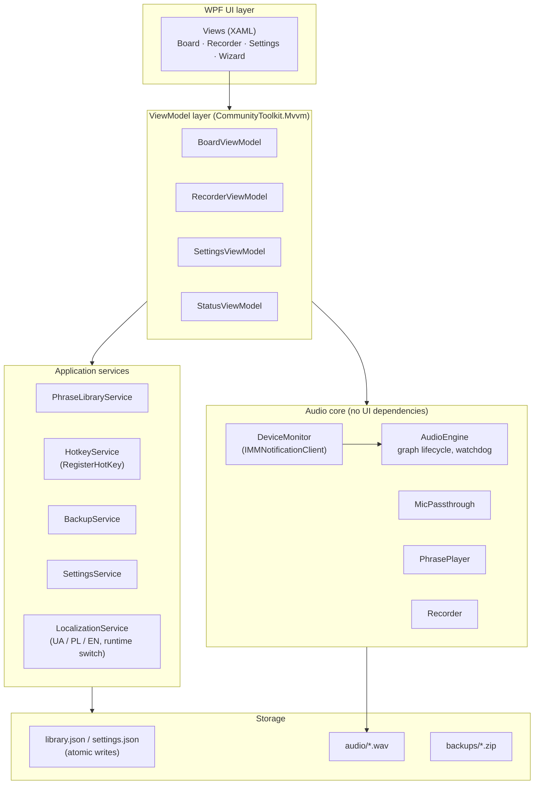

# 03 — Application Architecture & Technology Choices

## 1. Architecture overview

Single process, layered, MVVM. The audio core is UI-independent and testable.

### Rules

- **Audio core runs on dedicated threads.** The UI talks to it through a thread-safe
  command/event interface; no audio work ever runs on the WPF dispatcher.
- `AudioEngine` owns exactly three streams, all kept open for the app's lifetime:
  one capture (hardware mic), one render (CABLE Input), one optional render (headphone monitor).
- The global stop hotkey is registered system-wide so it fires while Chrome is focused.
- Storage is behind a repository interface so JSON can be swapped for SQLite without touching
  ViewModels (see alternatives below).

## 2. Technology choices

| Concern | Choice | Rationale |
|---|---|---|
| Runtime / UI | .NET 10, WPF, C# | Per project brief; mature Windows desktop stack |
| MVVM | CommunityToolkit.Mvvm | Source-generated observables/commands, lightweight |
| Audio I/O | **NAudio 2.x** | WASAPI capture/render, `MixingSampleProvider`, `WaveFileWriter`; battle-tested, MIT license |
| Virtual device | **VB-CABLE** | De-facto standard; free; cannot be bundled (user-driven install via wizard) |
| Metadata | JSON files, atomic write (tmp + rename) | Solo-dev simple, human-recoverable, trivially backed up |
| Audio format | **WAV PCM 16-bit / 48 kHz / mono** | Zero decode latency, no licensing, matches engine format. ~5.6 MB/min — irrelevant at 5–15 s per phrase. MP3 only as a future *export* option |
| Localization | `.resx` per language + `LocalizationService` | Runtime switching without restart; no hard-coded XAML strings (rule enforced from day one) |
| Hotkeys | Win32 `RegisterHotKey` via `HwndSource` | System-wide, simpler and AV-friendlier than low-level keyboard hooks |
| Logging | Serilog → rolling file | Post-hoc diagnosis of audio issues |
| Installer | Inno Setup (MSIX possible later) | Simple, supports per-user install |

### WAV vs. MP3 tradeoff (explicit)

- **WAV (chosen):** no decode step on the hot path, no patent/licensing concerns, lossless
  re-edit (re-record/trim without generation loss). Cost: ~10× disk vs. MP3 — irrelevant at
  this library size (worst case tens of MB total).
- **MP3:** saves disk nobody needs here, adds decoder dependency and quality loss on every
  re-edit. Rejected for storage; acceptable later as an export format.

## 3. Alternative architectures considered

| Alternative | When it would win | Why not now |
|---|---|---|
| Voicemeeter does the mixing (routing Option B) | If in-app passthrough proves flaky in Phase 0 or real use | Operator must manage a second complex app |
| No passthrough; Windows "Listen to this device" | Minimal app complexity | +50–150 ms latency; hidden fragile OS settings |
| SQLite instead of JSON | Library grows beyond ~1–2k phrases or rich querying appears | Overkill at few-dozen scale; repository interface keeps migration trivial |
| Two-process split (audio service + UI) | Hardening: UI crash would no longer kill the mic | Over-engineering for v1; listed as future enhancement |

## 4. Threading model

| Thread | Work |
|---|---|
| WPF dispatcher | UI only |
| WASAPI capture callback | Mic buffer fill (driver-paced, event-driven) |
| WASAPI render callback(s) | Mixer pull → cable / monitor (driver-paced) |
| Engine control thread | Start/stop/rebuild commands, device-change handling, watchdog ticks |
| Background | Library save, backup zip, log flush |

Cross-thread communication: immutable command objects into a concurrent queue (UI → engine);
engine state changes surfaced as events marshalled to the dispatcher (engine → UI).
