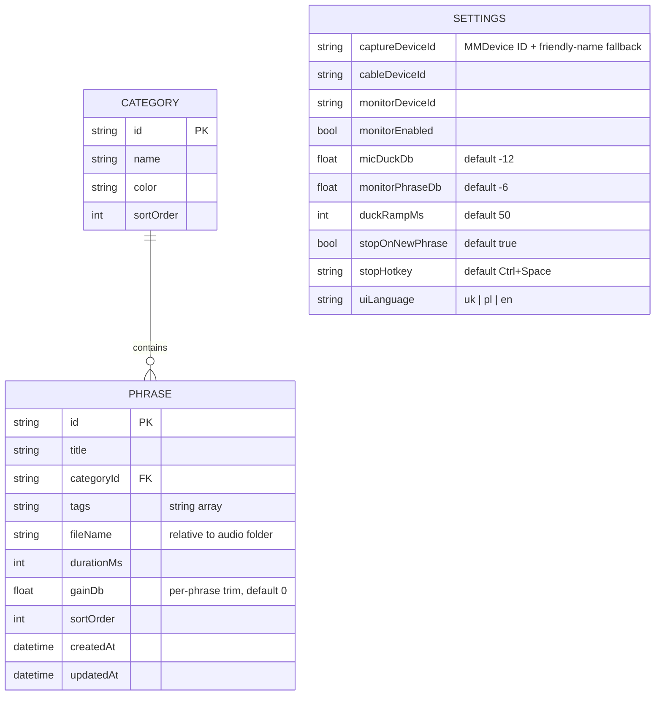

# 04 — Data Model & Local Storage

## 1. Data model



### `library.json` example

```jsonc
{
  "version": 1,
  "categories": [
    { "id": "c1", "name": "Greeting", "color": "#4F8EF7", "sortOrder": 0 }
  ],
  "phrases": [
    {
      "id": "p-7f3a",
      "title": "Hello, how can I help?",
      "categoryId": "c1",
      "tags": ["opening"],
      "fileName": "p-7f3a.wav",
      "durationMs": 2350,
      "gainDb": 0.0,
      "sortOrder": 0,
      "createdAt": "2026-06-09T10:00:00Z",
      "updatedAt": "2026-06-09T10:00:00Z"
    }
  ]
}
```

Notes:

- Audio devices are stored by **MMDevice ID with a friendly-name fallback** — this survives
  Windows re-enumerating/renumbering devices after reboots or USB replugs (a classic failure
  mode of audio apps). If neither matches, the app prompts instead of guessing.
- Per-phrase hotkey field is intentionally absent in v1 (deferred decision); the schema
  carries a `version` field so adding it later is a non-breaking migration.

## 2. Folder structure

```
%LOCALAPPDATA%\AdaVoice\          (root configurable in settings)
├── library.json                  metadata (atomic write: tmp + rename)
├── settings.json
├── audio\                        p-{id}.wav — 48 kHz / 16-bit / mono PCM
├── trash\                        deleted phrase files, purged after 30 days
├── backups\                      adavoice-backup-YYYY-MM-DD.zip (daily, keep 7)
└── logs\                         app-YYYYMMDD.log (Serilog rolling)
```

## 3. Persistence rules

- **Atomic writes:** metadata is written to a temp file and renamed over the original —
  a crash mid-save can never corrupt `library.json`.
- **Delete = move to trash:** phrase deletion moves the WAV to `trash\` and removes the
  metadata entry; trash is purged after 30 days.
- **Re-record:** the new take is written alongside; the old file moves to `trash\` only after
  the new one is successfully saved (atomic swap).
- **Startup validation:** every metadata entry is checked against the file system; missing or
  corrupt files mark the phrase as broken in the UI rather than crashing.

## 4. Backup / export / import

| Operation | Behavior |
|---|---|
| Automatic backup | Daily zip of `library.json` + `settings.json` into `backups\`, keep last 7 |
| Manual export | One `.zip` of metadata + entire `audio\` folder, user-chosen destination |
| Import | Validates schema version, then user chooses **merge** (skip duplicate IDs) or **replace** |
| Encryption | Not in v1 — backups are plain zips; documented in [07-risks-security.md](07-risks-security.md). Encrypted export is a future enhancement |

## 5. Phrase RAM cache

Per confirmed decision (few dozen phrases × 5–15 s): **all phrases are pre-decoded to
48 kHz float arrays at startup** (~3 MB per 15-second phrase, ≈ 100 MB worst case).
No streaming path, no cache eviction in v1 — this guarantees zero disk I/O on the playback
hot path and keeps trigger latency bounded by the audio buffer size alone.
