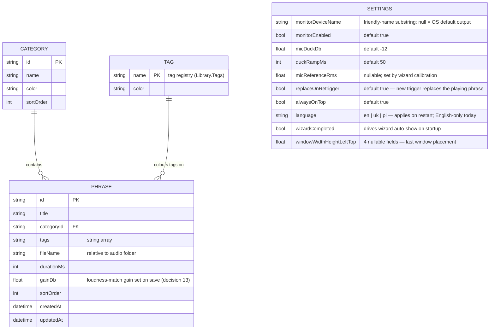

# 04 — Data Model & Local Storage

## 1. Data model



The SETTINGS block mirrors `src/AdaVoice.Core/Domain/Settings.cs`. The mic and cable devices
are **not stored**: the engine resolves them by role at runtime (see notes below). There is no
stop-hotkey or monitor-phrase-level setting yet; those land with their consumers.

### `library.json` example

```jsonc
{
  "version": 1,
  "categories": [
    { "id": "c1", "name": "Greeting", "color": "#4F8EF7", "sortOrder": 0 }
  ],
  "phrases": [
    {
      "id": "p-7f3a",
      "title": "Hello, how can I help?",
      "categoryId": "c1",
      "tags": ["opening"],
      "fileName": "p-7f3a.wav",
      "durationMs": 2350,
      "gainDb": -2.4,
      "sortOrder": 0,
      "createdAt": "2026-06-09T10:00:00Z",
      "updatedAt": "2026-06-09T10:00:00Z"
    }
  ],
  "tags": [
    { "name": "opening", "color": "#4F8EF7" }
  ]
}
```

Notes:

- The mic, cable, and alarm devices are **resolved by role at runtime**
  (`WasapiDeviceFactory`), not stored — this survives Windows re-enumerating devices after
  reboots or USB replugs (a classic failure mode of audio apps). Only the monitor device is
  persisted, as a friendly-name substring; if it is absent, previews fall back to the OS
  default output.
- The `tags` array is the tag registry (`Library.Tags`): one colour per tag name, so a tag
  keeps a stable colour across phrases. It grows as tags are used.
- `gainDb` is set automatically on save: the recorder loudness-matches the take to the
  wizard-calibrated live-mic RMS reference (`micReferenceRms`), so phrases and her live voice
  reach the client at the same perceived level (decision #13).
- Per-phrase hotkey field is intentionally absent in v1 (deferred decision); the schema
  carries a `version` field so adding it later is a non-breaking migration.

## 2. Folder structure

```
%LOCALAPPDATA%\AdaVoice\          (fixed root; making it configurable is a possible future setting)
├── library.json                  metadata (atomic write: tmp + rename)
├── settings.json
├── audio\                        p-{id}.wav — 48 kHz / 16-bit / mono PCM
│                                 deleted-{id}.wav — orphaned recordings (kept, see §3)
├── backups\                      adavoice-backup-YYYY-MM-DD.zip (daily, keep 7)
└── logs\                         adavoice-YYYYMMDD.log (Serilog rolling)
```

## 3. Persistence rules

- **Atomic writes:** metadata is written to a temp file and renamed over the original —
  a crash mid-save can never corrupt `library.json`.
- **Delete = orphan, never destroy:** deletion shows a confirm dialog, removes the metadata
  entry, and renames the WAV to `deleted-{id}.wav` in place. Voice recordings are
  irreplaceable; disk cost at this scale is zero. No trash subsystem, no purge timer —
  orphans are simply excluded from the library and from manual exports, but **included in
  daily backups**. (Trimmed from the original trash + 30-day-purge design in review
  2026-06-10.)
- **Re-record:** the new take is written alongside; the old file becomes an orphan only after
  the new one is successfully saved (atomic swap).
- **Startup validation:** every metadata entry is checked against the file system; missing or
  corrupt files mark the phrase as broken in the UI rather than crashing.

## 4. Backup / export / import

| Operation | Behavior |
|---|---|
| Automatic backup | Daily zip of `library.json` + `settings.json` + **`audio\`** into `backups\`, keep last 7. Audio is the irreplaceable data (her voice) — at tens of MB total, excluding it saved nothing |
| Manual export | One `.zip` of metadata + active phrases in `audio\` (orphans excluded), user-chosen destination |
| Import | Validates schema version, then user chooses **merge** (skip duplicate IDs) or **replace** |
| Encryption | Not in v1 — backups are plain zips; documented in [07-risks-security.md](07-risks-security.md). Encrypted export is a future enhancement |

## 5. Phrase RAM cache (planned optimization — not built)

**Current behavior:** every trigger loads the phrase's WAV from disk (`WavFile.Load` in
`EngineHost.PlayEntry`) and applies its gain before playback. At a few dozen short phrases
this is fast enough; there is no cache.

**Planned:** pre-decode all phrases to 48 kHz float arrays (~3 MB per 15-second phrase,
≈ 100 MB worst case) on a background thread at startup, with buttons enabling as each decode
completes. This would remove disk I/O from the playback hot path. Deferred until the library
size or a slow disk makes it worth building.
