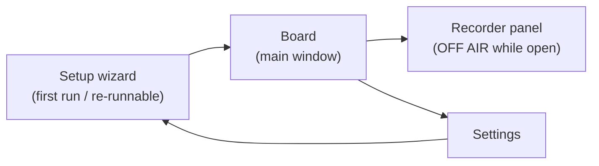

# 05 — WPF UI Design & Localization

Design goal: an operator under time pressure, mid-call, with Chrome focused most of the day.
Big targets, constant status visibility, one-keystroke panic stop, window always reachable.
The best outcome is invisibility: she stops noticing the app exists.

Design source of truth: [`09-design-system.md`](09-design-system.md) (tokens, type ramp,
theme). This document specifies the screens; the design system specifies what they're built
from.

## 0. Visual System (summary — canonical in 09-design-system.md)

- **Theme:** WPF-UI library (Fluent / Windows 11 style, MIT), **fixed dark theme**
  (decision: operator preference; one palette, verified once).
- **Typography:** Segoe UI Variable (platform convention). Ramp (DIPs): window/section
  titles 20/16 semibold, phrase-button title 16 semibold, status bar 14 ALL-CAPS,
  metadata/duration 12. Floor: nothing below 12; status elements never below 14.
- **Status tokens** (dark surfaces, contrast ≥ 4.5:1 against `#1F1F1F`):
  `LIVE` green `#54D262`, `OFF AIR` amber `#F2A33C`, `DEGRADED` red `#FF6B6B`
  (also used for STOP), surfaces `#1F1F1F` window / `#2B2B2B` raised, text `#F0F0F0`
  primary / `#A0A0A0` secondary, accent `#4CC2FF` (interactive highlights only).
- **Spacing:** 4 px grid (controls padded 8/12/16). **Corner radius:** 4 px everywhere.
- **Category colors:** shown as a small dot in the category rail only. Phrase buttons stay
  neutral — no colored borders (calm surface hierarchy; colored-edge cards are a known
  generic-AI pattern).
- **Long text:** phrase titles clamp to 2 lines with ellipsis, full title in tooltip.
  Category names clamp to 1 line. All labels sized for the longest locale (Polish).

## 1. Main window ("Board")

```
┌──────────────────────────────────────────────────────────┐
│ [🔍 Search…]              📌 Engine ● LIVE     Mic ▮▮▮   │
├───────────┬──────────────────────────────────────────────┤
│ ●Greeting │  ┌─────────────┐ ┌─────────────┐ ┌─────────┐ │
│ ●Payment  │  │ Hello, how…  │ │ One moment  │ │ Thank   │ │
│ ●Shipping │  │ 0:02         │ │ 0:03        │ │ you…    │ │
│ ●Closing  │  └─────────────┘ └─────────────┘ └─────────┘ │
│ + New     │   (large buttons, 3 per row in Full layout;   │
│           │    the playing one glows + progress ring)     │
├───────────┴──────────────────────────────────────────────┤
│ ▶ Playing: "One moment please"  ████░░ 0:02/0:03         │
│ [⏹ STOP (Pause)]      [🎙 Record]  [⚙ Settings]          │
└──────────────────────────────────────────────────────────┘
```

- **Always-on-top by default** (`Topmost`, 📌 toggle, decision #16): she docks AdaVoice
  beside a full-screen Chrome/Zoho and never hunts for the window mid-call.
- **Phrase buttons ≥ 96 px tall**, title (2-line clamp) + duration; playing button glows
  (accent ring + progress); decode-pending buttons per state table below.
- **Status bar always visible:** engine state (token-colored LIVE / OFF AIR / DEGRADED /
  STOPPED, ≥14 DIP caps), live mic meter, current phrase + progress, large STOP.
- Left rail: categories with color dot + count. Phrases move between categories via the
  edit dialog (drag-and-drop trimmed in review 2026-06-10).
- Top: search box — type-to-filter across title and tags.

### Window sizing — two named layouts

| Layout | Width | Behavior |
|---|---|---|
| **Full** | ≥ 720 px | Category rail visible, 3-column phrase grid |
| **Docked** | 420–719 px | Rail collapses to a category dropdown above the grid, 2-column grid, status bar and STOP unchanged (never collapse) |

- **Minimum window size: 420 × 560.** Below-minimum resizing is blocked.
- Docked is the *primary* real-world layout (a strip beside full-screen Chrome on a
  1366×768 laptop); design and test it first, not as an afterthought.
- Respects OS display scaling (per-monitor DPI aware); all sizes in DIPs.

### Accessibility floor

- Contrast ≥ 4.5:1 for all text; status colors verified on dark surfaces.
- Click targets: phrase buttons ≥ 96 px; every other interactive control ≥ 32 px.
- Keyboard reachable: every action available without the mouse (see §3).
- `AutomationProperties.Name` on all controls (cheap; enables OS tooling).

## 2. Interaction states (what she SEES)

| Feature | LOADING | EMPTY | ERROR | SUCCESS | PARTIAL |
|---|---|---|---|---|---|
| Board grid (first run) | — | **Designed welcome:** "Your phrase board is empty. Record your first phrase — it takes 30 seconds." + primary Record button + hint about the test call (§4 step 9) | — | — | — |
| Board grid (decode at startup) | Buttons visible with title but dimmed (40% opacity) + small spinner replacing duration; enable individually as decodes land | — | Broken phrase: button shows ⚠ + "file missing" subtitle, click opens repair dialog (re-record / remove) | — | Some decoded, some pending — playable ones fully lit |
| Search | — | "No phrases match '{query}'" + one-click **Clear search** | — | — | — |
| Category (empty) | — | "No phrases in {category} yet." + Record-into-this-category button | — | — | — |
| Recorder | Level meter live while recording; "Processing…" ≤ 1 s after Stop (trim+loudness) | — | Mic delivers no signal for 3 s → inline "No signal from microphone — check connection"; disk-full → blocking dialog, take discarded | Toast "Saved ✓ — {title}" 2 s, panel fields reset for next take | — |
| Wizard checks | Each check row: spinner → ✓/✗ with fix-it hint | — | Failed check: red row + "Fix it" link + Re-check button; Next disabled until pass or explicit "skip anyway" | All-green → Next enabled | Some checks passed — failed ones listed first |
| Calibration | 5-s countdown ring while she speaks | — | Too quiet (< usable RMS): "We barely heard you — move closer and retry" | "Voice level captured ✓" | — |
| Settings device change | Brief "Switching device…" inline | — | Device failed to open → inline error + auto-revert to previous device | Meter shows live signal on new device | — |
| Backup/export | Progress bar in Settings row | — | "Backup failed: {reason}" toast, log link | Toast "Backed up ✓ {date}" / export shows file path | — |

Empty states are features: every one above names what the space is for and offers the
single obvious next action.

## 3. Keyboard-first UX (within the app)

| Key | Action |
|---|---|
| `/` | Focus search |
| Arrows | Navigate phrase grid |
| `Enter` | Play focused phrase |
| `Esc` | Stop playback |
| `Pause` | Global stop (works system-wide, including when Chrome is focused) |

Per-phrase global hotkeys are **deferred** (decision #8); the Topmost board + in-app keys
must be fast enough for v1. Validated at the post-Phase-3 operator pilot (decision #20).

## 4. Screens



### Recorder panel — OFF AIR rule (decision #11)

**Recording during calls is not allowed, and the app enforces it:** opening the Recorder
pauses the cable output (her mic stops reaching the call) and shows a full-width
**OFF AIR** banner (amber token); closing the panel restores the previous live state.
Recording and being on air are mutually exclusive by design.

- Device level meter with clipping warning, Record / Stop buttons.
- Lightweight waveform preview of the take.
- Processing on save: trim silence (on), **loudness-match to the calibrated live-mic
  reference** (sets `gainDb`; peak ceiling −3 dBFS), per decision #13.
- Fields: title, category, tags. Save / discard. Re-record keeps the old take until saved.
- Preview always plays to the **monitor** device — never into the cable.
- States per §2 table (no-signal, disk-full, saved-toast).

### Settings — grouped IA (frequent first, dangerous last)

| Group | Contents | Notes |
|---|---|---|
| **1. Levels** | Mic duck slider, phrase monitor slider (both live), re-run voice calibration | The only group she touches routinely — top of page |
| **2. Behavior** | New-trigger-stops-current toggle, board always-on-top toggle, stop-hotkey reassignment (live press-to-test, conflict surfaced inline) | |
| **3. Language & Backup** | UI language (Українська / Polski / English — applies on restart, dialog offers "Restart now"), export, import, open backup folder | |
| **4. Devices & Routing** | Mic / cable / monitor pickers with live meters, "Run routing test" (re-opens wizard self-test) | Visually separated + each device change asks one confirm ("Switching can interrupt the call feed — continue?") since this group can kill the call path |

### Setup wizard

1. VB-CABLE detection → official download link if missing → re-verify.
2. **Environment checks** (each row: spinner → ✓/✗ + fix-it hint, per §2):
   mic privacy allows desktop apps; CABLE shared format = 48 kHz (offers fix);
   **default output ≠ CABLE Input** (and communications device sanity); AdaVoice session
   not muted in Volume Mixer; Sound → Communications = "Do nothing" (decision #12 fallback).
3. Device selection (mic / cable / monitor) with meters.
4. **Voice calibration:** "speak normally for 5 seconds" → stores `micReferenceRms`
   (decision #13), with too-quiet retry state.
5. **Stop-hotkey check:** verifies `Pause` exists, live press-to-test; `Ctrl+F12` fallback
   (decision #10).
6. Instruction step with screenshots: set Chrome/Zoho microphone to **CABLE Output**.
7. Loopback self-test: speak → confirm signal on cable; play test tone → confirm.
8. Mentions the VB-CABLE control-panel latency setting (kept at default unless Phase 0
   measurements said otherwise).
9. **First-call confidence card (final screen):** "Before your first client call, make a
   test call" — 3-item checklist: call your own phone or a friend through Zoho; play two
   phrases; confirm they sound natural and levels match your voice. The empty-board
   welcome (§2) echoes this hint after she records her first phrases. This is the designed
   bridge over the scariest moment in the product: trusting it on a real client.

## 5. Localization (UA / PL / EN)

- All UI strings live in static `.resx` resource files (`Strings.uk.resx`, `Strings.pl.resx`,
  `Strings.en.resx`); **no hard-coded strings in XAML** — enforced from the first commit.
- Language is chosen in Settings and **applies on restart** (decision #6).
- Phrase *content* (titles, audio) is the operator's own in any language — only application
  chrome is localized. A resource-completeness test asserts every key exists in all three
  languages (see [08-testing.md](08-testing.md)).
- Layout uses dynamic sizing (no fixed-width labels); Polish strings size the boxes.
- Copy voice: utility language — orientation, status, action. No mood copy, no marketing.

## 6. Status & alarm behavior

| Engine state | UI | Audio |
|---|---|---|
| LIVE | Green token dot + "LIVE", meters active | — |
| OFF AIR (Recorder open) | Full-width amber banner "OFF AIR — recording mode" | — |
| DEGRADED (mic forwarding down, rebuilding) | Red banner across the board, taskbar flash | Alarm tone on the **system default output device** — independent of the monitor setting; she must know the client cannot hear her |
| STOPPED | Dimmed UI, board disabled, setup hint | — |
