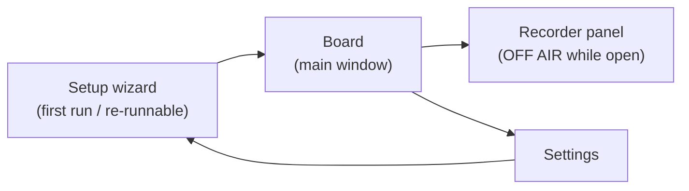

# 05 — WPF UI Design & Localization

Design goal: an operator under time pressure, mid-call, with Chrome focused most of the day.
Big targets, constant status visibility, one-keystroke panic stop, window always reachable.
The best outcome is invisibility: she stops noticing the app exists.

Design source of truth: [`09-design-system.md`](09-design-system.md) (tokens, type ramp,
theme). This document specifies the screens; the design system specifies what they're built
from.

## 0. Visual System (summary — canonical in 09-design-system.md)

- **Theme:** WPF-UI library (Fluent / Windows 11 style, MIT), **light + dark following the
  OS** (owner decision 2026-07-11; was fixed-dark before — see 09).
- **Typography:** Segoe UI Variable (platform convention). Ramp (DIPs): window/section
  titles 20/16 semibold, phrase-button title 16 semibold, status bar 14 ALL-CAPS,
  metadata/duration 12. Floor: nothing below 12; status elements never below 14.
- **Status tokens** (dark surfaces, contrast ≥ 4.5:1 against `#1F1F1F`):
  `LIVE` green `#54D262`, `OFF AIR` amber `#F2A33C`, `DEGRADED` red `#FF6B6B`
  (also used for STOP), surfaces `#1F1F1F` window / `#2B2B2B` raised, text `#F0F0F0`
  primary / `#A0A0A0` secondary, accent `#4CC2FF` (interactive highlights only).
- **Spacing:** 4 px grid (controls padded 8/12/16). **Corner radius:** 4 px everywhere.
- **Category colors:** a slim category-colour **edge marker** on a neutral tile (Studio
  Graphite, 2026-07-11 — replaced the full-fill rule). 09-design-system.md §Category colors
  is canonical.
- **Long text:** phrase titles clamp to 2 lines with ellipsis, full title in tooltip.
  Category names clamp to 1 line. All labels sized for the longest locale (Polish).

## 1. Main window ("Board")

```
┌──────────────────────────────────────────────────────────┐
│ [🔍 Search…]              📌 Engine ● LIVE     Mic ▮▮▮   │
├───────────┬──────────────────────────────────────────────┤
│ ●Greeting │  ┌─────────────┐ ┌─────────────┐ ┌─────────┐ │
│ ●Payment  │  │ Hello, how…  │ │ One moment  │ │ Thank   │ │
│ ●Shipping │  │ 0:02         │ │ 0:03        │ │ you…    │ │
│ ●Closing  │  └─────────────┘ └─────────────┘ └─────────┘ │
│ + New     │   (large buttons, 3 per row in Full layout;   │
│           │    the playing one glows + progress ring)     │
├───────────┴──────────────────────────────────────────────┤
│ ▶ Playing: "One moment please"  ████░░ 0:02/0:03         │
│ [⏹ STOP (Pause)]      [🎙 Record]  [⚙ Settings]          │
└──────────────────────────────────────────────────────────┘
```

*(Diagram shows the planned Full layout. The shipped Board uses compact filter menu
buttons instead of the left rail, and has no mic meter yet — see "Window sizing" below.)*

- **Always-on-top by default** (`Topmost`, 📌 toggle, decision #16): she docks AdaVoice
  beside a full-screen Chrome/Zoho and never hunts for the window mid-call.
- **Phrase buttons ≥ 96 px tall**, title (2-line clamp) + duration; playing button glows
  (accent ring + progress); broken phrases show the repair state (§2).
- **Status bar always visible:** engine state (token-colored LIVE / OFF AIR / DEGRADED /
  STOPPED, ≥14 DIP caps), current phrase + progress, large STOP. The live mic meter in the
  status bar is *planned — not built yet*.
- Filters: the shipped Board uses two **compact menu buttons** above the grid (redesign
  2026-07-07): **Categories** (multi-select, checkable) and **Conversations** (single-select).
  The two are mutually exclusive — picking a conversation clears the category filter. Phrases
  move between categories via the edit dialog (drag-and-drop trimmed in review 2026-06-10).
- **Conversations** (shipped 2026-07-06): an ordered phrase script selectable from the filter
  bar; the board shows its phrases in call order with a step highlight that follows playback.
  Managed in `ManageConversationsDialog`; per-conversation "random version" plays a random
  alternate take per step (see design 04).
- Top: search box — type-to-filter across title and tags, with a Clear button.

### Window sizing

**Shipped:** one layout at all widths — filter menu buttons + phrase grid.
**Minimum window size 420 × 560 is enforced** (below-minimum resizing is blocked).

The two named layouts below are a **slice-3 open item**, not built yet. Open design
decision: bring back the category rail at ≥ 720 px, or keep the single filter-bar layout and
update this doc.

| Layout (planned) | Width | Behavior |
|---|---|---|
| **Full** | ≥ 720 px | Category rail visible, 3-column phrase grid |
| **Docked** | 420–719 px | Rail collapses to a category dropdown above the grid, 2-column grid, status bar and STOP unchanged (never collapse) |

- Docked is the *primary* real-world layout (a strip beside full-screen Chrome on a
  1366×768 laptop).
- Respects OS display scaling (per-monitor DPI aware); all sizes in DIPs.

### Accessibility floor

- Contrast ≥ 4.5:1 for all text; status colors verified on dark surfaces.
- Click targets: phrase buttons ≥ 96 px; every other interactive control ≥ 32 px.
- Keyboard reachable: every action available without the mouse (see §3).
- `AutomationProperties.Name` on all controls (cheap; enables OS tooling).

## 2. Interaction states (what she SEES)

| Feature | LOADING | EMPTY | ERROR | SUCCESS | PARTIAL |
|---|---|---|---|---|---|
| Board grid (first run) | — | **Designed welcome:** "Your phrase board is empty. Record your first phrase — it takes 30 seconds." + primary Record button + hint about the test call (§4 step 9) | — | — | — |
| Board grid (startup decode — *planned; no decode phase exists today, phrases load from disk per trigger*) | Buttons dimmed + spinner, enable as decodes land (planned) | — | **Shipped:** broken phrase: button shows ⚠ + "file missing" subtitle, click opens repair dialog (re-record / remove) | — | Some decoded, some pending (planned) |
| Search | — | "No phrases match '{query}'" + one-click **Clear search** | — | — | — |
| Category (empty) | — | "No phrases in {category} yet." + Record-into-this-category button | — | — | — |
| Recorder | Level meter live while recording; "Processing…" ≤ 1 s after Stop (trim+loudness) | — | "No signal for 3 s" detection is *deferred* (no live metering capability yet); disk-full → blocking dialog, take discarded | Toast "Saved ✓ — {title}" 2 s, panel fields reset for next take | — |
| Wizard checks | Each check row: spinner → ✓/✗ with fix-it hint | — | Failed check: red row + "Fix it" link + Re-check button; Next disabled until pass or explicit "skip anyway" | All-green → Next enabled | Some checks passed — failed ones listed first |
| Calibration | 5-s countdown ring while she speaks | — | Too quiet (< usable RMS): "We barely heard you — move closer and retry" | "Voice level captured ✓" | — |
| Settings device change (*planned — Devices group deferred, §4*) | Brief "Switching device…" inline | — | Device failed to open → inline error + auto-revert to previous device | Meter shows live signal on new device | — |
| Backup/export | Progress bar in Settings row | — | "Backup failed: {reason}" toast, log link | Toast "Backed up ✓ {date}" / export shows file path | — |

Empty states are features: every one above names what the space is for and offers the
single obvious next action.

## 3. Keyboard-first UX (within the app)

The in-app shortcuts below (`/`, arrows, `Enter`, `Esc`) are **not built yet** — the
MainWindow has no KeyBindings today. The global `Pause` stop **is** shipped.

| Key | Action | Status |
|---|---|---|
| `/` | Focus search | planned |
| Arrows | Navigate phrase grid | planned |
| `Enter` | Play focused phrase | planned |
| `Esc` | Stop playback | planned |
| `Pause` | Global stop (works system-wide, including when Chrome is focused) | **shipped** |

Per-phrase global hotkeys are **deferred** (decision #8); the Topmost board + in-app keys
must be fast enough for v1. Validated at the operator pilot — passed 2026-06-29
(decision #20).

## 4. Screens



### Recorder window — OFF AIR rule (decision #11)

The recorder is a **modal window** (owner decision 2026-07-07 — it replaced the always-visible
record strip at the bottom of the Board). It opens from the Record button in the Board's filter
row, from the empty-state cards, or from a repair-dialog Re-record; clicking Record starts the
take immediately and the window shows its progress. Closing the window mid-take stops the
recorder and keeps the take pending (shown the next time the recorder opens) — audio is never
silently lost. With a take already recording or waiting, Record **reopens the recorder instead
of starting a new take** (nothing is ever overwritten); the Board's Record button lights amber
(Caution) while a take waits, so the unfinished work is visible.

**Recording during calls is not allowed, and the app enforces it:** while a take is being
captured, the cable output is paused (her mic stops reaching the call) and the **OFF AIR**
state shows — amber status pill + the OFF AIR toggle lit amber (the full-width banner was
replaced by the lit toggle, owner decision 2026-07-06); stopping the take restores the previous
live state. Recording and being on air are mutually exclusive by design.

- Device level meter with clipping warning, Record / Stop buttons.
- Lightweight waveform preview of the take.
- Processing on save: trim silence (on), **loudness-match to the calibrated live-mic
  reference** (sets `gainDb`; peak ceiling −3 dBFS), per decision #13.
- Fields: title, category, tags. Save / discard. Re-record keeps the old take until saved.
- Preview plays to the **default output** device — never into the cable. (A dedicated
  headphone-monitor device is planned — not built yet.)
- States per §2 table (no-signal, disk-full, saved-toast).

### Settings — grouped IA (frequent first, dangerous last)

The shipped Settings window has the first three groups. The phrase monitor slider and the
whole "Devices & Routing" group are **deferred**. The stop hotkey shows a **read-only
status** (which fixed candidate is active); reassignment is deferred.

| Group | Contents | Status |
|---|---|---|
| **1. Levels** | Mic duck slider (live), re-run voice calibration | Shipped. Phrase monitor slider deferred (no monitor path yet) |
| **2. Behavior** | New-trigger-stops-current toggle, board always-on-top toggle, stop-hotkey status (read-only) | Shipped. Reassignment + live press-to-test deferred |
| **3. Language & Backup** | UI language (Українська / Polski / English — applies on restart), export, import, open backup folder | Shipped. Language picker waits on the .resx retrofit (§5) |
| **4. Devices & Routing** | Mic / cable / monitor pickers with live meters, "Run routing test"; each device change asks one confirm since this group can kill the call path | **Deferred — not built yet** |

### Setup wizard

**Shipped steps:** environment checks → voice calibration → stop-hotkey status →
instruction → first-call card. The shipped environment-check step runs **4 checks**:
cable present, cable at 48 kHz, default output ≠ cable, mic present (each row: spinner →
✓/✗ + fix-it hint, per §2).

**v2 — not built yet:** device-selection step, loopback self-test, and the extra checks
(mic privacy allows desktop apps, AdaVoice session not muted in Volume Mixer,
Sound → Communications = "Do nothing" — decision #12 fallback), plus the VB-CABLE
download-link flow and control-panel latency note.

1. VB-CABLE detection — *shipped as the "cable present" check; download link v2*.
2. **Environment checks** — *shipped 4-check subset above; privacy/mixer/communications
   checks v2*.
3. Device selection (mic / cable / monitor) with meters — *v2*.
4. **Voice calibration:** "speak normally for 5 seconds" → stores `micReferenceRms`
   (decision #13), with too-quiet retry state — *shipped*.
5. **Stop-hotkey check:** shows which key is active (`Pause`, `Ctrl+F12` fallback,
   decision #10) — *shipped as read-only status; live press-to-test v2*.
6. Instruction step: set Chrome/Zoho microphone to **CABLE Output** — *shipped
   (screenshots v2)*.
7. Loopback self-test: speak → confirm signal on cable; play test tone → confirm — *v2*.
8. VB-CABLE control-panel latency note — *v2*.
9. **First-call confidence card (final screen):** "Before your first client call, make a
   test call" — 3-item checklist: call your own phone or a friend through Zoho; play two
   phrases; confirm they sound natural and levels match your voice — *shipped*. The
   empty-board welcome (§2) echoes this hint. This is the designed bridge over the
   scariest moment in the product: trusting it on a real client.

## 5. Localization (UA / PL / EN)

**Status: planned — not built yet.** Today the UI is English-only with hard-coded strings
(zero `.resx` files exist). The UA/PL/EN retrofit is the last UI slice.

- Target design: all UI strings in static `.resx` resource files (`Strings.uk.resx`,
  `Strings.pl.resx`, `Strings.en.resx`); no hard-coded strings in XAML after the retrofit.
- Language is chosen in Settings and **applies on restart** (decision #6).
- Phrase *content* (titles, audio) is the operator's own in any language — only application
  chrome is localized. A resource-completeness test asserts every key exists in all three
  languages (see [08-testing.md](08-testing.md)).
- Layout uses dynamic sizing (no fixed-width labels); Polish strings size the boxes.
- Copy voice: utility language — orientation, status, action. No mood copy, no marketing.

## 6. Status & alarm behavior

| Engine state | UI | Audio |
|---|---|---|
| LIVE | Green token dot + "LIVE", meters active | — |
| OFF AIR (Recorder open) | Amber status pill + OFF AIR toggle lit amber (Caution) | — |
| DEGRADED (mic forwarding down, rebuilding) | Red banner across the board, taskbar flash | Alarm tone on the **system default output device** — independent of the monitor setting; she must know the client cannot hear her |
| STOPPED | Dimmed UI, board disabled, setup hint | — |
