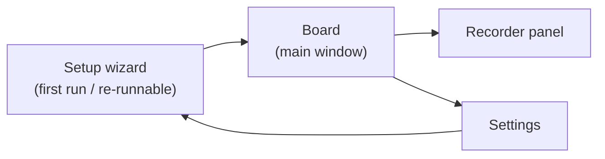

# 05 — WPF UI Design & Localization

Design goal: an operator under time pressure, mid-call, with Chrome focused most of the day.
Big targets, constant status visibility, one-keystroke panic stop.

## 1. Main window ("Board")

```
┌──────────────────────────────────────────────────────────┐
│ [🔍 Search…]                    Engine ● LIVE   Mic ▮▮▮  │
├───────────┬──────────────────────────────────────────────┤
│ Greeting  │  ┌─────────────┐ ┌─────────────┐ ┌─────────┐ │
│ Payment   │  │ Hello, how…  │ │ One moment  │ │ Thank   │ │
│ Shipping  │  │ 0:02         │ │ 0:03        │ │ you…    │ │
│ Closing   │  └─────────────┘ └─────────────┘ └─────────┘ │
│ + New     │   (large buttons, 3–4 per row; the playing    │
│           │    one glows and shows a progress ring)       │
├───────────┴──────────────────────────────────────────────┤
│ ▶ Playing: "One moment please"  ████░░ 0:02/0:03         │
│ [⏹ STOP (Ctrl+Space)]   [🎙 Record]  [⚙ Settings]        │
└──────────────────────────────────────────────────────────┘
```

- **Phrase buttons ≥ 96 px tall**, title + duration; playing button glows with progress ring.
- **Status bar always visible:** engine state (color-coded LIVE / DEGRADED / STOPPED),
  live mic level meter, current phrase + progress, and a large STOP button.
- Left rail: categories with counts; drag-and-drop phrases between categories.
- Top: search box — type-to-filter across title and tags.

## 2. Screens



### Recorder panel

- Device level meter with clipping warning, Record / Stop buttons.
- Lightweight waveform preview of the take.
- Toggles: trim silence (on), peak normalize to −3 dBFS (on).
- Fields: title, category, tags. Save / discard. Re-record keeps the old take until saved.
- Preview always plays to the **monitor** device — never into the cable.

### Settings

- Device pickers (mic / cable / monitor) with live level meters.
- **Live sliders** (adjustable while a phrase is playing, so she can tune on a real call):
  - Mic ducking during phrase: `micDuckDb` (−60…0 dB, mute floor; default −12 dB)
  - Phrase monitor level: `monitorPhraseDb` (default −6 dB)
- Stop-hotkey reassignment with conflict detection (registration failures surfaced inline).
- Behavior toggle: new trigger stops current phrase (default on).
- UI language selector: Українська / Polski / English — applies immediately.
- Backup controls: export, import, open backup folder.
- "Run routing test" button → re-opens the wizard's self-test step.

### Setup wizard

1. VB-CABLE detection → official download link if missing → re-verify.
2. Device selection with meters.
3. Instruction step with screenshots: set Chrome/Zoho microphone to **CABLE Output**.
4. Loopback self-test: speak → confirm signal on cable; play test tone → confirm.

## 3. Keyboard-first UX (within the app)

| Key | Action |
|---|---|
| `/` | Focus search |
| Arrows | Navigate phrase grid |
| `Enter` | Play focused phrase |
| `Esc` | Stop playback |
| `Ctrl+Space` | Global stop (works system-wide, including when Chrome is focused) |

Per-phrase global hotkeys are **deferred** (confirmed decision); the grid + search must be
fast enough with the mouse and in-app keys for v1.

## 4. Localization (UA / PL / EN)

- All UI strings live in `.resx` resource files (`Strings.uk.resx`, `Strings.pl.resx`,
  `Strings.en.resx`); **no hard-coded strings in XAML** — enforced from the first commit,
  because retrofitting localization in WPF is expensive.
- `LocalizationService` swaps the resource dictionary at runtime; language change applies
  without restart.
- Phrase *content* (titles, audio) is the operator's own in any language — only application
  chrome is localized.
- Layout uses dynamic sizing (no fixed-width labels) since Polish/Ukrainian strings run
  longer than English.

## 5. Status & alarm behavior

| Engine state | UI | Audio |
|---|---|---|
| LIVE | Green dot, meters active | — |
| DEGRADED (mic forwarding down, rebuilding) | Red banner across the board, taskbar flash | Alarm tone in headphones — she must know the client cannot hear her |
| STOPPED | Gray UI, board disabled, setup hint | — |
