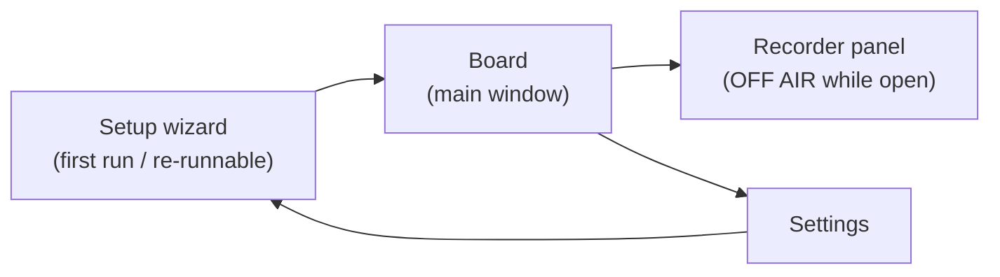

# 05 — WPF UI Design & Localization

Design goal: an operator under time pressure, mid-call, with Chrome focused most of the day.
Big targets, constant status visibility, one-keystroke panic stop, window always reachable.

## 1. Main window ("Board")

```
┌──────────────────────────────────────────────────────────┐
│ [🔍 Search…]              📌 Engine ● LIVE     Mic ▮▮▮   │
├───────────┬──────────────────────────────────────────────┤
│ Greeting  │  ┌─────────────┐ ┌─────────────┐ ┌─────────┐ │
│ Payment   │  │ Hello, how…  │ │ One moment  │ │ Thank   │ │
│ Shipping  │  │ 0:02         │ │ 0:03        │ │ you…    │ │
│ Closing   │  └─────────────┘ └─────────────┘ └─────────┘ │
│ + New     │   (large buttons, 3–4 per row; the playing    │
│           │    one glows and shows a progress ring)       │
├───────────┴──────────────────────────────────────────────┤
│ ▶ Playing: "One moment please"  ████░░ 0:02/0:03         │
│ [⏹ STOP (Pause)]      [🎙 Record]  [⚙ Settings]          │
└──────────────────────────────────────────────────────────┘
```

- **Always-on-top by default** (`Topmost`, 📌 toggle in the title area, decision #16): she
  docks AdaVoice beside a full-screen Chrome/Zoho and never hunts for the window mid-call.
  With per-phrase hotkeys deferred, this is what keeps phrase triggering instant.
- **Phrase buttons ≥ 96 px tall**, title + duration; playing button glows with progress ring;
  buttons appear greyed at startup until their audio is decoded (background decode, 04 §5).
- **Status bar always visible:** engine state (color-coded LIVE / OFF AIR / DEGRADED /
  STOPPED), live mic level meter, current phrase + progress, and a large STOP button.
- Left rail: categories with counts. Phrases move between categories via the edit dialog
  (drag-and-drop trimmed in review 2026-06-10).
- Top: search box — type-to-filter across title and tags.

## 2. Screens



### Recorder panel — OFF AIR rule (decision #11)

**Recording during calls is not allowed, and the app enforces it:** opening the Recorder
pauses the cable output (her mic stops reaching the call) and shows a full-width
**OFF AIR** banner; closing the panel restores the previous live state. Recording and being
on air are mutually exclusive by design — a client can never hear retakes or false starts.

- Device level meter with clipping warning, Record / Stop buttons.
- Lightweight waveform preview of the take.
- Processing on save: trim silence (on), **loudness-match to the calibrated live-mic
  reference** (sets `gainDb`; peak ceiling −3 dBFS), per decision #13.
- Fields: title, category, tags. Save / discard. Re-record keeps the old take until saved.
- Preview always plays to the **monitor** device — never into the cable.

### Settings

- Device pickers (mic / cable / monitor) with live level meters.
- **Live sliders** (adjustable while a phrase is playing, so she can tune on a real call):
  - Mic ducking during phrase: `micDuckDb` (−60…0 dB, mute floor; default −12 dB)
  - Phrase monitor level: `monitorPhraseDb` (default −6 dB)
- Stop-hotkey reassignment (default `Pause`, decision #10) with conflict detection
  (registration failures surfaced inline) and live press-to-test.
- Behavior toggles: new trigger stops current phrase (default on); board always-on-top
  (default on).
- **Re-run voice calibration** (re-measures live-mic RMS reference; offered after mic changes).
- UI language selector: Українська / Polski / English — **applies on restart** (decision #6);
  the dialog says so explicitly and offers "Restart now".
- Backup controls: export, import, open backup folder.
- "Run routing test" button → re-opens the wizard's self-test step.

### Setup wizard

1. VB-CABLE detection → official download link if missing → re-verify.
2. **Environment checks** (each with a fix-it hint):
   - Windows Privacy → Microphone allows desktop apps.
   - CABLE shared-mode format is 48 kHz (offers to open the device settings to fix).
   - **Default output device is NOT CABLE Input** — otherwise every system sound plays
     straight to the client. Same check for default communications device.
   - AdaVoice's session is not muted in the Volume Mixer.
   - Sound → Communications is set to "Do nothing" (fallback for the programmatic
     ducking opt-out, decision #12).
3. Device selection (mic / cable / monitor) with meters.
4. **Voice calibration:** "speak normally for 5 seconds" → stores `micReferenceRms`
   (decision #13).
5. **Stop-hotkey check:** verifies the `Pause` key exists on her keyboard with a live
   press-to-test; offers `Ctrl+F12` fallback (decision #10).
6. Instruction step with screenshots: set Chrome/Zoho microphone to **CABLE Output**.
7. Loopback self-test: speak → confirm signal on cable; play test tone → confirm.
8. Mentions the VB-CABLE control-panel latency setting (kept at default unless Phase 0
   measurements said otherwise).

## 3. Keyboard-first UX (within the app)

| Key | Action |
|---|---|
| `/` | Focus search |
| Arrows | Navigate phrase grid |
| `Enter` | Play focused phrase |
| `Esc` | Stop playback |
| `Pause` | Global stop (works system-wide, including when Chrome is focused) |

Per-phrase global hotkeys are **deferred** (decision #8); the Topmost board + in-app keys
must be fast enough for v1. Validated at the post-Phase-3 operator pilot (decision #20).

## 4. Localization (UA / PL / EN)

- All UI strings live in static `.resx` resource files (`Strings.uk.resx`, `Strings.pl.resx`,
  `Strings.en.resx`); **no hard-coded strings in XAML** — enforced from the first commit.
- Language is chosen in Settings and **applies on restart** (decision #6). This keeps every
  view on plain static resource references instead of the `DynamicResource`/binding tax that
  runtime switching would impose on all screens forever.
- Phrase *content* (titles, audio) is the operator's own in any language — only application
  chrome is localized. A resource-completeness test asserts every key exists in all three
  languages (see [08-testing.md](08-testing.md)).
- Layout uses dynamic sizing (no fixed-width labels) since Polish/Ukrainian strings run
  longer than English.

## 5. Status & alarm behavior

| Engine state | UI | Audio |
|---|---|---|
| LIVE | Green dot, meters active | — |
| OFF AIR (Recorder open) | Full-width amber banner "OFF AIR — recording mode" | — |
| DEGRADED (mic forwarding down, rebuilding) | Red banner across the board, taskbar flash | Alarm tone on the **system default output device** — independent of the monitor setting and of the monitor stream's health; she must know the client cannot hear her |
| STOPPED | Gray UI, board disabled, setup hint | — |
