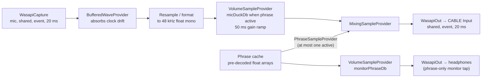
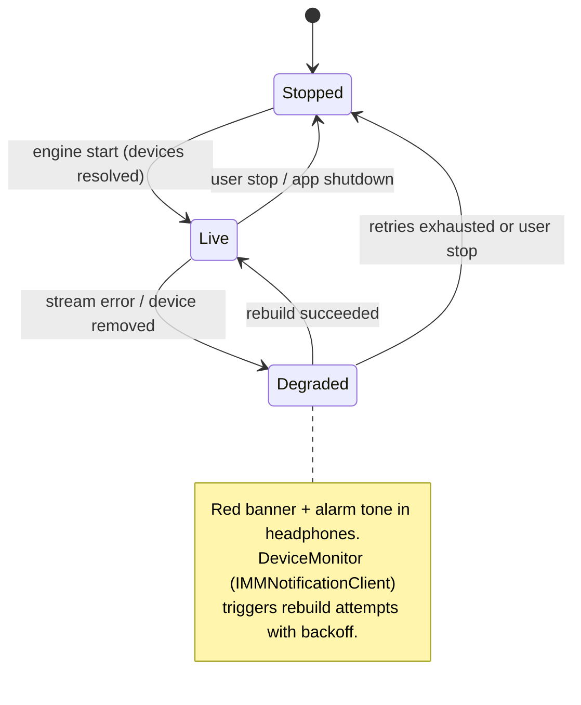
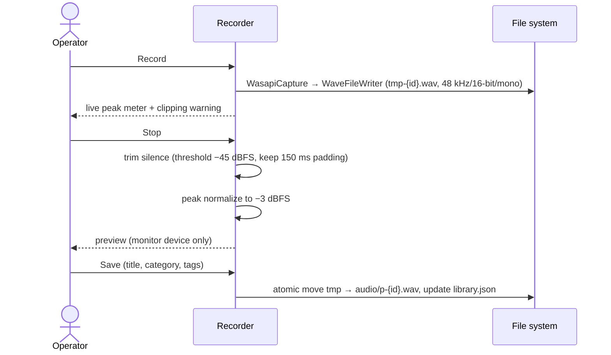

# 06 — Audio Engine, Recording Engine, Hotkeys

## 1. Engine graph

Internal format: **48 kHz / 32-bit float / mono**, converted at the edges (up-mixed to stereo
at the cable output if the device expects stereo).

### Hot-path behavior

- **Phrase start:** all phrases are pre-decoded to RAM at startup (per confirmed library
  scale). Trigger = add one `PhraseSampleProvider` to the mixer → audible within one or two
  20 ms buffers. No device open, no disk I/O.
- **Stop:** mark the provider finished with a **10 ms linear fade-out** (avoids clicks),
  mixer removes it. Device streams are never torn down on trigger/stop.
- **Single-playback rule:** the engine holds at most one phrase input. A new trigger
  **replaces** the current phrase (confirmed default) or is ignored (settings toggle).
- **Ducking:** while a phrase is active, the mic branch ramps to `micDuckDb` over
  `duckRampMs` (50 ms default) and ramps back on completion/stop. Both values adjustable
  live from Settings.

### Latency budget (target)

| Stage | Budget |
|---|---|
| Trigger dispatch (UI/hotkey → engine queue) | < 5 ms |
| Mixer pickup (next render callback) | ≤ 20 ms |
| WASAPI render buffer | 20 ms |
| **Total trigger → cable** | **≈ 40–45 ms** (hard ceiling 100 ms) |

Mic passthrough adds capture buffer (20 ms) + mixer (≤ 20 ms) + render buffer (20 ms)
≈ 60 ms worst case on the voice path — within the < 50 ms *added* target once buffers
overlap; verify in Phase 0 and tune buffer sizes if needed. *(Marked uncertain until
measured.)*

### Clock drift

Capture and render run on different device clocks. The `BufferedWaveProvider` absorbs
short-term drift; if the buffer exceeds ~100 ms, the engine drops the oldest samples
(logged) to keep the live-voice latency bounded.

## 2. Engine state machine

- `DeviceMonitor` implements `IMMNotificationClient` — device add/remove/default-change
  events trigger targeted stream rebuilds (only the affected stream, not the whole graph).
- A watchdog heartbeat detects a stalled render callback (no pull for > 500 ms) and forces
  a rebuild.
- The cardinal rule: **the engine must never be silently dead.** Any state where the mic is
  not being forwarded is loudly surfaced (see UI doc §5).

## 3. Recording engine

- Deliberately **no noise-reduction DSP in v1** (per brief: don't over-engineer). A quiet
  room and a decent wired headset beat software cleanup. Simple trim + peak normalization
  only.
- Re-record keeps the old file until the new take is saved; the old file then moves to trash.
- Pre-recording free-disk-space check; writer failure aborts the take cleanly with a message.

## 4. Hotkey system (MVP scope)

- Mechanism: Win32 `RegisterHotKey` on a hidden `HwndSource`; `WM_HOTKEY` dispatched to
  `HotkeyService`. System-wide — fires while Chrome has focus. No low-level keyboard hook
  (less invasive, AV-friendlier).
- **MVP registers exactly one global hotkey: emergency stop** (`Ctrl+Space` default,
  reassignable in Settings). Per confirmed decision, per-phrase hotkeys are deferred.
- Registration failure (combination taken by another app) is surfaced inline in Settings,
  never silent.
- Future (post-MVP): per-phrase hotkey slots, conflict editor, optional avoidance of the
  platform's push-to-talk key. The `HotkeyService` interface is designed for N hotkeys from
  day one so this is additive.
