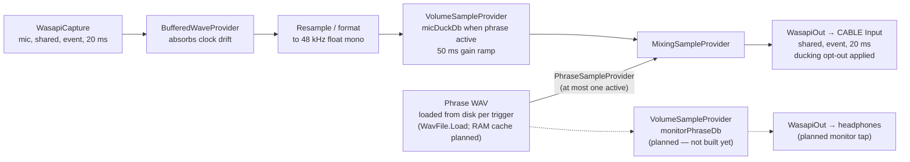
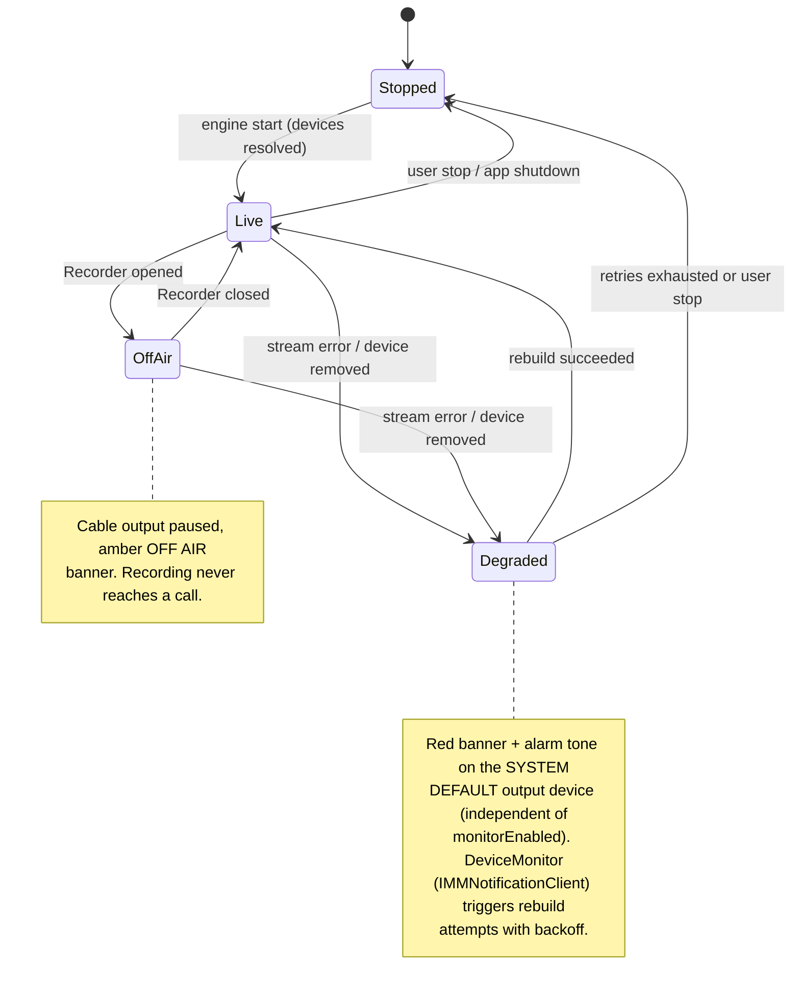
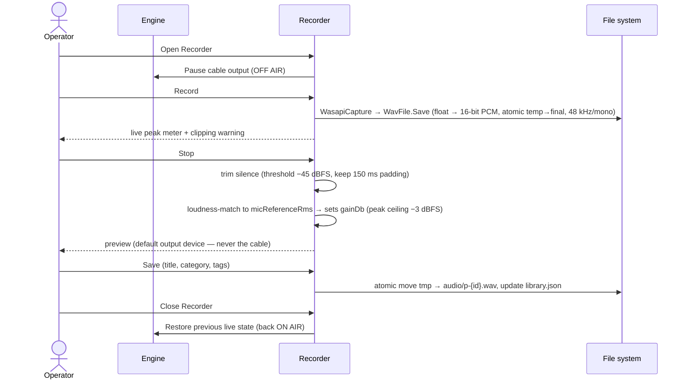

# 06 — Audio Engine, Recording Engine, Hotkeys

## 1. Engine graph

Internal format: **48 kHz / 32-bit float / mono**, converted at the edges (up-mixed to stereo
at the cable output if the device expects stereo).

The headphone monitor tap (OUT2, `monitorPhraseDb`) is **planned — not built yet**.
Previews play on the default output device. The engine's other output today is the
DEGRADED alarm on the system default device (§2).

### Session-level protections

- The cable render session (and the planned monitor session, once built) calls
  `IAudioSessionControl2::SetDuckingPreference(optOut: true)` after stream start —
  otherwise Windows attenuates them the moment Chrome opens a communications stream, i.e.
  exactly when a call begins (decision #12). NAudio does not wrap this; it is a ~30-line COM
  interop shim. Note the documented constraint: the preference takes effect on stream
  (re)start, so it is applied as part of stream initialization.
- The app calls `RegisterApplicationRestart` at startup so Windows relaunches it after a
  crash (decision #18) — this process is the operator's mic path; it must not stay dead.

### Hot-path behavior

- **Phrase start (current behavior):** each trigger loads the phrase WAV from disk
  (`WavFile.Load` in `EngineHost.PlayPhrase`), then adds one `PhraseSampleProvider` to the
  mixer → audible within one or two 20 ms buffers. No device open on the hot path, but
  there **is** disk I/O per trigger. A pre-decoded RAM cache (background decode at
  startup) stays a **planned optimization**.
- **Stop:** mark the provider finished with a **10 ms linear fade-out** (avoids clicks),
  mixer removes it. Device streams are never torn down on trigger/stop.
- **Single-playback rule:** the engine holds at most one phrase input. A new trigger
  **replaces** the current phrase (confirmed default) or is ignored (settings toggle).
- **Ducking:** while a phrase is active, the mic branch ramps to `micDuckDb` over
  `duckRampMs` (50 ms default) and ramps back on completion/stop. Both values adjustable
  live from Settings. (Caveat: Chrome's AGC downstream may partially counteract perceived
  ducking — see 02 §4; defaults were tuned against post-AGC output in Phase 0.)
- **OFF AIR (decision #11):** entering recording mode pauses the cable output branch
  entirely; preview stays available on the default output. Restored on Recorder close.

### Latency budget (app-side targets — A11: verified, Phase 0 gate passed 2026-06-15)

| Stage | Budget |
|---|---|
| Trigger dispatch (UI/hotkey → engine queue) | < 5 ms |
| Mixer pickup (next render callback) | ≤ 20 ms |
| WASAPI render buffer | 20 ms |
| **App-side trigger → cable** | **≈ 40–45 ms** (hard ceiling 100 ms) |

Passthrough (voice path): capture buffer 20 ms + mixer ≤ 20 ms + render buffer 20 ms ⇒
**target ≤ 60 ms added, hard ceiling 80 ms, app-side**.

**These numbers exclude VB-CABLE's own internal buffering** (driver default "max latency"
is thousands of samples — tens of ms — adjustable only in its control panel) **and Chrome's
WebRTC capture buffering.** Phase 0 therefore measured **mouth-to-Chrome end-to-end**
(speak → loopback recording of what Chrome receives), not just app-internal timing. The
gate **passed 2026-06-15**; note the exact measured numbers were never recorded
(`spike/PHASE0-RESULTS.md` still has TBDs).

### Clock drift and buffer policy

Capture and render run on different device clocks. Policy, both directions:

- **Overrun** (capture faster): if the buffer exceeds ~100 ms, drop the oldest samples and
  log. Audible as a small skip in her live voice; recurrence is logged so the cadence can
  be quantified.
- **Underrun** (render faster): insert silence for the missing samples and log. Audible as a
  brief gap; same logging.
- If either event recurs frequently (> a few per hour), that is a finding to fix
  (buffer sizing or a slow-adaptive resampler keyed to buffer fill) — not something to ship
  around silently. Phase 0 passed 2026-06-15, but glitch-cadence numbers were not recorded.

## 2. Engine state machine

- `DeviceMonitor` implements `IMMNotificationClient` — device add/remove/default-change
  events trigger targeted stream rebuilds (only the affected stream, not the whole graph).
- A watchdog heartbeat detects a stalled render callback (no pull for > 500 ms) and forces
  a rebuild.
- The cardinal rule: **the engine must never be silently dead.** Any state where the mic is
  not being forwarded is loudly surfaced — and the alarm path (system default device) does
  not depend on the optional monitor stream being enabled or healthy.

## 3. Recording engine

- **Loudness matching (decision #13):** peak normalization alone makes phrases and live
  voice differ in perceived loudness (peak ≠ loudness), producing audible level jumps at
  every phrase boundary. Instead, the recorder computes the take's RMS and sets `gainDb` so
  it matches the wizard-calibrated live-mic reference (`micReferenceRms`), with a −3 dBFS
  peak ceiling. Calibration is re-runnable from Settings (e.g., after a mic change).
- Deliberately **no noise-reduction DSP in v1** (per brief: don't over-engineer). A quiet
  room and a decent wired headset beat software cleanup. Simple trim + loudness match only.
- Re-record keeps the old file until the new take is saved; the old file then becomes an
  orphan (04 §3).
- Pre-recording free-disk-space check; writer failure aborts the take cleanly with a message.

## 4. Hotkey system (MVP scope)

- Mechanism: Win32 `RegisterHotKey` on a hidden `HwndSource`; `WM_HOTKEY` dispatched to
  `HotkeyService`. System-wide — fires while Chrome has focus. No low-level keyboard hook
  (less invasive, AV-friendlier).
- **MVP registers exactly one global hotkey: emergency stop, default `Pause`** (decision
  #10). `Ctrl+Space` was rejected: on a trilingual machine it collides with IME/layout
  switching, and the panic button cannot live on contested keys. The wizard verifies the
  `Pause` key exists (missing on some compact laptops) and offers `Ctrl+F12` as fallback.
  Settings shows which fixed candidate (`Pause` / `Ctrl+F12`) is active — read-only; true
  reassignment is **deferred**.
- Registration failure (combination taken by another app) is surfaced inline in Settings,
  never silent.
- Future (post-MVP): per-phrase hotkey slots, conflict editor, optional avoidance of the
  platform's push-to-talk key. The `HotkeyService` interface is designed for N hotkeys from
  day one so this is additive.
