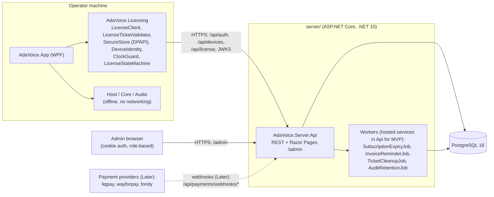

# Architecture Overview — AdaVoice Monetization

Purpose: high-level target architecture for adding licensing, billing, and an admin panel to AdaVoice. Status: Phases 0–2 shipped (see handoff.md); Phase 3 onward Proposed, 2026-07-05.

This doc follows the canonical brief. Detailed designs live in `licensing-design.md`, `billing-subscription-design.md`, `api-design.md`, and `database-design.md`.

---

## 1. Desktop-app baseline (facts, 2026-07-05 — dated snapshot)

This section is the point-in-time baseline the plan was written against, kept as a record.
The `server/` backend has since shipped Phases 0–2 (see the status line above and handoff.md).

At that point AdaVoice was a fully offline WPF desktop app on .NET 10.

- Solution: `AdaVoice.slnx`, central package management (`Directory.Packages.props`), `TreatWarningsAsErrors=true`.
- Projects, strictly layered:
  - `src/AdaVoice.App` — WPF UI (CommunityToolkit.Mvvm, WPF-UI, Serilog) → depends on `src/AdaVoice.Host`.
  - `src/AdaVoice.Host` — composition root `EngineHost`; host interfaces `IPlaybackHost`, `IRecorderHost`, `ISettingsHost`, `ILibraryHost`, `ISetupHost` → depends on `AdaVoice.Audio`, `AdaVoice.Audio.Wasapi`, `AdaVoice.Core`.
  - `src/AdaVoice.Core` — domain + JSON storage. No external packages.
  - `src/AdaVoice.Audio` — pure DSP/engine (NAudio.Core). `src/AdaVoice.Audio.Wasapi` — WASAPI/COM.
- Storage: local files under `%LOCALAPPDATA%\AdaVoice` — `library.json`, `settings.json`, `audio/*.wav`, `backups/*.zip`, `logs/`. Atomic temp-then-rename writes and corrupt-file quarantine. Key classes: `JsonPhraseRepository`, `JsonSettingsRepository`, `BackupService`, `LibraryArchiveService`, `AdaVoicePaths`. No database.
- There is **no** networking, HTTP, backend, auth, crypto, DPAPI, telemetry, licensing, or updater code anywhere.
- No DI container. Composition is hand-rolled in `App.xaml.cs` plus `EngineHost`.
- Logging: Serilog rolling file to `%LOCALAPPDATA%\AdaVoice\logs\adavoice-.log`. Global exception handlers in `App.xaml.cs`. Single-instance named Mutex. Crash relaunch via `RegisterApplicationRestart`.
- Tests: 5 xUnit projects (~360 tests green), one per src project. CI: GitHub Actions.
- No code signing yet (`Directory.Build.props` sets Deterministic only).

What this means: everything network-related is greenfield. We add new parts; we do not rewrite the audio stack.

## 2. Target system overview

We add three things:

1. A new client project `src/AdaVoice.Licensing`, referenced only by `AdaVoice.App`.
2. A new ASP.NET Core backend in a top-level `server/` folder (same repo, monorepo):
   - `server/AdaVoice.Server.Api` — REST API + Razor Pages admin area (`/admin`).
   - `server/AdaVoice.Server.Domain` — entities, no dependencies.
   - `server/AdaVoice.Server.Infrastructure` — EF Core, Npgsql, crypto, email.
   - `server/AdaVoice.Server.Workers` — background jobs. MVP: hosted services inside the Api process; split out later.
   - `server/AdaVoice.Server.Tests` — server tests.
3. A PostgreSQL 16 database (EF Core 10 + migrations, snake_case names, `uuid` PKs, single database with `tenant_id` multi-tenancy).

Server dependency direction: Api → Infrastructure → Domain; Workers → Infrastructure.

## 3. High-level architecture diagram



## 4. Main components and responsibilities

| Component | Responsibility |
|---|---|
| WPF client (`AdaVoice.App`) | UI, phrase playback, recording. Reads license state from the licensing module and maps it to UX states (`active`, `grace_period`, `offline_blocked`, etc.). Blocks premium features when required. Never deletes local user data. |
| `src/AdaVoice.Licensing` | All client-side licensing logic: `LicenseClient` (HTTP calls), `LicenseTicketValidator` (offline JWS check, ES256, pinned public keys), `SecureStore` (DPAPI files under `%LOCALAPPDATA%\AdaVoice\license\`), `DeviceIdentity` (deviceId + machineHash), `ClockGuard` (clock-rollback detection), `LicenseStateMachine` (one place that decides the current license state). |
| Backend API (`AdaVoice.Server.Api`) | Auth (JWT ES256 access + rotating refresh tokens), device activation and limits, license ticket issue/refresh, subscriptions, invoices, usage events, RFC 7807 errors with stable `code` values, rate limiting, correlation IDs, audit logging. |
| Database (PostgreSQL 16) | Source of truth: `tenants`, `users`, `plans`, `subscriptions`, `device_activations`, `license_tickets`, `invoices`, `payments`, `usage_events`, `audit_logs`, `refresh_tokens`, `signing_keys`, `idempotency_keys`. |
| Background workers | `SubscriptionExpiryJob` (hourly status transitions), `InvoiceReminderJob` (daily reminder emails), `TicketCleanupJob` (daily purge of expired tickets), `AuditRetentionJob` (daily). MVP: hosted services inside Api. |
| Admin panel | Razor Pages area `/admin` inside Api. Cookie auth, role-based (`super_admin`). Manual tenant/user/plan/subscription management, create invoices, mark invoices paid, revoke devices, view audit logs. |

## 5. Dependency directions

Client side:

```
AdaVoice.App ──> AdaVoice.Licensing   (new)
AdaVoice.App ──> AdaVoice.Host ──> Audio / Audio.Wasapi / Core   (unchanged)
```

- `AdaVoice.Licensing` is a separate project (`net10.0-windows`) referenced **only** by `AdaVoice.App`.
- Why: Core, Audio, and Host stay free of networking, crypto, and DPAPI. The audio stack keeps working fully offline and stays independently testable. The app layer is the only place that combines "can I play?" (license) with "play" (audio).
- New test project: `tests/AdaVoice.Licensing.Tests`.

Server side:

```
Api ──> Infrastructure ──> Domain
Workers ──> Infrastructure
```

- Domain has no dependencies, so entities and rules stay simple to test.
- Infrastructure owns EF Core, Npgsql, crypto, and email, so Api never talks to the database directly.

## 6. Core principles

- **The client is untrusted.** Any check in the WPF app can be bypassed by a determined user. Client checks are for honest customers and good UX, not security.
- **The server is the source of truth.** Subscription status, device limits, and payments live only in PostgreSQL. The client only holds a short-lived signed copy.
- **Signed tickets enable offline grace.** The server issues a JWS license ticket (ES256, 24 h TTL). The client validates it offline with pinned public keys. `graceUntil` (7 days paid, 2 days trial) lets operators keep working through network outages without letting a cancelled subscription run forever.

## 7. Key flows (where to find them)

This doc owns only the component diagram above. Detailed sequence flows live in one place
each, to avoid drift:

- `licensing-design.md`: first login + device activation; license issue; startup with a
  valid cached ticket; startup offline inside grace; startup offline after grace.
- `billing-subscription-design.md`: subscription expiry transitions; manual invoice
  payment + renewal; future payment webhook processing.

## 8. Risks and assumptions

Technical risks:

- **Greenfield networking.** No HTTP, auth, or crypto code exists in the repo today. Every network path (timeouts, retries, offline start) is new and must be designed, not patched in.
- **No DI container.** Composition is hand-rolled in `App.xaml.cs`. Wiring `AdaVoice.Licensing` needs care; the server side uses standard ASP.NET Core DI from day one.
- **Single developer.** One person builds and operates client + server + database. Simplicity (monorepo, one Api process, Razor admin) is a deliberate risk reduction.
- **Clock tampering.** Users can roll back the system clock to extend offline grace. `ClockGuard` (persisted `lastAcceptedUtc`, 5 min tolerance) and server-side skew rejection (>10 min) limit this, but cannot fully stop a hostile user — accepted, because the client is untrusted anyway.
- **Hosting reliability.** If the server is down, clients fall back to cached tickets within grace. Longer outages block paying customers. Hosting choice (open question 1) and backups (open question 11) matter.

Assumptions (per brief; owner sign-off tracked in `open-questions.md`):

- PostgreSQL 16, EF Core 10, single database with `tenant_id` multi-tenancy.
- ES256 for both access tokens and license tickets; keys in `signing_keys`, master key from env var.
- DPAPI (CurrentUser) for client secrets; files under `%LOCALAPPDATA%\AdaVoice\license\`.
- Monorepo: `server/` next to `src/` in the same repo, same CI.
- Razor Pages admin inside Api is enough for v1.
- Ticket TTL 24 h; grace 7 days paid / 2 days trial; device limit per plan (`limits.maxDevices`).

## 9. MVP vs Later

| Area | MVP | Later |
|---|---|---|
| Tenants/users | Manual, admin-created | Self-serve signup + trial |
| Billing | Manual invoices, bank transfer, mark-paid in admin | Payment webhooks (LiqPay first, then WayForPay/Fondy) |
| Licensing | Activation, tickets, offline grace, clock guard | Component-wise machine-hash tolerance |
| Workers | Hosted services inside Api process | Separate Workers deployment |
| Admin | Razor Pages `/admin` | SPA admin if the panel grows |
| Passwords | ASP.NET Core Identity `PasswordHasher` (PBKDF2) | Argon2id |
| Ops | Env-var secrets, audit logs, rate limiting | Secret manager, usage analytics dashboards |
| Client delivery | Current manual distribution | Auto-updater (Velopack) + Authenticode signing (certificate purchase is an open question) |
