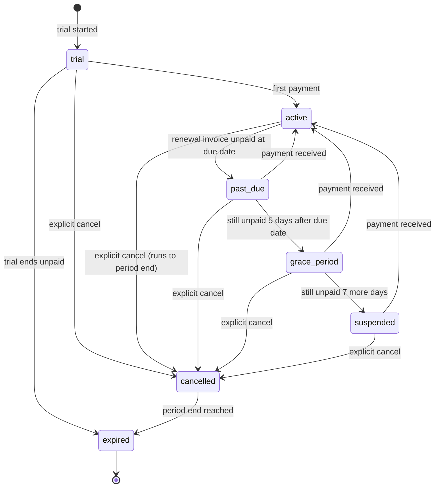
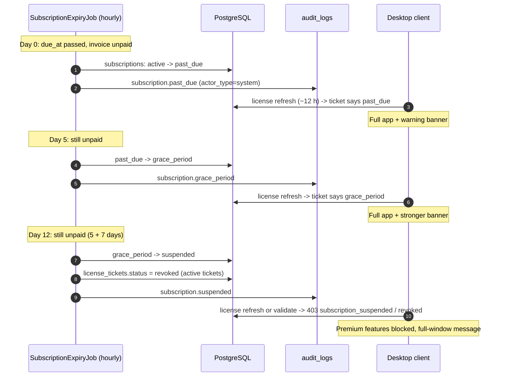

# AdaVoice Server — Billing and Subscription Design

Purpose: define the subscription lifecycle, manual invoice billing (v1), future payment provider flow (v2), worker jobs, and billing edge cases. Status: Proposed, 2026-07-05.

Source of truth for names and statuses: [README.md](README.md) (the canonical brief).

## 1. Subscription lifecycle

Canonical statuses: `trial`, `active`, `past_due`, `grace_period`, `suspended`, `cancelled`, `expired`.



Timing rules:

- `active` → `past_due`: the moment the renewal invoice is unpaid at `due_at` (checked hourly by `SubscriptionExpiryJob`).
- `past_due` → `grace_period`: 5 days after the due date (default; `subscriptions.grace_days` window follows).
- `grace_period` → `suspended`: 7 more days unpaid (default).
- Payment at any point in `past_due` / `grace_period` / `suspended` → `active`.
- `cancelled` keeps full service until `current_period_end`, then becomes `expired`.

Design rules for the lifecycle:

- Status transitions happen only in two places: the payment path (mark-paid / webhook) and `SubscriptionExpiryJob`. No other code moves a subscription status. One writer per direction keeps the state machine easy to reason about and to audit.
- Transitions are computed from stored facts (`current_period_end`, invoice `due_at`, `grace_days`), never from "days since last run". A missed job run catches up on the next tick without drift.
- The client never decides its own status. It only reflects what the last license ticket said.

## 2. Manual invoice billing (v1, MVP)

Flow:

1. Admin creates an invoice in the admin panel (`POST /api/invoices`), or a worker auto-drafts it before the period ends. It covers the next monthly period (or another agreed period).
2. Invoice moves `draft` → `issued`. Admin sends the PDF by email manually (MVP; automated email is Later).
3. The customer pays by bank transfer to the owner's FOP account.
4. Admin sees the money on the bank statement and clicks "mark paid" (`POST /api/invoices/{id}/mark-paid`).
5. The server creates a `payments` row (`provider = manual_bank_transfer`, `marked_by_user_id` set), sets the invoice to `paid`, renews the subscription, and writes an `audit_logs` row.

Invoice numbering: suggestion `AV-2026-0001` — a fixed prefix, the year, and a sequential counter that resets each year. Simple to read and to sort. **Open question:** confirm the exact format and legal requirements with the accountant (FOP 3rd group rules).

Billing period and timing rules:

- Default period: one calendar month, starting from the first paid period's start date (anniversary billing). A different agreed period (e.g. quarterly) is allowed per tenant.
- The renewal invoice should exist before the current period ends. Suggested timing: auto-draft 7 days before `current_period_end`, `due_at` = `current_period_end` + 4 days (Assumption; owner-confirmable).
- The auto-draft worker only creates a `draft`; a human reviews and issues it in v1. This keeps mistakes cheap while volume is low.
- `invoices.period_start` / `period_end` always record exactly what the customer pays for. Renewal logic reads these fields, never "one month from now".

## 3. Future payment provider integration (v2, Later)

- Each `issued` invoice gets a hosted checkout link (LiqPay / WayForPay / Fondy). The customer pays online.
- The provider calls our webhook. We: verify the signature → check idempotency by `provider_tx_id` → re-check the amount against the invoice → create the `payments` row → mark the invoice `paid` → renew the subscription.
- Never trust amounts from the callback; the invoice row is the source of truth.
- Provider order (LiqPay vs WayForPay vs Fondy first) is an open question for the owner.

## 4. Invoice statuses and transitions

Canonical statuses: `draft`, `issued`, `paid`, `overdue`, `cancelled`, `refunded`.

| From | To | Trigger |
|---|---|---|
| draft | issued | Admin issues; `issued_at` set |
| draft | cancelled | Admin cancels an unsent invoice |
| issued | paid | Payment recorded (manual or webhook) |
| issued | overdue | `InvoiceReminderJob`: `due_at` passed, unpaid |
| issued | cancelled | Admin cancels (e.g. wrong amount; re-issue a new one) |
| overdue | paid | Late payment recorded |
| overdue | cancelled | Admin writes it off |
| paid | refunded | Manual refund (rare, admin-only, audit-logged) |

No other transitions are allowed. The API returns `409 conflict` on an illegal transition (e.g. mark-paid on a `cancelled` invoice).

## 5. What each subscription status means for the operator

Aligned with the client UX states from the brief.

| Subscription status | Operator experience in the desktop app |
|---|---|
| trial | Full app (client state `trial`); shorter offline grace (2 days) |
| active | Full app (client state `active`) |
| past_due | Full app + non-blocking warning banner ("invoice unpaid") |
| grace_period | Full app + stronger warning banner ("service will pause soon") |
| suspended | Premium features blocked (phrase playback into call disabled); full-window message with reason and a Retry/Reconnect action |
| cancelled | Full app until `current_period_end`, then behaves as expired |
| expired | Premium features blocked; full-window message; local data never deleted |

## 6. Worker jobs

MVP: hosted services inside the `AdaVoice.Server.Api` process; split into `AdaVoice.Server.Workers` deployment later.

| Job | Schedule | What it does |
|---|---|---|
| SubscriptionExpiryJob | hourly | Moves subscription statuses per the timing rules above (past_due, grace_period, suspended, cancelled → expired, trial → expired) |
| InvoiceReminderJob | daily | Sends reminder emails before and after `due_at`; flips `issued` → `overdue` |
| TicketCleanupJob | daily | Purges `license_tickets` rows 90 days after expiry |
| AuditRetentionJob | daily | Purges `audit_logs` older than the retention window (≥ 3 years) |

Rules for all jobs:

- Idempotent: each run selects rows by state + time, so a re-run or an overlapping run does no harm. Use a per-job advisory lock so two instances never process the same batch.
- Every status change writes an `audit_logs` row (`actor_type = "system"`).
- Jobs read the clock once per run and pass it into all checks. This keeps a run consistent and makes the job easy to test with a fake clock.
- Enforcement path: a status change takes effect on the client at the next license refresh, so within 24 h at most (ticket TTL). For a faster cutoff on suspension, the job can also set the device's current `license_tickets.status = 'revoked'`; `POST /api/license/validate` checks revocation whenever the client is online.
- Job failures must not stop the batch: process each subscription/invoice in its own transaction, log the error with the entity id, and continue. A crashed run is simply retried on the next schedule tick.

## 7. How payment affects the subscription

- A paid invoice extends `current_period_end` by the invoiced period (`period_start` → `period_end` from the invoice).
- Payment while `past_due` or `grace_period`: subscription returns to `active`; the period is the invoiced period as originally billed.
- Late payment while `suspended`: subscription reactivates and the new period starts from the payment date, not from the missed period start. The customer does not pay for downtime. **Policy choice — owner-confirmable.** (Alternative: keep the original period dates; simpler bookkeeping, but the customer loses the suspended days.)
- Trial → paid: first payment moves `trial` → `active` and starts the first paid period from the payment date (Assumption).

## 8. Edge cases

- **Partial payment**: invoice stays unpaid (`issued`/`overdue`); admin records nothing in v1, contacts the customer, and either waits for the rest or cancels and re-issues. No partial `payments` rows in v1.
- **Overpayment**: mark the invoice `paid` with the actual received amount on the `payments` row; the difference is settled manually (credit on the next invoice). No balance/credit table in v1.
- **Payment after cancellation**: if the subscription is `cancelled` but not yet `expired`, payment for an already-issued invoice is accepted normally. If it is `expired`, the admin refunds manually or starts a new subscription; the invoice must not silently reactivate anything.
- **Invoice paid twice**: `mark-paid` requires an `Idempotency-Key`; a replay returns the stored response. A second distinct attempt on a `paid` invoice returns `409 conflict`. Webhooks dedupe by `provider_tx_id`.
- **Multiple subscriptions per tenant**: NOT supported in v1 — one active subscription per tenant, enforced by a partial unique index (see database-design.md).
- **Plan change mid-period**: v1 takes effect at the next period; proration is Later scope.
- **Refunds**: manual, rare, admin-only. Invoice `paid` → `refunded`, audit-logged with reason. Money moves outside the system (bank transfer back).
- **Currency**: UAH only in v1. The `currency` column exists for the future.
- **Timezones**: all timestamps stored and compared in UTC. Invoice dates displayed to users in Europe/Kyiv.

## 9. Flow diagrams

This doc owns flows (6), (7), (8) per the brief's assignment.

### (6) Subscription expires: past_due → grace_period → suspended



### (7) Manual invoice payment and subscription renewal

```mermaid
sequenceDiagram
    autonumber
    actor Admin as Admin (super_admin)
    participant API as Server API
    participant DB as PostgreSQL
    participant Audit as audit_logs
    actor Customer as Customer (tenant)

    Admin->>API: POST /api/invoices (Idempotency-Key)
    API->>DB: insert invoice (status=issued, number=AV-2026-0042)
    API->>Audit: invoice.issued
    Admin-->>Customer: send invoice PDF by email (manual, MVP)
    Customer-->>Admin: bank transfer to FOP account
    Note over Admin: sees payment on the bank statement
    Admin->>API: POST /api/invoices/{id}/mark-paid (Idempotency-Key)
    API->>DB: insert payment (manual_bank_transfer, marked_by_user_id)
    API->>DB: invoice -> paid; subscription -> active,\ncurrent_period_end extended by invoiced period
    API->>Audit: invoice.paid + subscription.renewed
    API-->>Admin: 200 (invoice paid, subscription active)
    Note over Customer: client picks up "active" on next license refresh (<= 24 h)
```

### (8) Future payment webhook processing (v2)

```mermaid
sequenceDiagram
    autonumber
    actor Customer
    participant Provider as Payment provider (LiqPay/...)
    participant API as Server API (webhook endpoint)
    participant Q as Async processor
    participant DB as PostgreSQL
    participant Audit as audit_logs

    Customer->>Provider: pays via hosted checkout link
    Provider->>API: POST /api/payments/webhooks/{provider}
    API->>API: verify provider signature (server-side secret)
    alt signature invalid
        API-->>Provider: 400 (log + audit, no processing)
    else signature valid
        API->>Q: enqueue payload
        API-->>Provider: 200 (fast ack)
    end
    Q->>DB: lookup payments by (provider, provider_tx_id)
    alt payment already exists
        Q->>Audit: webhook.duplicate (ignored)
    else new transaction
        Q->>DB: load invoice; re-check amount, currency, status
        Q->>DB: insert payment; invoice -> paid; renew subscription
        Q->>Audit: invoice.paid + subscription.renewed (actor_type=system)
    end
```

## 10. MVP vs Later

- MVP: manual invoices, bank transfer, mark-paid in the admin panel, lifecycle jobs, audit on every status change, one subscription per tenant, UAH only.
- Later: LiqPay-first webhooks and hosted checkout, automated invoice emails and PDF generation, proration on plan change, credit/balance handling for overpayments, separate Workers deployment.

Open questions owned here: invoice numbering format (accountant), reactivation-period policy after suspension (owner), payment provider order (owner), email provider for reminders (owner).
