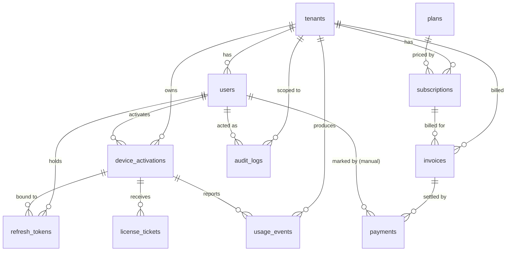

# AdaVoice Server — Database Design

Purpose: define the PostgreSQL schema for the AdaVoice monetization backend (tenants, auth, licensing, billing, audit). Status: Proposed, 2026-07-05.

Source of truth for names and statuses: [README.md](README.md) (the canonical brief). Database: PostgreSQL 16, EF Core 10 + Npgsql, snake_case names, `uuid` PKs (v7 preferred), `created_at`/`updated_at timestamptz` on every table.

## 1. Entities and relationships

- A **tenant** is a customer company. It owns users, subscriptions, devices, invoices, and usage.
- A **user** belongs to one tenant and has a role (`operator`, `tenant_admin`, `super_admin`).
- A **plan** is a global price/limit template. A **subscription** links a tenant to a plan.
- A **device_activation** is one desktop install of a user. A **license_ticket** is one issued JWS ticket for a device activation.
- An **invoice** bills a subscription period. A **payment** settles an invoice.
- **usage_events** and **audit_logs** are append-only history.
- **refresh_tokens**, **signing_keys**, **idempotency_keys** support auth, ticket signing, and safe retries.

Note on the diagram: `signing_keys` and `idempotency_keys` are standalone tables with no FKs, so they are not shown.

## 2. Tables

Conventions for every table:

- `id uuid` primary key (UUID v7), unless stated otherwise.
- `created_at timestamptz not null`, `updated_at timestamptz not null`.
- All FK columns are `uuid`.
- Statuses are `text` with CHECK constraints (see section 4).

### tenants

| Column | Type | Null | Notes |
|---|---|---|---|
| id | uuid | no | PK |
| name | text | no | Company display name |
| status | text | no | `active`, `suspended`, `cancelled`, `deleted` |
| contact_email | text | no | Billing/owner contact |
| notes | text | yes | Free-form admin notes |
| created_at / updated_at | timestamptz | no | |

### users

| Column | Type | Null | Notes |
|---|---|---|---|
| id | uuid | no | PK |
| tenant_id | uuid | no | FK → tenants. Super admins live in a system tenant (Assumption). |
| email | text | no | Unique per tenant (citext or lower() index) |
| password_hash | text | no | ASP.NET Core Identity `PasswordHasher` (PBKDF2) |
| role | text | no | `operator`, `tenant_admin`, `super_admin` |
| status | text | no | `active`, `disabled` (Assumption: two values are enough for MVP) |
| display_name | text | yes | |
| failed_login_count | int | no | Default 0; reset on success |
| locked_until | timestamptz | yes | Set after 10 failed logins (15 min lockout) |
| last_login_at | timestamptz | yes | |
| created_at / updated_at | timestamptz | no | |

### plans

| Column | Type | Null | Notes |
|---|---|---|---|
| id | uuid | no | PK |
| code | text | no | Unique, e.g. `standard` — used in ticket `plan` claim |
| name | text | no | Display name |
| price_uah | numeric(12,2) | no | Monthly price, UAH only in v1 |
| max_devices | int | no | Per-plan device limit |
| max_phrases | int | no | Ticket `limits.maxPhrases` |
| features | jsonb | no | Feature codes, e.g. `["phrase_library","hotkeys"]` |
| trial_grace_days | int | no | Offline grace for trial (1–3, default 2) |
| paid_grace_days | int | no | Offline grace for paid (default 7) |
| is_active | boolean | no | Hide retired plans from new subscriptions |
| created_at / updated_at | timestamptz | no | |

### subscriptions

| Column | Type | Null | Notes |
|---|---|---|---|
| id | uuid | no | PK |
| tenant_id | uuid | no | FK → tenants. One active subscription per tenant (partial unique index). |
| plan_id | uuid | no | FK → plans |
| status | text | no | `trial`, `active`, `past_due`, `grace_period`, `suspended`, `cancelled`, `expired` |
| current_period_start | timestamptz | no | |
| current_period_end | timestamptz | no | |
| trial_ends_at | timestamptz | yes | Set only for trials |
| grace_days | int | no | Billing grace after `past_due` (default 7) |
| cancelled_at | timestamptz | yes | Set on explicit cancel |
| created_at / updated_at | timestamptz | no | |

### device_activations

| Column | Type | Null | Notes |
|---|---|---|---|
| id | uuid | no | PK — this is `deviceActivationId` in the ticket |
| tenant_id | uuid | no | FK → tenants |
| user_id | uuid | no | FK → users |
| device_id | uuid | no | Client-generated GUID from `device.bin` |
| machine_hash | text | no | SHA-256 hex of soft machine signals |
| status | text | no | `active`, `revoked`, `blocked`, `expired` |
| activated_at | timestamptz | no | |
| last_seen_at | timestamptz | yes | Updated by heartbeat and license refresh |
| revoked_at | timestamptz | yes | |
| app_version | text | no | |
| os_version | text | no | |
| created_at / updated_at | timestamptz | no | |

Unique: `(tenant_id, device_id)` — one activation row per device; re-activation updates it (Assumption).

### license_tickets

| Column | Type | Null | Notes |
|---|---|---|---|
| jti | uuid | no | PK — the ticket's `jti` claim |
| device_activation_id | uuid | no | FK → device_activations |
| issued_at | timestamptz | no | |
| expires_at | timestamptz | no | `issued_at` + 24 h |
| grace_until | timestamptz | no | Offline-use limit |
| status | text | no | `issued`, `revoked` |
| created_at / updated_at | timestamptz | no | |

Used by `POST /api/license/validate` for revocation checks, and for audit.

### invoices

| Column | Type | Null | Notes |
|---|---|---|---|
| id | uuid | no | PK |
| tenant_id | uuid | no | FK → tenants |
| subscription_id | uuid | no | FK → subscriptions |
| number | text | no | Unique, e.g. `AV-2026-0001` (numbering is an open question) |
| status | text | no | `draft`, `issued`, `paid`, `overdue`, `cancelled`, `refunded` |
| amount_uah | numeric(12,2) | no | |
| currency | text | no | `UAH` in v1 (kept for future) |
| period_start | timestamptz | no | Billed subscription period |
| period_end | timestamptz | no | |
| issued_at | timestamptz | yes | Set when status leaves `draft` |
| due_at | timestamptz | yes | |
| paid_at | timestamptz | yes | |
| pdf_path | text | yes | Path/key of the stored PDF (MVP: generated manually) |
| created_at / updated_at | timestamptz | no | |

### payments

| Column | Type | Null | Notes |
|---|---|---|---|
| id | uuid | no | PK |
| invoice_id | uuid | no | FK → invoices |
| provider | text | no | `manual_bank_transfer`, `liqpay`, `wayforpay`, `fondy` |
| provider_tx_id | text | yes | Unique per provider; null for manual (unique on `(provider, provider_tx_id)` where not null) |
| amount_uah | numeric(12,2) | no | Actual received amount |
| received_at | timestamptz | no | |
| marked_by_user_id | uuid | yes | FK → users; who clicked "mark paid" (manual only) |
| created_at / updated_at | timestamptz | no | |

### usage_events

| Column | Type | Null | Notes |
|---|---|---|---|
| id | uuid | no | PK |
| tenant_id | uuid | no | FK → tenants |
| user_id | uuid | no | FK → users |
| device_activation_id | uuid | no | FK → device_activations |
| type | text | no | e.g. `phrase_played`, `app_started` (Assumption: small open list) |
| data | jsonb | yes | Event payload |
| occurred_at | timestamptz | no | Client clock (untrusted, informational) |
| received_at | timestamptz | no | Server clock (trusted) |
| created_at / updated_at | timestamptz | no | |

### audit_logs (append-only; no UPDATE/DELETE from app code)

| Column | Type | Null | Notes |
|---|---|---|---|
| id | uuid | no | PK |
| tenant_id | uuid | yes | Null for system-wide actions |
| actor_user_id | uuid | yes | Null for system jobs and webhooks |
| actor_type | text | no | `user`, `system`, `admin` |
| action | text | no | e.g. `invoice.mark_paid`, `subscription.suspended` |
| entity_type | text | no | e.g. `invoice` |
| entity_id | uuid | yes | |
| ip | text | yes | |
| correlation_id | text | yes | From `X-Correlation-Id` |
| data | jsonb | yes | Before/after snapshot or details |
| created_at | timestamptz | no | No `updated_at` — rows never change |

### refresh_tokens

| Column | Type | Null | Notes |
|---|---|---|---|
| id | uuid | no | PK |
| user_id | uuid | no | FK → users |
| device_activation_id | uuid | yes | FK → device_activations; null for admin-panel logins (Assumption) |
| token_hash | text | no | Unique; SHA-256 of the opaque token. Raw token never stored. |
| family_id | uuid | no | Groups a rotation chain; reuse revokes the family |
| issued_at | timestamptz | no | |
| expires_at | timestamptz | no | Sliding 30 days, absolute 90 days |
| revoked_at | timestamptz | yes | |
| replaced_by_id | uuid | yes | FK → refresh_tokens (rotation link) |
| created_at / updated_at | timestamptz | no | |

### signing_keys

| Column | Type | Null | Notes |
|---|---|---|---|
| id | uuid | no | PK |
| kid | text | no | Unique; goes into JWS header |
| algorithm | text | no | `ES256` |
| public_key_pem | text | no | Served via JWKS |
| private_key_encrypted | bytea | no | Encrypted with master key from env var |
| status | text | no | `active`, `next`, `retired` |
| retired_at | timestamptz | yes | |
| created_at / updated_at | timestamptz | no | |

### idempotency_keys

| Column | Type | Null | Notes |
|---|---|---|---|
| id | uuid | no | PK |
| key | text | no | Client `Idempotency-Key` header value |
| endpoint | text | no | e.g. `POST /api/invoices`; unique on `(key, endpoint)` |
| request_hash | text | no | SHA-256 of the request body |
| response_status | int | no | Stored HTTP status to replay |
| response_body | jsonb | yes | Stored response to replay |
| created_at | timestamptz | no | |
| expires_at | timestamptz | no | `created_at` + 24 h; cleanup job deletes expired rows |

## 3. Indexes

- Every FK column gets a b-tree index (EF Core convention; verify in migrations).
- `users`: unique `(tenant_id, lower(email))`.
- `subscriptions`: partial unique `(tenant_id)` where `status not in ('cancelled','expired')` — enforces one active subscription per tenant.
- `refresh_tokens`: unique `(token_hash)` — the hot lookup on every refresh; index `(family_id)` for family revocation.
- `audit_logs`: `(tenant_id, created_at)` — admin audit screens filter by tenant + date.
- `usage_events`: `(tenant_id, occurred_at)` — usage summaries per period.
- `license_tickets`: `(expires_at)` — `TicketCleanupJob` range scan; index `(device_activation_id, status)` for revocation checks.
- `invoices`: `(status, due_at)` — the overdue/reminder jobs scan issued invoices past due; unique `(number)`.
- `device_activations`: `(tenant_id, status)` — device-limit check counts active devices per tenant fast.
- `payments`: unique `(provider, provider_tx_id)` where `provider_tx_id is not null` — webhook idempotency.
- `idempotency_keys`: unique `(key, endpoint)`; index `(expires_at)` for cleanup.

## 4. Status values and how we store them

Canonical value lists (from the brief):

- Subscription: `trial`, `active`, `past_due`, `grace_period`, `suspended`, `cancelled`, `expired`
- Tenant: `active`, `suspended`, `cancelled`, `deleted`
- Device: `active`, `revoked`, `blocked`, `expired`
- Invoice: `draft`, `issued`, `paid`, `overdue`, `cancelled`, `refunded`
- Payment provider: `manual_bank_transfer`, `liqpay`, `wayforpay`, `fondy`
- User role: `operator`, `tenant_admin`, `super_admin`
- License ticket: `issued`, `revoked`
- Signing key: `active`, `next`, `retired`

Storage decision: store all of these as `text` columns with CHECK constraints, not native PostgreSQL enums, because adding or renaming a value is then a simple constraint swap in one migration instead of an awkward `ALTER TYPE`. In C#, map them to enums with EF Core value converters so code stays type-safe.

## 5. Migration strategy

- EF Core migrations live in `server/AdaVoice.Server.Infrastructure`.
- One migration per PR. Small, reviewable, named after the change (`AddInvoices`, not `Update3`).
- Applied on deploy via `dotnet ef database update` or a compiled migration bundle (bundle preferred for servers without the SDK).
- Never edit a migration that has been applied anywhere. Fix mistakes with a new migration.
- Seed data via an idempotent seeder that runs at startup: the initial `plans` rows and the first `super_admin` user (password from env var, forced change on first login). The seeder checks existence before inserting, so re-running is safe.
- MVP: migrations run automatically at app start behind a feature flag. Later: run migrations as an explicit deploy step, separate from app start.

## 6. Data retention

| Data | Retention | Why |
|---|---|---|
| audit_logs | Keep ≥ 3 years | Financial and security relevance; `AuditRetentionJob` purges older rows daily |
| usage_events | Aggregate into summaries, purge raw rows after 12 months | Summaries answer reporting needs; raw rows are big |
| license_tickets | Purge 90 days after `expires_at` | Only needed for revocation and recent audit; `TicketCleanupJob` |
| refresh_tokens | Purge 30 days after expiry or revocation | Keep a short window for incident analysis |
| invoices, payments | Keep forever | Financial records for FOP accounting |
| idempotency_keys | Purge after `expires_at` (24 h) | Retry-safety window only |

## 7. MVP vs Later

- MVP: all tables above, text+CHECK statuses, EF global query filters on `tenant_id`, seeder, retention jobs.
- Later: table partitioning for `usage_events`/`audit_logs` if volume grows, read replicas, component-wise machine-hash columns, soft-delete conventions beyond `tenants.status = 'deleted'`.

Open questions that touch this schema: invoice numbering rules (accountant), data-retention promise to customers, backup strategy (managed Postgres with PITR vs pg_dump).
