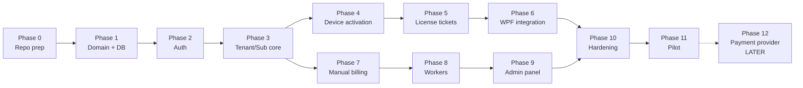

# Implementation Roadmap

**Purpose:** ordered, phased plan to build AdaVoice monetization: server, licensing, billing, admin panel, and WPF integration. Each phase has a goal, numbered tasks, dependencies, and testable acceptance criteria.

**Status: Proposed, 2026-07-05**

---

## How to read this document

- Phases run mostly in order. Dependencies are listed per phase.
- Sizes are rough: **S** = days, **M** = a week or two, **L** = several weeks. Not hours.
- **MVP cut line: MVP = Phases 0–11. Phase 12 = Later.**
- Every acceptance criterion should be checkable by a test, a command, or a click.

### Dependency overview

Simple dependency list:

- Phase 1 needs 0. Phase 2 needs 1. Phase 3 needs 2. Phase 4 needs 3. Phase 5 needs 4.
- Phase 6 needs 5. Phase 7 needs 3. Phase 8 needs 7 (and 5 for `TicketCleanupJob`).
- Phase 9 needs 3, 4, 5, 7, 8. Phase 10 needs 6 and 9. Phase 11 needs 10. Phase 12 needs 11.
- Phases 6 and 7 can run in parallel after Phase 5 and Phase 3 respectively.

---

## Phase 0 — Repository assessment and preparation (S) — MVP

**Goal:** the repo can host a server without disturbing the desktop app or its 360 green tests.

**Depends on:** nothing.

**Tasks**

1. Create the `server/` folder scaffold: `AdaVoice.Server.Api`, `AdaVoice.Server.Domain`,
   `AdaVoice.Server.Infrastructure`, `AdaVoice.Server.Workers`, `AdaVoice.Server.Tests`.
   Dependency direction: Api → Infrastructure → Domain; Workers → Infrastructure.
2. Wire the new projects into `AdaVoice.slnx` and `Directory.Packages.props`
   (central package management, `TreatWarningsAsErrors=true` applies to server code too).
3. Extend GitHub Actions CI: build + test the server projects alongside the existing app jobs.
4. Add `docker-compose.yml` for a local PostgreSQL 16 instance (dev only).
5. **Open question gate:** decide hosting location and provider (brief open question #1)
   and domain/API base URL (#2). Record the decision in `docs/monetize/open-questions.md`.
   The gate blocks Phase 11, not Phases 1–10.

**Acceptance criteria**

- `dotnet build` on the solution succeeds with all new projects; existing ~360 tests stay green.
- CI runs server build + tests on every PR.
- `docker compose up` starts Postgres 16; connection string documented in `server/README` section of the compose file comments.
- Hosting decision is either made or explicitly deferred with a named owner and date.

---

## Phase 1 — Domain model and database (M) — MVP

**Goal:** all canonical tables exist as EF Core entities with migrations and seed data.

**Depends on:** Phase 0.

**Tasks**

1. Create entities in `AdaVoice.Server.Domain` (no dependencies): `tenants`, `users`, `plans`,
   `subscriptions`, `device_activations`, `license_tickets`, `invoices`, `payments`,
   `usage_events`, `audit_logs`, `refresh_tokens`, `signing_keys`, `idempotency_keys`.
   Use the canonical status values from the brief exactly.
2. Add EF Core 10 + Npgsql in `AdaVoice.Server.Infrastructure`. Configure snake_case names,
   `uuid` PKs (v7 preferred), `created_at`/`updated_at timestamptz` on every table.
3. Add multi-tenancy: `tenant_id` column on tenant-owned tables + EF Core global query filters.
4. Create the initial migration.
5. Write the seeder: default `plans` rows and one `super_admin` user (credentials from env vars).
6. Unit tests: entity constraints, query filters exclude other tenants, seeder is idempotent.

**Acceptance criteria**

- `dotnet ef database update` creates all 13 tables with snake_case names and timestamptz audit columns.
- A query without an explicit tenant filter returns only the current tenant's rows (test proves it).
- Running the seeder twice produces no duplicates.
- All Phase 1 tests green in CI.

---

## Phase 2 — Auth (M) — MVP

**Goal:** users can log in and hold a session safely; every auth event is audited.

**Depends on:** Phase 1.

**Tasks**

1. `POST /api/auth/login`: email + password, ASP.NET Core Identity `PasswordHasher` (PBKDF2).
   Returns a 15-minute ES256 JWT (claims: `sub`, `tenant_id`, `role`, `jti`; `kid` header)
   plus an opaque 256-bit refresh token.
2. `POST /api/auth/refresh`: rotation on every use. Store only the SHA-256 hash in
   `refresh_tokens`. Sliding lifetime 30 days, absolute 90 days.
3. Reuse detection: presenting a rotated token revokes the whole token family and writes an audit row.
4. `POST /api/auth/logout`, `POST /api/auth/change-password`, `GET /api/auth/me`.
5. Account lockout: 15 minutes after 10 failed logins per user; lockout events audited.
6. Rate limiting: per-IP fixed window on `/api/auth/*` via ASP.NET Core `RateLimiter`.
7. RFC 7807 problem responses with stable `code` values (e.g. `invalid_refresh_token`).
8. Tests: login happy path, wrong password, lockout, refresh rotation, reuse → family revoked, expired tokens, rate-limit 429.

**Acceptance criteria**

- A rotated refresh token, when replayed, gets `invalid_refresh_token` and the whole family stops working (integration test).
- The 11th failed login within the window returns lockout; a correct password during lockout still fails.
- JWT validates against the ES256 public key and expires at 15 minutes.
- Every login, refresh, lockout, and reuse event appears in `audit_logs`.

---

## Phase 3 — Tenant / user / subscription core (M) — MVP

**Goal:** super_admin can manage tenants, users, and subscriptions via the admin API; subscription status transitions are correct.

**Depends on:** Phase 2.

**Tasks**

1. Admin CRUD under `/api/admin/...` for tenants and users (create, suspend tenant; create user, reset password, lock/unlock). `super_admin` role required.
2. Subscription endpoints: `GET /api/subscriptions/current`, `POST /api/subscriptions/start-trial`,
   `POST /api/subscriptions/change-plan`, `POST /api/subscriptions/cancel`,
   `POST /api/subscriptions/renew-manually`.
3. Subscription status engine implementing the canonical transitions:
   `trial → active | expired`; `active → past_due`; `past_due → grace_period → suspended`;
   any → `cancelled` → `expired`; `suspended → active` on payment.
4. Guard rails: invalid transitions rejected with a problem `code`.
5. Audit rows for every admin mutation (`actor_type=admin`).
6. Unit tests on every allowed and every forbidden transition.

**Acceptance criteria**

- Transition test matrix covers all 7 subscription statuses; forbidden moves (e.g. `expired → past_due`) return an RFC 7807 error.
- A suspended tenant's users cannot log in (`tenant_suspended` code).
- Each admin mutation produces exactly one audit row with actor, action, target.

---

## Phase 4 — Device activation (M) — MVP

**Goal:** devices activate against per-plan limits and can be revoked; repeated calls are safe.

**Depends on:** Phase 3.

**Tasks**

1. `POST /api/devices/activate` with `deviceId`, `machineHash`, `appVersion`, `osVersion`.
   Enforce the plan's device limit; create a `device_activations` row.
2. `Idempotency-Key` support: same key within 24 h returns the stored response
   (`idempotency_keys` table).
3. `GET /api/devices/current`, `GET /api/devices`, `POST /api/devices/{id}/revoke`,
   `POST /api/devices/heartbeat`.
4. Statuses: `active`, `revoked`, `blocked`, `expired`. Blocked devices may not re-activate.
5. Problem codes: `device_limit_reached`, `device_revoked`.
6. Tests: activation at limit, over limit, re-activation after revoke, idempotent replay, blocked device rejection.

**Acceptance criteria**

- Activating one device past the plan limit returns `device_limit_reached`; after revoking one device, the same call succeeds.
- Replaying an activate request with the same `Idempotency-Key` returns the identical response and creates no second row.
- A `blocked` device gets a distinct error and never re-activates.
- Heartbeat updates `last seen` and is visible via `GET /api/devices`.

---

## Phase 5 — License issuing and validation (M) — MVP

**Goal:** the server issues signed, short-lived license tickets that clients can verify offline.

**Depends on:** Phase 4.

**Tasks**

1. `signing_keys` management: ECDSA P-256 key pairs, private keys encrypted at rest in the DB with a master key from an env var. Key states: current / next / retired.
2. `POST /api/license/issue` (idempotent via `Idempotency-Key`) and `POST /api/license/refresh`:
   build the canonical JWS payload (exact fields from the brief: `iss`, `aud`, `jti`, `tenantId`,
   `userId`, `deviceActivationId`, `deviceId`, `plan`, `subscriptionStatus`, `features`,
   `limits`, `issuedAt`, `expiresAt`, `graceUntil`, `serverTime`). TTL 24 h.
   `graceUntil` = +7 days paid, +2 days trial, never past the subscription's hard end.
3. Record every issued ticket in `license_tickets` (jti, hash, device, expiry) for revocation checks and audit.
4. `POST /api/license/validate`, `GET /api/license/current`.
5. Revocation: refresh/validate fail for revoked devices or suspended subscriptions.
6. Server-side clock check: reject refresh if client-reported time skews more than 10 minutes; log it.
7. JWKS endpoint: `GET /.well-known/adavoice-jwks.json` serving current + next public keys.
8. Tests: signature round-trip, TTL math, `graceUntil` capping, revocation, skew rejection, kid rotation (old key still validates until retired).

**Acceptance criteria**

- An issued ticket verifies against the JWKS public key; a tampered payload fails verification.
- A trial ticket has `graceUntil = issuedAt + 2 days`; a paid one +7 days; a subscription suspended tomorrow caps `graceUntil` at tomorrow (tests prove all three).
- Refresh for a revoked device returns `device_revoked`.
- After rotation, tickets signed with the old `kid` still validate until the old key retires.

---

## Phase 6 — WPF integration (L) — MVP

**Goal:** the desktop app logs in, activates, caches its ticket, and enforces UX states — without breaking today's app.

**Depends on:** Phase 5.

**Risk note:** this phase touches app startup — regression risk for the 360 green tests.
Keep licensing behind a feature flag until pilot. With the flag off, the app behaves exactly as today.

**Tasks**

1. Create `src/AdaVoice.Licensing` (`net10.0-windows`), referenced only by `AdaVoice.App`.
   Core, Audio, and Host stay free of networking.
2. Implement `SecureStore` (DPAPI, CurrentUser scope; files under
   `%LOCALAPPDATA%\AdaVoice\license\`: `device.bin`, `auth.bin`, `ticket.bin`, `clock.bin`).
3. Implement `DeviceIdentity`: random GUID `deviceId` on first run; `machineHash` = SHA-256 over MachineGuid, machine name, user SID, volume serial. Raw signals never leave the machine.
4. Implement `ClockGuard`: persist `lastAcceptedUtc`; if `now < lastAcceptedUtc − 5 min` → `offline_blocked`; update every ~10 min while running.
5. Implement `LicenseTicketValidator`: offline JWS ES256 check against two pinned public keys (current + next), plus JWKS fetch when online.
6. Implement `LicenseClient` (HTTP: auth, activate, license issue/refresh) and
   `LicenseStateMachine` producing the exact UX states: `active`, `trial`, `grace_period`,
   `past_due`, `suspended`, `expired`, `device_revoked`, `device_limit_reached`,
   `offline_allowed`, `offline_blocked`.
7. Add `LoginWindow` and the startup flow: cached-ticket fast path → silent refresh when >50% TTL passed → login when no valid session.
8. Gate premium features via an `ILicenseState` check in App ViewModels: blocked states disable phrase playback into calls, show a full-window message with the reason and a Retry/Reconnect action. Warning banner for `grace_period`/`past_due`. The app never deletes local user data.
9. Create `tests/AdaVoice.Licensing.Tests`: state machine table tests, validator tests, offline simulation (no network inside grace → `offline_allowed`; after grace → blocked), clock-rollback simulation.

**Acceptance criteria**

- With the feature flag off, all ~360 existing tests stay green and startup behavior is unchanged.
- With the flag on and a valid cached ticket, the app starts fully offline in the grace window (`offline_allowed`).
- Setting the system clock back 6+ minutes past `lastAcceptedUtc` yields `offline_blocked`; an online refresh clears it (simulated in tests).
- Every UX state maps to a visible, correct UI behavior per the brief's behavior summary.
- `AdaVoice.Core`, `Audio`, `Audio.Wasapi`, and `Host` have no new package or project references.

---

## Phase 7 — Manual billing (M) — MVP

**Goal:** the owner can invoice customers and record bank-transfer payments; paying renews the subscription.

**Depends on:** Phase 3 (can run in parallel with Phases 4–6).

**Tasks**

1. Invoice endpoints: `GET /api/invoices`, `GET /api/invoices/{id}`, `POST /api/invoices`
   (idempotent), `POST /api/invoices/{id}/mark-paid` (idempotent), `POST /api/invoices/{id}/cancel`.
2. Invoice statuses and transitions: `draft → issued → paid | overdue | cancelled`; `refunded` from `paid`.
3. Mark-paid creates a `payments` row (`manual_bank_transfer`) and applies the renewal effect: `suspended`/`past_due`/`grace_period` subscription → `active`; period end extended.
4. `GET /api/payments`.
5. Audit rows for create, issue, mark-paid, cancel.
6. Tests: status transitions, renewal effect per subscription state, idempotent mark-paid.

**Acceptance criteria**

- Marking an invoice paid for a `suspended` subscription flips it to `active` and extends the period (test proves it).
- Mark-paid twice with the same `Idempotency-Key` creates exactly one payment.
- Cancelling a `paid` invoice is rejected with a problem `code`.

---

## Phase 8 — Background workers (S) — MVP

**Goal:** status changes and cleanup happen automatically and safely, even after restarts.

**Depends on:** Phase 7 (and Phase 5 for `TicketCleanupJob`).

**Tasks**

1. `SubscriptionExpiryJob` (hourly): moves `active → past_due` at due date, `past_due → grace_period` after 5 days, `grace_period → suspended` after 7 more, trial end → `expired`, `cancelled` → `expired` at period end.
2. `InvoiceReminderJob` (daily): reminder emails before/after due date. MVP: log-only sender behind an email interface; real provider is an open question (#9).
3. `TicketCleanupJob` (daily): purge expired `license_tickets` rows.
4. `AuditRetentionJob` (daily): apply the audit retention window.
5. Host all four as hosted services inside the Api process (split out Later).
6. Job idempotency tests: running a job twice in a row produces the same end state and no duplicate side effects.

**Acceptance criteria**

- A subscription seeded 6 days past due lands in `grace_period` after one job run — and stays there after a second run (idempotency test).
- Ticket cleanup removes only rows past expiry.
- Jobs log start/end with correlation IDs; a job crash does not take down the Api.

---

## Phase 9 — Admin panel (M) — MVP

**Goal:** the owner runs the whole business from the browser.

**Depends on:** Phases 3, 4, 5, 7, 8.

**Tasks**

1. Razor Pages area `/admin` with cookie auth and role checks (super_admin-only in v1).
2. Build every screen from `admin-panel-design.md`: dashboard, tenant list/detail (+create/suspend), user list (+create/reset password/lock), device list (+revoke/block), subscription view (+start trial/change plan/cancel/renew manually), invoice list/detail (+create/issue/mark paid/cancel), payment list, audit log viewer (filters: tenant, actor, action, date), signing keys page (view kid/status, trigger rotation).
3. Pages call the same application services as `/api/admin/...` — no logic in page models.
4. Every panel action writes `audit_logs` with `actor_type=admin`.
5. Smoke tests: page auth (anonymous → login redirect; operator/tenant_admin → 403), one happy-path test per action.

**Acceptance criteria**

- Every runbook in `admin-panel-design.md` section 4 can be walked click-by-click.
- A non-super_admin user gets 403 on every `/admin` page.
- Each panel action leaves an audit row identical in shape to the API path's row.

---

## Phase 10 — Security hardening (M) — MVP

**Goal:** the system is safe enough for real customers and real money.

**Depends on:** Phases 6 and 9.

**Tasks**

1. Rate-limit tuning: per-device token bucket on `/api/license/*`; review the `/api/auth/*` window with real traffic shapes; add 429 problem responses.
2. Security headers on Api + panel (HSTS, no-sniff, frame-deny, CSP for the panel).
3. Pen-test checklist pass: OWASP ASVS-based list covering auth, IDOR across tenants, injection, token handling. Fix findings.
4. Backup restore test: restore a Postgres backup to a fresh instance and boot the Api against it. Document the steps.
5. Error tracking: wire Sentry or self-hosted GlitchTip (open question #8 — decide here at the latest).
6. Health checks: `/health` liveness + readiness (DB, signing key availability).
7. Key-rotation drill: rotate signing keys on a staging environment; confirm clients with pinned current+next keys keep validating; document the runbook.

**Acceptance criteria**

- Checklist completed with every item marked pass/fixed/accepted-risk, reviewed and dated.
- Restore test performed at least once; time-to-restore recorded.
- Rotation drill: no client validation failures during rotation on staging.
- Health endpoint turns unready when the DB is down (test proves it).

---

## Phase 11 — Pilot launch (M) — MVP

**Goal:** one real paying tenant runs on the system in production.

**Depends on:** Phase 10 (and the Phase 0 hosting gate resolved).

**Tasks**

1. Provision production hosting per the Phase 0 decision: Postgres 16, TLS, env-var secrets, backups on schedule.
2. Deploy Api (with hosted workers) + admin panel; run the seeder (plans + super_admin).
3. Create the first real tenant, users, and subscription via the panel; issue the first real invoice; mark it paid on real bank transfer.
4. Enable the WPF licensing feature flag in the pilot build only; ship it to the pilot tenant.
5. Monitoring: uptime check, error-tracking alerts, daily look at the dashboard failures count.
6. Support runbook dry-run: execute all four runbooks from `admin-panel-design.md` against production (with the pilot tenant's consent where visible to them).
7. Two-week pilot review: collect issues, decide go/no-go for wider rollout.

**Acceptance criteria**

- Pilot tenant's operators use the app daily for two weeks with zero licensing-caused blocks during calls.
- The full manual billing loop happened at least once with real money: invoice → bank transfer → mark paid → subscription renewed → license refreshed.
- All four runbooks were executed successfully at least once.
- On-call knows where logs, audit trail, and error tracking live.

---

## Phase 12 — Future payment provider integration (L) — LATER

**Goal:** customers can pay online without manual invoice work. LiqPay first.

**Depends on:** Phase 11. **This phase is after the MVP cut line.**

**Tasks**

1. Decide provider order (open question #6); confirm FOP 3rd group support with the provider.
2. LiqPay checkout links: generate a payment link per invoice; show it on the invoice and in email.
3. Webhook endpoint `POST /api/payments/webhooks/liqpay`: verify signature, idempotent by provider transaction ID stored on `payments`, apply the same renewal effect as mark-paid.
4. Stubs for `POST /api/payments/webhooks/wayforpay` and `POST /api/payments/webhooks/fondy` (registered routes, 501 until implemented).
5. Reconciliation view in the panel: provider payments vs invoices.
6. Tests: signature verification, duplicate webhook delivery, out-of-order delivery, amount mismatch handling.

**Acceptance criteria**

- A sandbox LiqPay payment marks the invoice `paid` and renews the subscription with no admin action.
- Replaying the same webhook creates no duplicate payment (idempotency by transaction ID).
- An amount-mismatch webhook does not mark the invoice paid; it raises an alert instead.

---

## Risks worth naming

| Phase | Risk | Mitigation |
|---|---|---|
| 0 | Hosting decision stalls | Gate blocks only Phase 11; keep building on local Docker |
| 2 | Auth bugs are security bugs | Test matrix is the deliverable, not an afterthought |
| 5 | Key management mistakes are unrecoverable in the field | Two pinned keys in client + JWKS + rotation drill in Phase 10 |
| 6 | Startup changes break the stable desktop app (~360 tests) | Feature flag off by default until pilot; no references from Core/Audio/Host |
| 7 | Manual money handling with no audit trail | Audit rows on every billing action; idempotent mark-paid |
| 8 | A job double-run corrupts statuses | Idempotency tests are acceptance criteria |
| 11 | First customer hits an unknown failure mid-call | Offline grace (7 days) means server issues never block calls; runbook dry-run before go-live |
| 12 | Webhook fraud or replay | Signature check + transaction-ID idempotency + amount verification |

---

## Summary table

| Phase | Name | Size | Scope |
|---|---|---|---|
| 0 | Repository assessment and preparation | S | MVP |
| 1 | Domain model and database | M | MVP |
| 2 | Auth | M | MVP |
| 3 | Tenant/user/subscription core | M | MVP |
| 4 | Device activation | M | MVP |
| 5 | License issuing and validation | M | MVP |
| 6 | WPF integration | L | MVP |
| 7 | Manual billing | M | MVP |
| 8 | Background workers | S | MVP |
| 9 | Admin panel | M | MVP |
| 10 | Security hardening | M | MVP |
| 11 | Pilot launch | M | MVP |
| 12 | Payment provider integration (LiqPay first) | L | **Later** |
