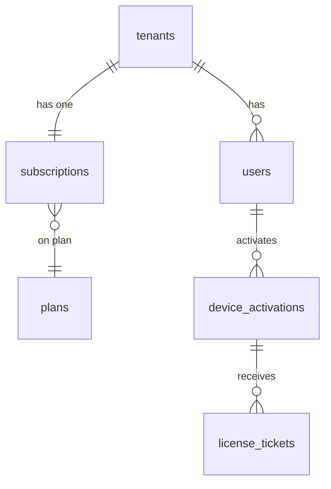
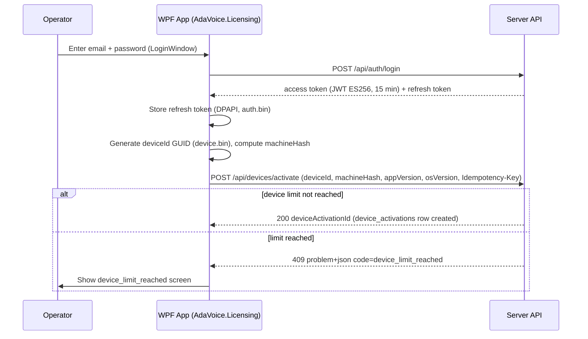
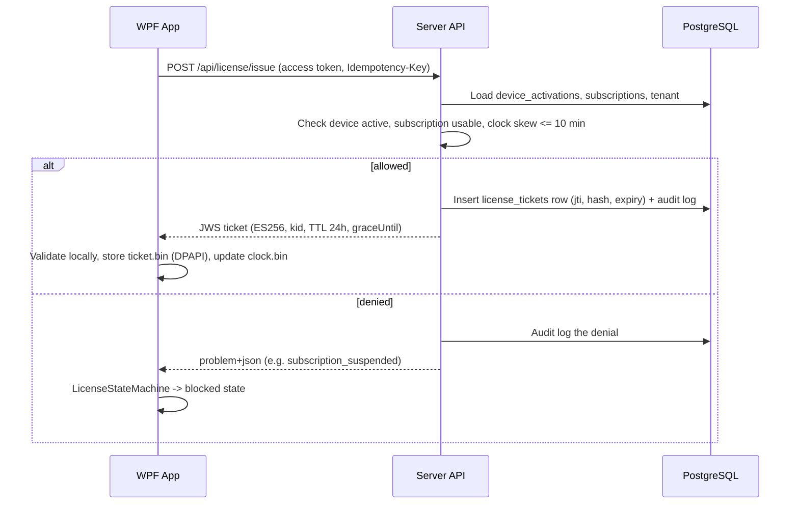
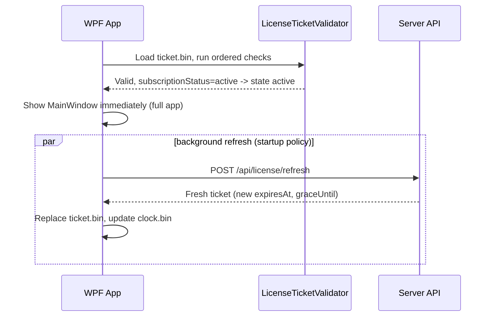
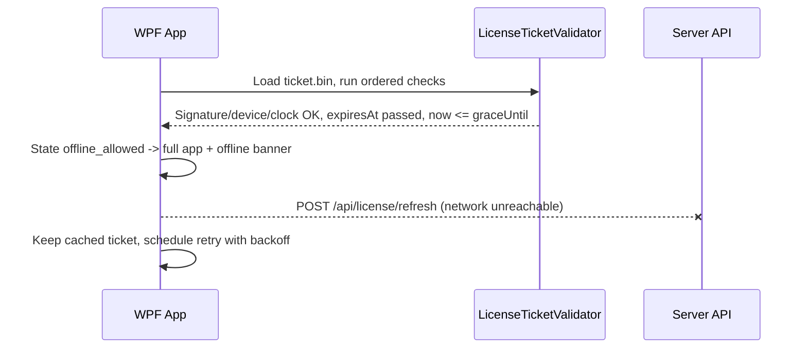
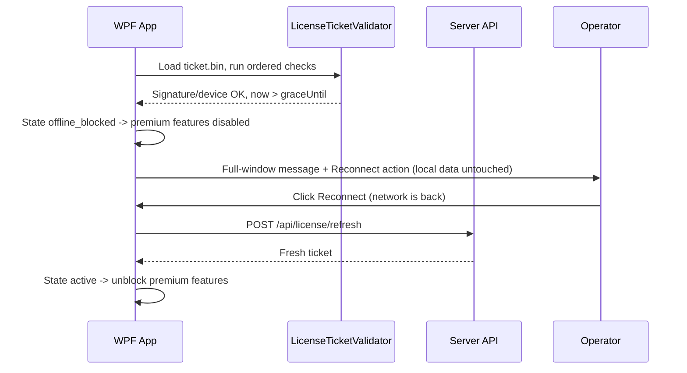

# AdaVoice Licensing Design

Purpose: how AdaVoice licenses are modeled, issued, refreshed, validated offline, and protected against clock rollback. Status: Proposed, 2026-07-05.

Source of truth for names and values: the canonical monetization brief. Companion docs: `security-design.md`, `wpf-client-integration.md`.

---

## 1. License model

We do not sell perpetual license keys. We sell a **subscription entitlement**. The server is the source of truth. The client only holds a **short-lived signed proof** of that entitlement: a **license ticket**.

- A **tenant** is the paying company.
- A tenant has **users** (operators, tenant admins).
- A tenant has one **subscription** with a plan and a status
  (`trial`, `active`, `past_due`, `grace_period`, `suspended`, `cancelled`, `expired`).
- Each installed copy of the app registers a **device activation**.
- For each active device, the server issues **license tickets**: JWS-signed JSON blobs with a 24-hour TTL.

Why tickets instead of a long-lived key:

- The client is untrusted. A long-lived key is copied once and works forever.
- A 24-hour ticket forces the client to come back to the server often. Revocation and status changes take effect within a day, without any "phone home to check a blacklist" logic on the client.
- Offline work still works through the `graceUntil` window (see section 5).



Table names match `database-design.md`: `tenants`, `users`, `plans`, `subscriptions`, `device_activations`, `license_tickets`.

---

## 2. Device activation

### Flow (prose)

1. The user logs in (`POST /api/auth/login`) and gets a 15-minute access token plus a refresh token.
2. On first run, the client generates a random `deviceId` (GUID, stored DPAPI-protected in `device.bin`) and computes `machineHash` (SHA-256 over soft machine signals; raw signals never leave the machine).
3. The client calls `POST /api/devices/activate` with `deviceId`, `machineHash`, `appVersion`, `osVersion`, and an `Idempotency-Key` header.
4. The server checks the tenant, subscription, and the per-plan device limit, then creates a `device_activations` row with status `active` and returns `deviceActivationId`.
5. The client immediately calls `POST /api/license/issue` to get its first ticket.

### Rules

- **Device limit per plan.** The plan defines `maxDevices` (it also appears in the ticket's `limits` field). If the tenant already has that many `active` activations, the server returns RFC 7807 problem `code: device_limit_reached`. The client shows the `device_limit_reached` UX state. A `tenant_admin` (or `super_admin` in the admin panel) frees a slot with `POST /api/devices/{id}/revoke`.
- **Re-activation on machineHash change.** The client re-computes `machineHash` at every local validation. If it no longer matches the value bound at activation (hardware change, OS reinstall, Windows user change), the cached ticket is treated as invalid and the client must re-activate online. MVP rule: exact-match hash. Component-wise tolerant matching is **Later scope**.
- Activation is idempotent: same `Idempotency-Key` replays the stored response for 24 h, so a retry after a network drop does not burn a second device slot.
- Device statuses: `active`, `revoked`, `blocked`, `expired`. Only `active` devices get tickets.

---

## 3. License issue flow

`POST /api/license/issue` (authenticated, device-bound, idempotent via `Idempotency-Key`):

1. Server loads the device activation and checks device status is `active`.
2. Server loads the subscription and checks the tenant is `active` and the subscription status allows use (`trial`, `active`, `past_due`, `grace_period`).
3. Server checks client-reported time. Skew > 10 minutes → reject with `code: clock_skew_too_large` and log it.
4. Server builds the ticket payload (section 6), signs it (JWS ES256, `kid` header) with the current key from `signing_keys`.
5. Server records the ticket in `license_tickets` (jti, hash, device, expiry) for revocation checks and audit, writes an audit log entry, and returns the compact JWS.
6. Client validates the ticket locally, stores it DPAPI-protected in `ticket.bin`, and updates `clock.bin`.

Denials come back as problem+json with stable codes: `device_limit_reached`, `subscription_suspended`, `device_revoked`, `tenant_suspended`, `clock_skew_too_large`. Every issue and every denial is audit-logged.

---

## 4. License refresh flow

`POST /api/license/refresh` re-runs the same server checks and returns a fresh ticket. The client refresh policy (from the brief):

- **Refresh on startup**, always, in the background. Never block the UI on it.
- **Refresh when >50% of the ticket TTL has passed** (~every 12 h for the 24 h TTL), silently, while the app runs.
- On failure (offline, server down, 5xx): **fall back to the cached ticket** and keep full functionality while `now <= graceUntil`. Retry later with backoff.
- On an explicit denial (e.g. `subscription_suspended`, `device_revoked`): the server's answer wins immediately. The client drops to the matching blocked state. Grace does not apply to a definitive "no".

This split matters: *no answer* means "trust the cached ticket until grace ends"; *a negative answer* means "stop now".

---

## 5. Offline grace period

The ticket carries two clocks:

- `expiresAt`: ticket TTL end. `expiresAt − issuedAt` = **24 hours**. After this, the ticket is stale but not necessarily dead.
- `graceUntil`: the last moment offline use is allowed. Paid subscription: issue time + **7 days**. Trial: issue time + **2 days** (configurable 1–3 per plan). The server never sets `graceUntil` past the subscription's own hard end (for example a suspension date).

Client evaluation (with a signature-valid, device-matching ticket):

| Condition | State | Behavior |
|---|---|---|
| `now <= expiresAt` | normal state from `subscriptionStatus` | full app (banner if `grace_period`/`past_due`) |
| `expiresAt < now <= graceUntil` | `offline_allowed` | full app + "offline mode" banner; keep retrying refresh |
| `now > graceUntil` | `offline_blocked` | premium features blocked; full-window message with Reconnect action |

Why two values: a short TTL keeps revocation fast when the machine is online. A longer grace window keeps honest customers working through weekends, travel, or a server outage. Trial grace is short (2 days) because trial abuse is the cheaper attack.

---

## 6. Signed ticket structure

Format: **JWS compact serialization** (JWT-shaped), signed **ES256** (ECDSA P-256), header contains `kid`. Exact payload:

```json
{
  "iss": "adavoice-license",
  "aud": "adavoice-desktop",
  "jti": "uuid",
  "tenantId": "uuid",
  "userId": "uuid",
  "deviceActivationId": "uuid",
  "deviceId": "uuid",
  "plan": "standard",
  "subscriptionStatus": "active",
  "features": ["phrase_library", "hotkeys"],
  "limits": { "maxDevices": 5, "maxPhrases": 500 },
  "issuedAt": 1780000000,
  "expiresAt": 1780086400,
  "graceUntil": 1780691200,
  "serverTime": 1780000000
}
```

Notes:

- `jti` lets the server track and revoke individual tickets via the `license_tickets` table.
- `serverTime` feeds the client clock guard (`lastAcceptedUtc` in `clock.bin`).
- `features` and `limits` let the client gate functionality without extra calls.

### Keys and rotation

- Server-side ECDSA P-256 key pairs live in the `signing_keys` table (private keys encrypted at rest; master key from an environment variable — see `security-design.md`).
- The client embeds **two pinned public keys**: current + next. When online it can also fetch JWKS at `GET /.well-known/adavoice-jwks.json`.
- Rotation procedure: add the new key (published in JWKS and shipped as "next" in client updates) → server keeps signing with the old key until clients are updated → switch signing to the new key → retire the old key. The 24 h ticket TTL makes the overlap window short and rotation fast.
- The client selects the verification key by the `kid` header. Unknown `kid` while online → refresh JWKS once, then fail closed.

---

## 7. WPF local validation logic

`LicenseTicketValidator` (in `src/AdaVoice.Licensing`) runs this **ordered** checklist on every startup and every re-validation. The order is strict: cheap integrity checks first, business evaluation last. Remember: these checks are UX, not security — the server enforces (see `security-design.md`).

1. **Signature.** Verify the JWS ES256 signature against the pinned public key matching `kid`. Fail → treat as no ticket → need online issue.
2. **`aud` / `iss`.** Must be exactly `adavoice-desktop` / `adavoice-license`. Fail → treat as no ticket.
3. **`deviceId` match.** Payload `deviceId` must equal the DPAPI-stored value from `device.bin`. Mismatch → ticket copied from another machine → need online re-activation.
4. **`machineHash` match.** Re-compute the hash now; it must match the value bound at activation. Mismatch → `device_revoked`-style path: require online re-activation.
5. **Clock guard.** `ClockGuard` check: if `now < lastAcceptedUtc − 5 min` → `offline_blocked` (tamper suspected). Stop here.
6. **`expiresAt` / `graceUntil` evaluation.** Apply the table in section 5.
7. **Resulting UX state.** If the ticket is fresh, map `subscriptionStatus` from the payload to the client state.

Mapping validation outcomes to canonical client UX states:

| Outcome | Client state |
|---|---|
| Fresh ticket, `subscriptionStatus: active` | `active` |
| Fresh ticket, `subscriptionStatus: trial` | `trial` |
| Fresh ticket, `subscriptionStatus: grace_period` | `grace_period` (banner) |
| Fresh ticket, `subscriptionStatus: past_due` | `past_due` (banner) |
| Server says suspended / expired / device revoked | `suspended` / `expired` / `device_revoked` (blocked) |
| Server says device limit hit at activation | `device_limit_reached` (blocked) |
| Stale ticket, offline, inside grace | `offline_allowed` (banner) |
| Stale ticket, offline, past grace | `offline_blocked` (blocked) |
| Clock rollback detected | `offline_blocked` (blocked, needs online refresh) |

`LicenseStateMachine` owns the current state and exposes it to the App layer. Blocked states disable premium features (phrase playback into calls) but never delete local data.

---

## 8. Sequence diagrams

### 8.1 First login and device activation



### 8.2 License issue



### 8.3 App startup with valid cached ticket



### 8.4 App startup offline inside grace period



### 8.5 App startup offline after grace expired



---

## 9. MVP vs Later

**MVP:** activation with exact machineHash match, issue/refresh endpoints, 24 h TTL, 7-day/2-day grace, clock guard, two pinned keys + JWKS, per-plan device limits, admin revocation.

**Later:** component-wise machineHash tolerance, per-seat concurrency enforcement (open question 12), `POST /api/devices/heartbeat`-driven "last seen" UX in admin, plan-configurable grace beyond the 1–3 day trial range.
