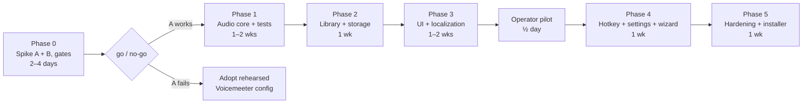

# AdaVoice — MVP Implementation Roadmap

Implementation-oriented summary. Full design: [`../design/`](../design/README.md).
**Status: design complete and eng-reviewed (2026-06-10); no code or project scaffolding exists yet.**

## Goal

WPF/.NET 10 app: record phrases in the operator's voice, organize them, and play them into a
virtual microphone (VB-CABLE) during live Zoho CRM calls in Chrome, with continuous real-mic
passthrough and instant stop. Local-first, offline, solo-dev scale.

## Locked decisions

The **canonical decisions table is [design 01 §4](../design/01-overview.md#4-confirmed-decisions-canonical)** (20 entries).
Implementation-critical gist: VB-CABLE + in-app NAudio mixer (Voicemeeter rehearsed in
Phase 0 as known-good plan B); WAV 48 kHz mono with RMS loudness-matching to a calibrated
mic reference; `Pause` stop hotkey; Recorder = OFF AIR (mutually exclusive with the call
feed); ducking opt-out via `SetDuckingPreference`; language applies on restart; Topmost
board; delete = orphan (no trash subsystem); daily backup includes audio; self-contained
.NET 10 installer, unsigned in v1.

## MVP scope checklist

- [ ] Setup wizard: VB-CABLE detect/verify; environment checks (mic privacy, cable = 48 kHz, default output ≠ CABLE Input, session not muted, Communications = "Do nothing"); device pick; voice calibration; `Pause` key press-to-test; Chrome/Zoho instruction; loopback self-test
- [ ] Audio engine: persistent capture→mix→cable graph behind `IAudioCaptureDevice`/`IAudioRenderDevice` seams; monitor tap; ducking + ducking opt-out interop; single-playback rule; 10 ms stop fade; OFF AIR state; drift policy (drop-oldest / insert-silence, logged); device-loss recovery; DEGRADED alarm on system default device; `RegisterApplicationRestart`
- [ ] Recorder: record/re-record, trim silence, RMS loudness-match to calibrated reference (peak ceiling −3 dBFS), preview to monitor, OFF AIR enforcement
- [ ] Library: categories, tags, search, move-via-edit-dialog, delete-as-orphan, JSON repository (atomic writes)
- [ ] Board UI: large phrase buttons (enable as background decode lands), Topmost toggle (default on), status bar (engine state incl. OFF AIR, mic meter, progress), big STOP; **WPF-UI fixed dark theme + tokens per /DESIGN.md**; **Full + Docked layouts (min 420×560)**
- [ ] Interaction states per design 05 §2: first-run welcome board, decode-dimmed buttons, broken-phrase repair, search/category empty states, saved/backup toasts
- [ ] Global stop hotkey `Pause` via `RegisterHotKey`, reassignable, conflict-surfaced, `Ctrl+F12` fallback
- [ ] Settings: grouped IA (Levels → Behavior → Language & Backup → Devices with confirm-on-change), devices with meters, live duck sliders, re-run calibration, language choice (applies on restart)
- [ ] Localization UA/PL/EN (static .resx, completeness test)
- [ ] Backup: daily zip incl. `audio\` (keep 7), manual export/import
- [ ] Tests per [design 08](../design/08-testing.md): state machine, golden-file DSP, storage, services; CI from Phase 1
- [ ] Logging (Serilog) + engine state alarms
- [ ] Installer (Inno Setup, self-contained .NET 10) + short user guide with Zoho screenshots incl. SmartScreen note

**Not in MVP:** per-phrase hotkeys, compact always-on-top strip (Topmost board covers v1), runtime language switching, drag-and-drop, trash/purge subsystem, MP3 export, encrypted backup, noise-reduction DSP, phrase chaining, two-process split.

## Phases

### Phase 0 — Spike + human gates (2–4 days) · highest risk first

Throwaway console prototype (not production code): NAudio mic→CABLE passthrough + WAV mixing.

- **Gate (non-technical, day 1):** A8 — employer/Zoho permission confirmed by email. A "no"
  kills the project; do not build first.
- Test end-to-end in Chrome against a **real Zoho Voice call** on the target machine.
- Measure **mouth-to-Chrome latency end-to-end** (includes VB-CABLE internal buffering and
  Chrome capture buffering — not just app-internal timing); tune VB-CABLE control-panel
  latency if needed.
- Test matrix includes **AGC**: does ducking survive? Do phrase levels stay consistent
  post-AGC? Check for `autoGainControl`/NS toggles in Zoho/Chrome.
- Verify communications-ducking opt-out holds across call start/stop cycles.
- **Rehearse the fallback:** switch Chrome's mic to the hardware headset mid-call; confirm
  Zoho applies it without reconnecting.
- **Spike Architecture B (~half a day):** same call setup through Voicemeeter Banana;
  document the working configuration as the known-good plan B.
- **Exit criteria / go-no-go:** phrases clearly intelligible to the far end post-AGC;
  app-side trigger→cable < 100 ms and acceptable mouth-to-Chrome total; passthrough stable
  for 1 h; ducking opt-out verified; fallback rehearsed; B documented. Failure of A →
  adopt the rehearsed B configuration and re-scope Phase 1 (engine shrinks to soundboard).

### Phase 1 — Audio core + tests (1–2 wks)

`AudioEngine`, `MicPassthrough`, `PhrasePlayer`, `Recorder`, `DeviceMonitor` behind the
device seams from [design 08 §1](../design/08-testing.md); state machine
(LIVE/OFF AIR/DEGRADED/STOPPED), watchdog, rebuild logic, drift policy, ducking opt-out,
`RegisterApplicationRestart`. Unit + golden-file suites running in CI.
**Exit:** all 08 §3 engine/mixer/recorder tests green; 8-hour soak passes (drift events
logged < a few/hour); device unplug/replug recovers automatically.

### Phase 2 — Library + storage (1 wk)

JSON repository with atomic writes, orphaning delete, startup validation, daily backup
incl. audio, zip export/import.
**Exit:** storage test suite green (incl. automated kill -9 simulation and corrupt-file
recovery); export→import round-trips losslessly.

### Phase 3 — Board UI + Recorder UI + localization (1–2 wks)

MVVM screens built on WPF-UI dark theme + /DESIGN.md tokens; Full **and Docked** layouts;
search, edit-dialog categorization, status bar + STOP, Topmost toggle, recorder panel with
OFF AIR banner; all §2 interaction states (first-run welcome, decode-dimmed, broken-phrase,
empty search/category, toasts); static `.resx` UA/PL/EN + completeness test.
**Exit:** full record→organize→play→stop flow usable in both layouts; localization test
green; every state in the 05 §2 table reachable and styled.

### Operator pilot (½ day, after Phase 3)

Supervised session with the real operator on the real machine (test calls, not client
calls): button sizes, duck defaults, category workflow, Topmost ergonomics, OFF AIR clarity.
Findings feed Phase 4. **The only user's acceptance is validated here, not at the end.**

### Phase 4 — Stop hotkey + Settings + wizard (1 wk)

`RegisterHotKey` stop (`Pause` + fallback), conflict surfacing; settings page with live duck
sliders, calibration re-run, device meters; setup wizard with all environment checks,
loopback self-test, and the first-call confidence card (decision #24).
**Exit:** stop fires while Chrome is focused; wizard succeeds on a clean Windows VM
(self-contained install, no runtime download).

### Phase 5 — Hardening + installer (1 wk)

Edge cases from [design 07](../design/07-risks-security.md), Serilog, Inno Setup installer
(self-contained), user guide (fallback playbook, Zoho mic screenshots, SmartScreen note),
final manual call-test checklist ([design 08 §4](../design/08-testing.md)), pilot follow-up.
**Exit:** operator completes a full real workday on AdaVoice without developer help.

**Total: ~5.5–7.5 calendar weeks solo**, dominated by Phases 0–1.

## Assumptions (carried into implementation)

1. ⚠ Zoho Voice respects Chrome mic selection and passes pre-recorded speech intelligibly
   through NS/EC/**AGC** — **verified only by Phase 0** (A5/A6).
2. Wired headset on Windows 10/11 x64; admin available for VB-CABLE install (confirmed).
3. Library stays at "few dozen" scale — full RAM pre-decode is safe (~100 MB ceiling).
4. Employer/platform permits assistive audio tools — **Phase 0 gate, answered before the
   build** (A8).
5. VB-CABLE cannot be bundled (license) — wizard-driven manual install is acceptable UX.
6. ⚠ All latency numbers are app-side design targets until Phase 0 measures mouth-to-Chrome
   end-to-end, including VB-CABLE internal buffering (A11).

## Deferred (post-MVP backlog)

Per-phrase global hotkeys + conflict editor · compact always-on-top strip · phrase chaining
("script player") · runtime language switching · drag-and-drop categorization ·
orphan-purge tool · MP3 export · encrypted backups · two-process split (audio service
survives UI crash) · code signing (if ever distributed) · Stream Deck/MIDI triggers ·
local usage stats for board layout.

## GSTACK REVIEW REPORT

| Review | Trigger | Why | Runs | Status | Findings |
|--------|---------|-----|------|--------|----------|
| CEO Review | `/plan-ceo-review` | Scope & strategy | 0 | — | — |
| Codex Review | `/codex review` | Independent 2nd opinion | 0 | — | — |
| Eng Review | `/plan-eng-review` | Architecture & tests (required) | 1 | CLEAR (PLAN) | 22 issues (8 inside + 14 outside-voice), all resolved; 0 critical gaps |
| Design Review | `/plan-design-review` | UI/UX gaps | 1 | CLEAR (FULL) | score: 4/10 → 9/10, 7 decisions (visual system, dark theme, Docked layout, state table, Settings IA, confidence step, DESIGN.md) |
| DX Review | `/plan-devex-review` | Developer experience gaps | 0 | — | — |

- **CROSS-MODEL:** Eng-review outside voice (Claude fresh-context subagent; Codex CLI
  unavailable) raised 14 findings; all 14 accepted. Design review ran without outside
  voices (user choice) and without mockups (no OpenAI key — captured in TODOS.md).
- **VERDICT:** ENG + DESIGN CLEARED — design docs, /DESIGN.md, and this roadmap updated in
  place; ready for Phase 0.

NO UNRESOLVED DECISIONS
