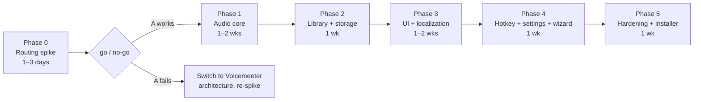

# AdaVoice — MVP Implementation Roadmap

Implementation-oriented summary. Full design: [`../design/`](../design/README.md).
**Status: design complete; no code or project scaffolding exists yet.**

## Goal

WPF/.NET 10 app: record phrases in the operator's voice, organize them, and play them into a
virtual microphone (VB-CABLE) during live Zoho CRM calls in Chrome, with continuous real-mic
passthrough and instant stop. Local-first, offline, solo-dev scale.

## Locked decisions

- Routing: **VB-CABLE + in-app NAudio (WASAPI) mixer** — mic passthrough + phrase mixing in one persistent graph. Voicemeeter is fallback only.
- Audio: WAV PCM 48 kHz/16-bit/mono storage; 48 kHz float mono internal; all phrases pre-decoded to RAM (~few dozen × 5–15 s).
- Ducking: mic duck (`micDuckDb`, default −12 dB) and phrase monitor level (`monitorPhraseDb`, default −6 dB), both live-adjustable.
- Trigger policy: new phrase stops the current one (configurable).
- Hotkeys: **global STOP only** (`Ctrl+Space`, reassignable). Per-phrase hotkeys deferred.
- UI: runtime-switchable **UA / PL / EN** (`.resx`, no hard-coded XAML strings).
- Storage: JSON metadata + WAV files under `%LOCALAPPDATA%\AdaVoice\`, atomic writes, daily backup, zip export/import.
- Stack: NAudio 2.x, CommunityToolkit.Mvvm, Serilog, Inno Setup.

## MVP scope checklist

- [ ] Setup wizard: VB-CABLE detect/verify, device pick, Chrome/Zoho instruction, loopback self-test
- [ ] Audio engine: persistent capture→mix→cable graph, monitor tap, ducking, single-playback rule, 10 ms stop fade, device-loss recovery + DEGRADED alarm
- [ ] Recorder: record/re-record, trim silence, peak normalize −3 dBFS, preview to monitor
- [ ] Library: categories, tags, search, trash, JSON repository (atomic writes)
- [ ] Board UI: large phrase buttons, status bar (engine state, mic meter, progress), big STOP
- [ ] Global stop hotkey via `RegisterHotKey`, reassignable, conflict-surfaced
- [ ] Settings: devices with meters, live duck sliders, language switch, behavior toggles
- [ ] Localization UA/PL/EN, runtime switch
- [ ] Backup: daily metadata zip (keep 7), manual export/import
- [ ] Logging (Serilog) + engine state alarms
- [ ] Installer (Inno Setup) + short user guide with Zoho screenshots

**Not in MVP:** per-phrase hotkeys, compact always-on-top mode, MP3 export, encrypted backup, noise-reduction DSP, phrase chaining, two-process split.

## Phases

### Phase 0 — Routing spike (1–3 days) · highest risk first

Throwaway console prototype (not production code): NAudio mic→CABLE passthrough + WAV mixing.

- Test end-to-end in Chrome against a **real Zoho Voice call** on the target machine.
- Measure trigger latency and added mic latency; assess phrase intelligibility through
  Chrome + Zoho audio processing.
- **Exit criteria / go-no-go:** phrases clearly intelligible to the far end; trigger→audio
  < 100 ms; passthrough stable for 1 h. Failure → switch to Voicemeeter architecture and re-test.

### Phase 1 — Audio core (1–2 wks)

`AudioEngine`, `MicPassthrough`, `PhrasePlayer`, `Recorder`, `DeviceMonitor`; state machine
(LIVE/DEGRADED/STOPPED), watchdog, rebuild logic; unit tests with file-based fake devices.
**Exit:** 8-hour soak test passes; device unplug/replug recovers automatically.

### Phase 2 — Library + storage (1 wk)

JSON repository with atomic writes, trash, startup validation, daily backup, zip export/import.
**Exit:** kill -9 during save never corrupts metadata; export→import round-trips losslessly.

### Phase 3 — Board UI + Recorder UI + localization (1–2 wks)

MVVM screens, search, drag-to-categorize, status bar + STOP, recorder panel;
`.resx` UA/PL/EN with runtime switching (no hard-coded strings from the first commit).
**Exit:** full record→organize→play→stop flow usable; language switch needs no restart.

### Phase 4 — Stop hotkey + Settings + wizard (1 wk)

`RegisterHotKey` stop, conflict surfacing; settings page with live duck sliders and device
meters; setup wizard with VB-CABLE verify and loopback self-test.
**Exit:** stop fires while Chrome is focused; wizard succeeds on a clean Windows VM.

### Phase 5 — Hardening + installer (1 wk)

Edge cases from [design 07](../design/07-risks-security.md), Serilog, Inno Setup installer,
user guide (incl. fallback playbook + Zoho mic screenshots), pilot with the real operator.
**Exit:** operator completes a full real workday on AdaVoice without developer help.

**Total: ~5–7 calendar weeks solo**, dominated by Phases 0–1.

## Assumptions (carried into implementation)

1. ⚠ Zoho Voice respects Chrome mic selection and passes pre-recorded speech intelligibly — **verified only by Phase 0**.
2. Wired headset on Windows 10/11 x64; admin available for VB-CABLE install (confirmed).
3. Library stays at "few dozen" scale — full RAM pre-decode is safe (~100 MB ceiling).
4. Employer/platform permits assistive audio tools — **user to confirm before rollout**.
5. VB-CABLE cannot be bundled (license) — wizard-driven manual install is acceptable UX.
6. Latency numbers (≈40 ms trigger, ≈60 ms passthrough) are design targets, not measurements, until Phase 0/1.

## Deferred (post-MVP backlog)

Per-phrase global hotkeys + conflict editor · compact always-on-top strip · phrase chaining
("script player") · MP3 export · encrypted backups · two-process split (audio service survives
UI crash) · Stream Deck/MIDI triggers · local usage stats for board layout.
